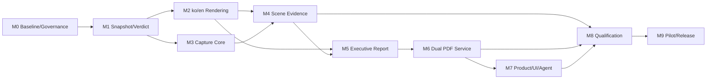

# Phase 11 Milestone Execution Plan

```yaml
version: p11-milestone-plan-v1
status: planned
governing: true
milestones: [P11-M0, P11-M1, P11-M2, P11-M3, P11-M4, P11-M5, P11-M6, P11-M7, P11-M8, P11-M9]
active_milestone: none
release_qualified: false
```

## 1. 의존관계



M2와 M3은 M1 완료 후 병행 가능하다. M4는 두 경로가 모두 끝나기 전 착수하지 않는다.
M8의 visual/performance fixture 작성은 앞서 시작할 수 있지만 qualification 판정은 M7 이후에만 한다.

## 2. 공통 완료조건

모든 마일스톤은 다음 조건을 만족해야 한다.

- 대응 WP 범위의 production code 또는 계획 evidence가 실제 존재
- 전용 `tests/p11-mN-*.mjs`와 관련 회귀 green
- `verification/evidence/validation/phase11/p11-mN-*.json`에 명령·환경·source revision·hash 기록
- open Critical/High code-review finding 0
- API, Agent manifest, feature catalog, user manual 영향 검토
- 성능·메모리·산출물 크기 변화 기록
- 문서와 `IMPLEMENTATION_STATUS.md`를 실제 상태로 갱신
- unrelated worktree 변경을 commit에 포함하지 않음
- 하나의 의도적인 milestone commit 생성

스크린샷이 보기 좋거나 PDF가 열리는 것만으로 완료 처리하지 않는다.

## P11-M0 — Truthful Baseline, Scope and Governance

### 목표

현재 영문 계산서와 pilot 결과를 재현 가능한 baseline으로 고정하고 Phase 11의 계약·의존·보존정책을 확정한다.

### 구현·산출물

- current report/API/string/capture/export inventory
- `PILOT-OFFICE-01` model, analysis summary, HTML, PDF baseline hash
- P11-S1/S2 범위와 release 의미
- ADR-001 공통 스냅샷·분리 PDF, ADR-002 결정론적 capture 결정
- raw PNG/PDF와 tracked evidence의 보존정책
- translation key, capture kind, verdict reason code registry skeleton
- Phase 11 evidence schema와 release manifest skeleton

### 제품 표면 영향

사용자 동작은 바꾸지 않는다. 현재 계산서와 PDF 경로가 baseline과 일치하는지만 확인한다.

### 리팩토링 gate

- report owner와 prototype tool owner map 작성
- 신규 runtime/dev dependency는 이 단계에서 자동 추가하지 않음
- 기존 pilot 생성물과 사용자 변경을 덮어쓰지 않음

### 검증

`P11-BASE-01~06`, `P11-REL-01`

전용 테스트: `tests/p11-m0-baseline-governance.mjs`

### 정량 수용기준

- baseline 재생성의 모델 count·해석 수치·audit가 고정 reference와 동일
- current 22-page PDF의 page count, A4, text marker, hash가 evidence에 기록
- GAP-01~14에 owner와 target milestone 100% 지정

### 증빙

`verification/evidence/validation/phase11/p11-m0-baseline-governance.json`

### 완료판정

현재 기능을 과장하지 않은 baseline과 승인된 scope/ADR/retention 규칙이 있을 때만 완료한다.

### 비범위·잔여 위험

한·영 renderer, 화면 capture, 새 PDF service 구현은 M1 이후 범위다.

## P11-M1 — Versioned ReportSnapshot and Verdict Engine

### 목표

언어·UI·PDF와 분리된 불변 보고서 snapshot과 진실한 종합 결론 규칙을 만든다.

### 구현·산출물

- `ReportSnapshot` schema, canonical serializer와 hash
- 기존 detailed/calculation package 데이터 adapter
- `ReportVerdict` 4축 판정과 reason code registry
- external validation, design eligibility, audit, limitation 결속
- stale model/result 검출
- compatibility facade가 새 snapshot 경로 사용

### 제품 표면 영향

기존 영문 계산서 출력은 유지하되 내부 입력을 snapshot으로 전환한다. 첫 페이지 구조 변경은 M5에서 한다.

### 리팩토링 gate

- report data builder의 중복 owner 제거
- snapshot에 자연어·locale·output path 포함 금지
- renderer가 model/analysis를 직접 읽는 신규 코드 금지

### 검증

`P11-DATA-01~10`, `P11-RPT-01~03`

전용 테스트: `tests/p11-m1-report-snapshot-verdict.mjs`

### 정량 수용기준

- 동일 입력 snapshot hash 100회 반복 일치
- locale·시간표시·출력경로 변경이 snapshot hash에 영향 0
- 독립 기준해 없음 fixture는 `PASS`가 아니라 `CONDITIONAL_PASS`
- analysis/audit/stale failure fixture의 잘못된 성공 판정 0

### 증빙

`verification/evidence/validation/phase11/p11-m1-report-snapshot-verdict.json`

### 완료판정

모든 report 결과가 하나의 snapshot과 verdict를 사용하고 기존 원 수치 회귀가 무손상일 때 완료한다.

### 비범위·잔여 위험

현지화와 visual asset은 아직 연결하지 않는다.

## P11-M2 — Korean/English Localization and Dual HTML Rendering

### 목표

하나의 snapshot에서 한국어와 영어 정적 HTML을 생성하고 번역 누락과 수치 drift를 차단한다.

### 구현·산출물

- `ko-KR`, `en-US` message catalog
- locale formatter와 status/reason/caption label
- translation key/placeholder lint
- 공통 renderer와 locale별 HTML API
- 기존 하드코딩 문자열의 단계적 제거
- Korean font stack과 print embedding probe

### 제품 표면 영향

report API에 명시 locale과 `locales: ['ko-KR','en-US']` 계획 옵션을 추가한다.

### 리팩토링 gate

- locale별 별도 데이터 builder 금지
- renderer의 미등록 자연어 literal gate
- raw code·기술 ID를 번역하는 로직 금지

### 검증

`P11-I18N-01~12`, `P11-PAR-01~06`, `P11-RPT-04`

전용 테스트: `tests/p11-m2-bilingual-rendering.mjs`

### 정량 수용기준

- catalog key와 placeholder signature 차이 0
- 두 HTML의 snapshot hash와 모든 numeric token parity 100%
- 한국어판 미번역 일반 영문, 영문판 미번역 한국어 detector 0건
- 한글 sample glyph 검색·복사 probe PASS

### 증빙

`verification/evidence/validation/phase11/p11-m2-bilingual-rendering.json`

### 완료판정

같은 snapshot에서 두 HTML을 한 명령으로 만들고 번역·수치 parity gate를 통과하면 완료한다.

### 비범위·잔여 위험

PDF pair와 화면 이미지는 후속 마일스톤 범위다.

## P11-M3 — Deterministic Visual Evidence Capture Core

### 목표

실제 제품 장면을 재현 가능한 PNG evidence로 만드는 capture 계약과 합성기를 구현한다.

### 구현·산출물

- `CaptureSpec`, capture profile과 required/optional 정책
- camera·viewport·pixel ratio·layer·combo·scale 고정
- base canvas + result overlay compositor
- font/image readiness와 animation stabilization
- PNG encoder, blank/size/hash/stale 검증
- `EvidenceManifest`와 view state restore
- capture cancel/timeout/error reason

### 제품 표면 영향

아직 보고서에 그림을 넣지 않는다. 내부/Agent diagnostic API로 capture plan과 결과 manifest를 조회한다.

### 리팩토링 gate

- runtime Playwright/OS screenshot 의존 금지
- result scene 계산 중복 금지
- ambient active UI state를 spec 대신 사용하는 capture 금지

### 검증

`P11-CAP-01~14`, `P11-SEC-01~03`

전용 테스트: `tests/p11-m3-visual-capture-core.mjs`

### 정량 수용기준

- 동일 spec 10회 capture의 dimensions·scene metadata·content class 일치
- 필수 PNG 유효 해상도 1600×900 이상
- blank·단색·0-byte·stale fixture 검출률 100%
- capture 전후 사용자 view state deep-equivalent
- timeout·cancel 후 orphan canvas/buffer 0

### 증빙

`verification/evidence/validation/phase11/p11-m3-visual-capture-core.json`

### 완료판정

capture 결과가 snapshot/hash에 결속되고 실패를 누락 이미지로 숨기지 않을 때 완료한다.

### 비범위·잔여 위험

실제 7개 장면의 제품 배선과 report embedding은 M4 범위다.

## P11-M4 — Required Scene Evidence and Contextual Embedding

### 목표

필수 7개 장면을 생성하고 각 장면을 관련 보고서 장에 figure로 연결한다.

### 구현·산출물

- model isometric
- combined plan/elevation
- gravity load
- lateral load
- governing deformed shape
- governing reactions
- governing member utilization
- locale별 caption, figure numbering, combo/scale/hash strip
- image-reference integrity와 missing-scene fail-closed gate

### 제품 표면 영향

한국어·영어 HTML preview에 동일 PNG와 locale별 caption이 표시된다.

### 리팩토링 gate

- figure를 base64로 무제한 중복 삽입하지 않음
- 서로 다른 snapshot의 asset 혼합 금지
- report section 밖의 장식용 screenshot 남발 금지

### 검증

`P11-CAP-15~24`, `P11-RPT-05~09`, `P11-PAR-07`

전용 테스트: `tests/p11-m4-scene-evidence-report.mjs`

### 정량 수용기준

- required scene coverage 7/7
- 모든 figure의 snapshot/model/result hash 일치
- figure reference/caption/number 누락 0
- ko/en asset sha256 동일, caption만 locale별 차이
- active combo와 변형배율 metadata 불일치 0

### 증빙

`verification/evidence/validation/phase11/p11-m4-scene-evidence-report.json`

### 완료판정

그림이 수치 결과의 추적 가능한 증거로 배치되고 누락·stale asset이 render를 차단하면 완료한다.

### 비범위·잔여 위험

최종 executive layout과 PDF 자동 저장은 M5~M6 범위다.

## P11-M5 — Executive Conclusion and Production Report Layout

### 목표

첫 페이지에서 결론·근거·제한사항을 이해할 수 있고 100% page render에서 안정적인 문서 구조를 완성한다.

### 구현·산출물

- page 1 executive conclusion, 4축 verdict와 핵심 metric
- scope/issue suitability와 not-verified 강조
- 새 TOC와 장 순서
- figure/table numbering과 cross-reference
- print CSS, repeated table header, break control, footer
- accessibility label, contrast, searchable text
- detailed trace appendix

### 제품 표면 영향

계산서 modal preview를 production report preview로 전환하되 기존 상세보고서 메뉴는 migration 기간 유지한다.

### 리팩토링 gate

- verdict 문구를 template에서 재계산하지 않음
- 색상만으로 상태를 전달하지 않음
- 표 전체를 raster image로 만드는 방식 금지

### 검증

`P11-RPT-10~22`, `P11-VIS-01~08`, `P11-A11Y-01~05`

전용 테스트: `tests/p11-m5-executive-report-layout.mjs`

### 정량 수용기준

- 첫 페이지에 overall verdict, 독립검증 상태, 핵심 metric, limitation 존재
- required heading/figure/table/footer marker coverage 100%
- structural overflow detector 0
- 100% page raster에서 clipping·overlap·tofu·black square 0
- PDF text extraction 대비 HTML 핵심 marker 손실 0

### 증빙

`verification/evidence/validation/phase11/p11-m5-executive-report-layout.json`

### 완료판정

두 locale의 전체 문서가 동일 정보구조와 명확한 진실성 표현을 가지면 완료한다.

### 비범위·잔여 위험

제품 자동 PDF pair 생성은 M6 범위다.

## P11-M6 — Atomic Dual-PDF Export Service

### 목표

한국어·영어 PDF를 한 export job으로 생성·검증·원자적으로 발행한다.

### 구현·산출물

- export job state machine과 artifact manifest
- Electron isolated preload/IPC와 hidden print window
- `webContents.printToPDF` adapter
- browser print-ready fallback
- CLI qualification adapter
- font/image readiness, metadata, page footer와 hash
- temp output, validation, atomic publish, cleanup
- progress·cancel·timeout·retry

### 제품 표면 영향

내부 service API를 먼저 제공하며 M7에서 정식 UI/Agent에 연결한다.

### 리팩토링 gate

- arbitrary shell/path IPC 금지
- renderer Node 권한 확대 금지
- Python one-off finalizer를 production runtime owner로 승격하지 않음
- 한쪽 성공을 pair 성공으로 보고하지 않음

### 검증

`P11-PDF-01~16`, `P11-SEC-04~10`, `P11-FAIL-01~08`

전용 테스트: `tests/p11-m6-dual-pdf-export.mjs`

### 정량 수용기준

- ko/en PDF 모두 A4, metadata, page footer, embedded/usable Korean font
- `file:///`, 로컬 절대경로, 사용자명, token pattern 0
- manifest의 page/bytes/hash와 실제 파일 일치 100%
- 한쪽 실패·cancel·timeout에서 final partial artifact 0
- job 종료 후 hidden window·handle·temp artifact leak 0

### 증빙

`verification/evidence/validation/phase11/p11-m6-dual-pdf-export.json`

### 완료판정

검증된 두 PDF와 manifest가 함께 승격되고 모든 실패 경로가 fail-closed일 때 완료한다.

### 비범위·잔여 위험

전자서명·PDF/A·외부 업로드는 S2다.

## P11-M7 — Product UI, Agent and Export History

### 목표

사용자와 Agent가 동일한 export service를 사용해 계획·실행·취소·결과 확인을 수행한다.

### 구현·산출물

- `한·영 보고서 내보내기` UI
- snapshot/verdict/required-scene preflight
- progress, cancel, reason code, remediation
- locale pair preview와 output location
- export history와 artifact manifest 조회
- Agent/API plan/run/status/cancel/artifacts
- feature catalog와 user manual

### 제품 표면 영향

기존 `인쇄 / PDF`는 browser fallback으로 유지하고 production pair action을 우선 경로로 표시한다.

### 리팩토링 gate

- UI·Agent의 직접 renderer/print 호출 0
- export 상태 관리 중복 0
- raw local path를 Agent 응답에 무조건 노출하지 않음

### 검증

`P11-UI-01~12`, `P11-API-01~12`, `P11-PAR-08`

전용 테스트: `tests/p11-m7-product-agent-export.mjs`

### 정량 수용기준

- 같은 request의 UI/Agent export plan hash 일치
- status transition과 terminal manifest 일치
- cancel acknowledgement 2초 이하
- stale result, missing capture, unavailable desktop adapter의 정확한 reason 100%

### 증빙

`verification/evidence/validation/phase11/p11-m7-product-agent-export.json`

### 완료판정

UI와 Agent가 동일한 job/result를 보여주고 unsupported 경로를 성공처럼 표시하지 않을 때 완료한다.

### 비범위·잔여 위험

클라우드 동기화와 이메일 전송은 범위 밖이다.

## P11-M8 — Visual, Performance, Security and Failure Qualification

### 목표

지원 환경에서 layout·font·성능·메모리·실패·보안을 검증하고 release 후보를 만든다.

### 구현·산출물

- Windows Electron/Chrome 기준 환경 profile
- ko/en full-page raster와 visual diff
- Korean glyph/search/copy qualification
- S/M fixture export time, peak memory, PDF size
- blank image, corrupted asset, font missing, disk full, permission denied, cancel failure injection
- HTML injection, path traversal, secret/local-path leak 검사
- package/build/install smoke
- artifact cleanup과 retention 검증

### 제품 표면 영향

qualification 상태와 blocker를 export preflight와 도움말에 노출한다.

### 리팩토링 gate

- test-only browser path가 production behavior를 대체하지 않음
- visual golden 갱신은 승인 사유와 source revision을 가짐
- performance budget 완화를 silent 변경하지 않음

### 검증

`P11-VIS-09~20`, `P11-PERF-01~10`, `P11-SEC-11~20`, `P11-FAIL-09~16`

전용 테스트: `tests/p11-m8-qualification-hardening.mjs`

### 정량 수용기준

- S-tier dual export p95 ≤ 30초
- peak working set ≤ 1 GiB
- first progress ≤ 500 ms, cancel acknowledgement ≤ 2초
- 각 PDF 목표 ≤ 25 MiB 또는 승인된 reason
- clipping·overlap·tofu·required blank figure·privacy leak 0
- failure injection의 false success 0

### 증빙

`verification/evidence/validation/phase11/p11-m8-qualification-hardening.json`

### 완료판정

필수 환경·실패 matrix와 정량 예산을 모두 통과하고 open Critical/High가 0일 때 완료한다.

### 비범위·잔여 위험

macOS/Linux native PDF는 별도 환경 qualification 없이는 release claim에 포함하지 않는다.

## P11-M9 — PILOT-OFFICE-01 Acceptance and Release Gate

### 목표

실제 사무실 fixture로 전체 제품 흐름을 반복 검증하고 Phase 11 보고서 기능 release를 판정한다.

### 구현·산출물

- clean office model → design-basis loads → 28 combinations → analysis
- required 7 scene capture
- ko/en HTML·PDF·manifest
- 3회 반복 parity와 artifact integrity
- full regression, package/install smoke
- final risk/debt/code review
- feature manual과 운영·사용자·Agent 문서
- fail-closed Phase 11 release manifest

### 제품 표면 영향

프로덕션 action을 기본 보고서 pair 경로로 승격한다. 기존 fallback 제거 여부는 사용처 확인 후 결정한다.

### 리팩토링 gate

- owner 없는 debt 0
- expired compatibility caller 0
- stale public export·문서 0
- generated artifact hygiene PASS

### 검증

`P11-E2E-01~12`, `P11-REL-02~14`, 전 Phase 11 verification

전용 테스트: `tests/p11-m9-release-gate.mjs`

### 정량 수용기준

- 3회 run의 model/snapshot/numeric/evidence selection parity 100%
- 두 PDF의 필수 section·figure·verdict·limitation coverage 100%
- artifact manifest hash 재검증 PASS
- 전체 회귀 green, Critical/High 0
- 현재 독립 정답 모델 부재를 `CONDITIONAL_PASS`로 정확히 표시

### 증빙

`verification/evidence/validation/phase11/p11-m9-release-gate.json`

### 완료판정

실제 PDF pair와 release manifest가 모든 필수 evidence를 hash 검증할 때만
`release-qualified=true`로 바꾼다. 누락 evidence는 PASS가 아니다.

### 비범위·잔여 위험

Phase 10 외부 교차검증 blocker와 구조공학적 정답 검증은 별도 상태로 유지한다.

## 3. 사용자 판단이 필요한 변경

다음은 구현 중 자동 결정하지 않는다.

- 새 runtime/dev dependency와 license
- 제품 배포본에 font 파일을 포함하는 결정
- PDF/A 또는 전자서명을 P11-S1으로 승격
- Electron preload/IPC의 호환성 파괴
- 성능·파일크기 budget 완화
- 필수 capture 장면 축소
- 독립 기준해가 없는 상태에서 `PASS` 허용
- raw report·capture의 장기 보존기간과 외부 업로드

## 4. 상태 갱신 규칙

`IMPLEMENTATION_STATUS.md`는 실제 code, test, evidence, review, milestone commit이 생긴 뒤
한 마일스톤씩 갱신한다. 계획 문서만 존재하는 상태는 전부 `planned`다.

