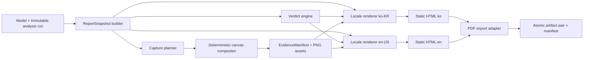

# Phase 11 Target Architecture

```yaml
version: p11-target-architecture-v1
status: planned
reviewed_at: 2026-07-23
```

## 1. 단일 방향 pipeline



역방향 mutation은 허용하지 않는다. renderer와 capture가 model 또는 analysis를 고치면 계약 위반이다.

## 2. 핵심 계약

### 2.1 ReportSnapshot

언어·HTML·PDF와 무관한 유일한 보고서 입력이다.

```js
{
  schemaVersion,
  snapshotId,
  createdAt,
  sourceRevision,
  project,
  model: { hash, counts, bounds, units, stories },
  analysis: { runId, resultHash, status, audit, envelope, combinations },
  design: { status, governing, checks },
  loadBasis,
  limitations,
  eligibility,
  reportSnapshotHash
}
```

- 원 수치와 raw status code만 저장한다.
- 자연어 title, caption, `OK/WARN` 표시문구는 저장하지 않는다.
- hash는 시간·locale·출력 경로를 제외한 canonical payload로 계산한다.

### 2.2 ReportVerdict

```js
{
  version,
  overall,
  dimensions: {
    operational,
    numericalIntegrity,
    engineeringValidation,
    issueSuitability
  },
  reasonCodes,
  blockers,
  warnings
}
```

우선순위는 `FAIL > REVIEW > CONDITIONAL_PASS > PASS`다. 독립 기준해가 없으면
`engineeringValidation=not-verified`이며 overall은 최대 `CONDITIONAL_PASS`다.

### 2.3 CaptureSpec

```js
{
  version,
  id,
  kind,
  required,
  modelHash,
  resultHash,
  comboId,
  view,
  camera,
  viewport,
  pixelRatio,
  layers,
  deformScale,
  captionKey
}
```

카메라와 scene layer는 명시적으로 고정한다. `activeCombo` 같은 ambient UI state에 의존하지 않는다.

### 2.4 EvidenceManifest

각 PNG의 spec, hash, 크기, capture 결과와 snapshot 결속을 기록한다.

```js
{
  version,
  reportSnapshotHash,
  captureProfile,
  assets: [{
    id, kind, path, sha256, width, height,
    modelHash, resultHash, comboId, view, deformScale, status
  }],
  evidenceManifestHash
}
```

필수 asset의 `status !== "ready"` 또는 hash 불일치는 render 전에 차단한다.

### 2.5 ReportArtifactManifest

```js
{
  version,
  jobId,
  status,
  reportSnapshotHash,
  evidenceManifestHash,
  sourceRevision,
  artifacts: {
    ko: { html, pdf, sha256, pages, bytes },
    en: { html, pdf, sha256, pages, bytes }
  },
  qualification
}
```

두 locale이 모두 검증될 때만 `status=complete`다.

## 3. 모듈 ownership 목표

| Owner | 책임 | 기존 자산 |
| --- | --- | --- |
| `src/report/contracts/` | snapshot·manifest schema, canonical hash | `detailedReport.js` 데이터 |
| `src/report/verdict/` | 결론 규칙과 reason code | `auditPackage`, eligibility |
| `src/report/i18n/` | message catalog, locale formatter, key lint | 신규 |
| `src/report/visualEvidence/` | capture plan, canvas 합성, blank/stale 검사 | `indexResultVisuals`, `indexResultOverlay` |
| `src/report/render/` | 공통 문서 구조와 locale별 text render | `calculationPackage.js`, `reportFormat.js` |
| `src/report/export/` | job, adapter, atomic publish, manifest | 신규 |
| `src/ui/indexReportExportWorkflow.js` | 제품 progress·cancel·artifact UX | `indexReportHooks.js` |
| `desktop/preload.mjs`, `desktop/reportExportIpc.mjs` | 격리된 Electron PDF bridge | `desktop/main.mjs` |
| `tools/` | CLI qualification, PDF render 검증 | pilot generator/finalizer |

실제 파일 이동은 behavior parity commit과 기능 commit을 분리한다.

## 4. 현지화 구조

- message key 예: `report.section.analysis.title`, `verdict.reason.referenceMissing`
- `ko-KR.js`와 `en-US.js`는 동일 key 집합을 가진다.
- placeholder signature를 자동 비교한다.
- report data에는 translation key만 참조할 수 있고 locale 문장을 넣지 않는다.
- raw code와 표시 label을 함께 유지해 감사 가능성을 보존한다.
- technical formula, member ID, combo ID는 모든 locale에서 동일하다.

## 5. 화면 증거 capture

### Runtime 경로

1. snapshot으로부터 명시적 장면 spec 생성
2. product view controller에 camera·combo·layer·scale 적용
3. 두 animation frame과 font readiness 대기
4. base `#cv`와 `#engineVisualOverlay`를 export canvas에 합성
5. legend와 evidence metadata strip을 vector/text로 합성
6. PNG encode, 크기·blank·hash 검사
7. view state 복원

OS 전체창 screenshot 또는 runtime Playwright 의존은 사용하지 않는다. UI 외곽·사용자 경로·알림이
증거에 섞이지 않도록 `canvasWrap`의 결정적 장면을 생성한다.

### Qualification 경로

Electron `capturePage` 또는 고정 browser runner의 실제 element screenshot과 compositor 결과를
비교한다. visual diff 도구 도입은 M0 dependency/ADR gate를 거친다.

## 6. 보고서 정보구조

1. Executive conclusion and scope — 첫 페이지
2. Table of contents
3. Model overview and geometry
4. Design basis, loads and combinations
5. Elastic analysis and serviceability
6. Reactions and equilibrium
7. Member checks and governing member
8. Quality audit and limitations
9. Detailed tables and trace appendix

figure는 관련 장에만 배치한다. 모든 이미지에는 figure 번호, 설명, combo, scale, hash short ID가 있다.

## 7. PDF export adapter

### Electron production adapter

- renderer는 sanitized static HTML과 export plan만 전달
- preload는 allowlist IPC만 노출
- main process가 hidden `BrowserWindow`에서 `webContents.printToPDF` 실행
- `contextIsolation: true`, `nodeIntegration: false`
- 임시 폴더에서 ko/en 순차 또는 제한 병렬 생성
- font ready와 image decode 완료 후 print
- page count/text/privacy/hash 검증 후 atomic rename

### Browser fallback

브라우저는 ko/en HTML을 생성하고 각각 print-ready preview를 연다. browser API가 허용하지 않는
무음 PDF 저장을 성공으로 보고하지 않는다.

### CLI qualification adapter

제품 snapshot/render/capture 모듈을 그대로 사용하며, pinned Chromium/Electron과 Poppler
page render 검증을 release toolchain에서 실행한다.

## 8. 실패·취소 상태

```text
planned → snapshotting → capturing → rendering → pdf-printing
        → validating → publishing → complete
        ↘ failed
        ↘ cancelled
```

- failed/cancelled는 final manifest를 `complete`로 만들지 않는다.
- debug artifact는 임시 경로에만 두고 retention policy에 따라 정리한다.
- partial ko/en 파일은 최종 경로에 승격하지 않는다.
- 원 model과 analysis run은 불변이다.

## 9. 보안·개인정보 경계

- report 문자열은 HTML escape
- final static HTML에 executable JS 삽입 금지
- file URL, 로컬 절대경로, account name, environment variable, token 패턴 검사
- user-selected output directory는 main process에서 canonicalize하고 허용 범위 확인
- report export IPC는 임의 shell/URL/navigation을 받지 않는다.
- capture/export는 network 요청 0이 기본

## 10. 기존 기능과의 호환

- `createCalculationPackageHtml()`은 migration 기간 facade로 유지한다.
- 기존 단일 영문 report 호출은 명시적 `en-US` adapter로 연결한다.
- 새 report snapshot은 기존 model/analysis schema를 변경하지 않는다.
- Phase 10 release eligibility와 external validation flag를 그대로 보고한다.
- M9 release 후 deprecated caller와 one-off PDF finalizer의 제거 또는 유지 결정을 기록한다.

