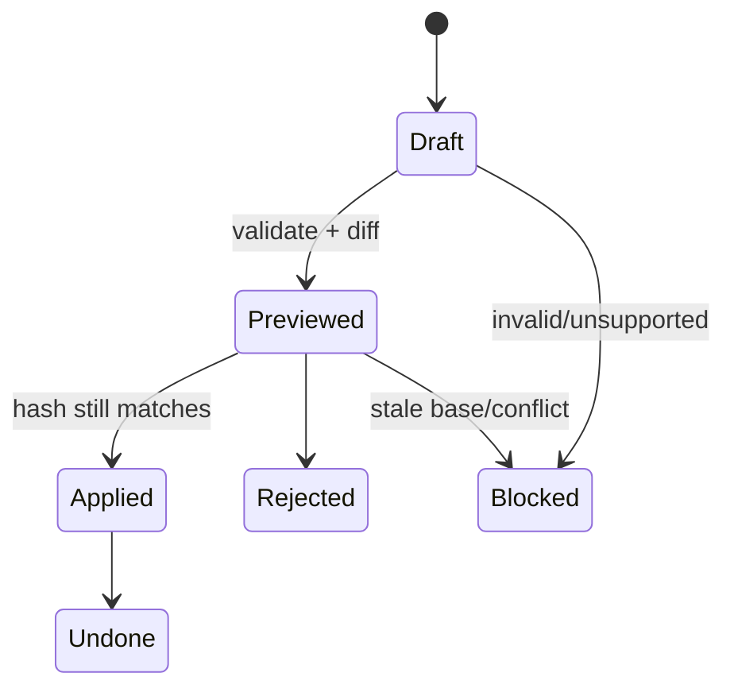

# Phase 13 Target Architecture

```yaml
version: p13-target-architecture-v1
status: planned
reviewed_at: 2026-08-05
```

## 1. 설계 목표

UI를 새로 꾸미는 것이 아니라 모델·실행·결과·보고서의 소유권을 먼저 정리한다. 사용자 입력은 canonical model에,
해석은 in-house elastic engine에, 조회·보고서는 immutable result/report snapshot에 결속한다.

## 2. 전체 데이터 흐름

```mermaid
flowchart LR
  UI["Elastic Review Workspace"] --> CS["Preview / Change Set"]
  CS -->|"Apply transaction"| MODEL["Canonical Project Model"]
  MODEL --> HASH["Domain & Input Hashes"]
  HASH --> PREFLIGHT["Model Check / Capability Preflight"]
  PREFLIGHT -->|"PASS"| COORD["Elastic Run Coordinator"]
  COORD --> ENGINE["S-Structures In-house Elastic Engine"]
  ENGINE --> AUDIT["Result / Equilibrium / Qualification Audit"]
  AUDIT -->|"atomic publish"| RUNS["Elastic Run Repository"]
  RUNS --> QUERY["Canonical Result Query / Governing Index"]
  QUERY --> UI
  QUERY --> REPORT["Review & Report Snapshot"]
  REPORT --> ART["PDF / SVG / DXF / CSV / JSON"]
```



외부 solver, subprocess 또는 network service는 ENGINE 경로에 존재하지 않는다.

## 3. 상태 소유권

| 상태 | 단일 owner | 소비자 |
| --- | --- | --- |
| canonical model | project revision store | modeler, preflight, run planner |
| edit preview | ChangeSet service | workspace inspector/table |
| issue/waiver | Model Issue registry | Check Center, run preflight, report |
| execution | Elastic Run Coordinator | ribbon, wizard, workspace, Agent |
| current/stale | Elastic Run Repository projection | 모든 제품 표면 |
| result value | immutable result snapshot/query | 3D, table, chart, CSV, report |
| report/export | immutable ReportSnapshot | preview, renderer, manifest |
| view/layout | user workspace settings | UI만; model hash 영향 없음 |

## 4. 계층·모듈 경계

### Domain·Workflow

- `src/core`: model/run/issue public schema와 hash
- `src/modeling`: transaction, batch edit, story/diaphragm model operation
- `src/loads`: load/mass/slab change-set와 totals
- `src/standards` 또는 M0 승인 위치: KDS procedure packs
- `src/import/mgt`: lexer/parser/mapper/audit

### Compute

- `src/compute/product`: preflight, plan, worker job, run coordinator
- 기존 `src/solver`, `src/dynamics`, `src/results`가 수치 owner
- UI/보고서가 solver 내부 배열을 직접 소비하지 않고 result query를 사용

### UI

- `src/ui/elasticWorkspace/`: shell, tree, inspector, drawer, routes
- `src/ui/dataGrid/`: schema grid, unit editor, virtualization
- `src/ui/modelCheck/`, `loadWorkspace/`, `resultsDashboard/`
- 기존 `index*` facade는 legacy adapter 뒤에서 점진 축소

### Report·Platform

- `src/report`: ReviewSnapshot, composer와 artifact manifest
- `src/platform`: revision diff, run persistence, import transaction
- Phase 12 server/public/private boundary는 변경하지 않음

경로는 계획상 target이며 M0 ADR에서 public export와 cycle 검사를 거쳐 확정한다.

## 5. Analysis Run 모델

```text
ElasticRunSet
  runId
  projectId / revisionId
  modelHash / domainHashes
  loadHash / massHash / combinationHash / criteriaHash
  engineBuildHash / capabilitySnapshot
  cases[]
    caseId, executionStatus, qualificationStatus
    startedAt, completedAt, resultHash, audit, limitations
  currentEligibility
  staleReasons[]
  evidenceRefs[]
```

- run output은 임시 영역에서 검증한 뒤 current pointer로 원자 publish한다.
- failed/cancelled/blocked run은 current가 될 수 없다.
- input hash mismatch는 historical 조회만 허용한다.
- partial dependency 재사용은 M1 이후 검증된 matrix 없이는 금지한다.

## 6. Change Set 계약

모든 repair/load/batch/import 작업은 같은 수명주기를 사용한다.



Change Set은 base model hash, affected objects, before/after, validation, stale impact와 deterministic ID를 가진다.

## 7. Compatibility·migration

- Phase 12 project schema를 additive하게 확장한다.
- legacy run/report는 read adapter로 열되 current 승격은 full hash 검증 후에만 허용한다.
- feature flag off 상태에서 새 canonical field를 삭제하지 않는다.
- N-1 reader가 이해하지 못하는 데이터는 recovery copy 없이 downgrade하지 않는다.
- public facade 제거에는 사용처 inventory와 parity test가 필요하다.

## 8. Release architecture

- Core Frame, Slab Load Distributor, Shell Experimental을 capability 단위로 판정한다.
- manifest는 workflow, engineering cross-validation, office pilot, final design와 shell transfer를 분리한다.
- shell containment 실패는 shell flag만 false로 만들고 Core result에 shell stiffness가 없는지 확인한 뒤 별도 판정한다.
- OpenSees runtime/package/process/network route는 build·source·package audit에서 0이어야 한다.
