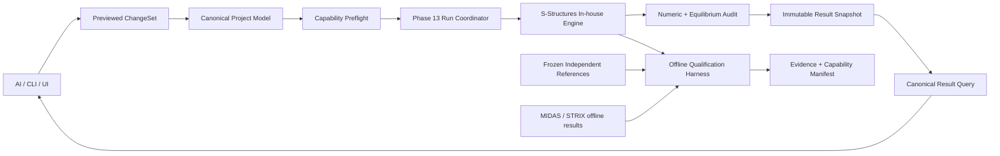

# Phase 14 Target Architecture

```yaml
version: p14-target-architecture-v1
status: review-ready
created_at: 2026-08-27
```

## 1. 전체 흐름



`EXT`는 사용자 runtime 경로에 연결하지 않는다. 외부 결과가 없어도 내부 기능은 개발할 수 있지만 `crossSolverCompared=false`를 유지한다.

## 2. 신규 모듈 경계

계획 경로이며 P14-M0 ADR에서 실제 public API와 cycle을 확정한다.

```text
src/core/
  foundationSchema.js
  massProperties.js
  capabilityQualification.js

src/solver/foundation/
  winklerLine.js
  foundationAssembly.js
  foundationRecovery.js

src/dynamics/
  linearDirectIntegration.js       # 기존 Newmark/Rayleigh owner 확장
  modalCombination.js              # 신규 ABS/NRC10 owner
  massMatrix.js                    # linear 6DOF mass owner

src/solver/shell/
  기존 QM6-EAS / MITC4 owner 유지
src/results/
  shellProbe.js
  foundationResult.js
  dynamicResult.js

src/nonlinear/pushover/
  productionPushover.js            # 기존 production owner 재사용·hardening
src/nonlinear/equilibrium/
  displacementControl.js           # 기존 owner 재사용
  arcLength.js                     # 기존 owner 재사용
src/nonlinear/core/
  stateStore.js                    # 기존 trial/commit/checkpoint owner 재사용

src/verification/phase14/
  referenceRegistry.js
  metamorphicRunner.js
  comparisonImporter.js
```

독립 reference 계산기는 가능하면 `tests/references/phase14/` 또는 별도 검증 도구에 두며 production bundle에 포함하지 않는다.

## 3. Canonical schema 확장

### 3.1 Winkler foundation

```json
{
  "foundationProperties": [{
    "id": "WF-1",
    "type": "winkler-line",
    "behavior": "linear-bilateral",
    "localY": { "lineStiffness": 0 },
    "localZ": {
      "lineStiffness": 25000,
      "derivation": { "mode": "subgrade-times-width", "subgradeModulus": 50000, "tributaryWidth": 0.5 }
    },
    "units": { "lineStiffness": "kN/m2" }
  }],
  "members": [{ "id": "B1", "foundationId": "WF-1" }]
}
```

내부 단위에서 line stiffness의 차원은 `force/length²`다. `subgradeModulus`는 `force/length³`이며 폭을 곱해 line stiffness로 변환한다.

### 3.2 6DOF 질량

기존 nonlinear mass domain이 이미 읽는 6성분 `node.mass`를 linear modal/RSA에도 동일하게 사용한다. 3성분 legacy array는 회전성분 0으로 additive migration한다.

```json
{
  "node": "N1",
  "mass": [10, 10, 0, 0, 0, 175000]
}
```

앞 세 성분 단위는 mass, 뒤 세 성분 단위는 `mass·length²`다. UI/API는 `mx,my,mz,jx,jy,jz` 이름과 단위를 표시해 배열 index 혼동을 막는다. weight와 mass를 혼동하지 않는다.

### 3.3 Modal combination

```json
{
  "responseSpectrum": {
    "method": "NRC10",
    "dampingRatio": 0.04,
    "modeSelection": { "count": 4 },
    "closeModeRatio": 0.10
  }
}
```

enum은 `SRSS | CQC | ABS | NRC10`이다. alias와 UI label은 canonical enum으로 정규화한다.

## 4. 계산 소유권

| 계산 | owner | 금지 |
| --- | --- | --- |
| frame/shell/foundation K | 자체 solver assembly | benchmark별 보정계수 |
| mass/diaphragm reduction | 자체 mass matrix + constraint transform | 외부 eigen 결과 삽입 |
| modal combination | 자체 modalCombination | UI에서 사후 숫자 조합 |
| THA | 자체 Newmark/Rayleigh | 외부 time-history subprocess |
| pushover | 자체 nonlinear driver | expected curve에 맞춘 step 수정 |
| expected/reference | test-side frozen artifact | production 함수 재사용 |

## 5. Capability 상태기계

```text
planned
  → implementation-complete
  → internally-verified
  → independently-qualified
  → cross-solver-compared
  → release-allowed
```

단계는 건너뛰지 않는다. `cross-solver-compared`는 필수 primary truth가 아니라 추가 증거이며, 독립 기준이 없는 custom 기능은 `internally-verified/custom-criterion`으로 별도 표시한다.

## 6. Run·result 확장

각 case result는 다음을 추가한다.

```text
capabilityId / implementationVersion
qualificationSnapshotHash
formulation / interpolation / integration
unitAxisSignConvention
meshOrStepLineage
numericAudit { equilibrium, energy, symmetry, residual, convergence }
limitations[]
```

foundation result는 station reaction과 resultant를, RSA는 modal contribution과 조합 trace를, THA와 pushover는 step history와 convergence reason을 immutable snapshot에 넣는다.

## 7. AI-native 계약

- `inspectCapability(id)`는 지원상태·제약·required inputs·evidence hash를 반환한다.
- `previewModelChange(change)`는 schema diff와 stale capability를 반환한다.
- `runAnalysis(request)`는 preflight가 green일 때만 자체 엔진을 실행한다.
- `compareRun(referenceSet)`은 offline evidence를 생성하지만 production result를 변경하지 않는다.
- `proposeEngineChange()` 결과는 코드 diff, 영향 capability, mandatory test plan으로 제한하고 자동 승인하지 않는다.

## 8. Compatibility·rollback

- 모든 신규 collection/field는 없을 때 기존 동작과 수치가 동일하다.
- legacy model 저장 시 신규 field를 조용히 삭제하지 않는다.
- capability flag off는 신규 입력을 보존하되 실행을 `unsupported-by-build`로 차단한다.
- failed migration/import/run은 canonical model과 last current result hash를 바꾸지 않는다.
