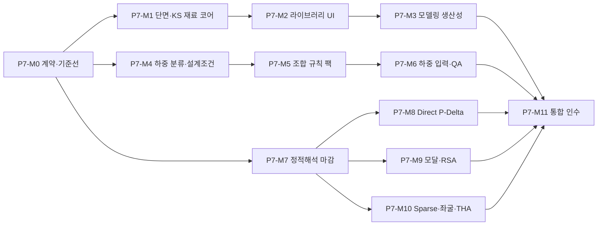

# Phase 7 Milestone Execution Plan

```yaml
plan_version: 2026-07-10
milestones: P7-M0..P7-M11
execution_rule: one milestone at a time; verification and review required before status complete
```

구현 결과와 남은 릴리스 조건은 [IMPLEMENTATION_STATUS.md](IMPLEMENTATION_STATUS.md), 코드 기반 재점검 결과는 [CODEBASE_REVIEW.md](CODEBASE_REVIEW.md)를 기준으로 한다.

## 1. 릴리스 증분

| 증분 | 포함 마일스톤 | 사용자가 얻게 되는 결과 |
| --- | --- | --- |
| R7.1 Practical Modeling | P7-M0~M3 | 현행 KS 강종과 legacy 호환, 안전한 단면 라이브러리, 정사각형 기둥, 빠른 층·그리드 모델링 |
| R7.2 Practical Loads | P7-M4~M6 | 설계조건에서 케이스·질량원·조합 생성, 하중 QA와 재생성 |
| R7.3 Verified Elastic | P7-M7~M10 | 정적/P-Delta/RSA/좌굴의 결과 계약과 독립 검증 마감 |
| R7.4 Practice Acceptance | P7-M11 | 통합 작업공간, 보고서 추적성, 대표 프로젝트 인수시험 |

R7.1과 R7.2는 일부 병렬 개발이 가능하지만 P7-M0 계약을 먼저 고정한다. R7.3은 앞선 UI 개선과 별개로 보이지 않게 진행할 수 있으나, 검증이 끝나기 전 고급 결과를 `verified`로 표시하지 않는다.

## 2. 의존성



## 3. 상태 규칙

| 상태 | 의미 |
| --- | --- |
| planned | 범위와 검증 ID만 확정 |
| in-progress | 해당 마일스톤만 변경 중 |
| candidate | 코드와 신규 시험은 통과했으나 코드리뷰·독립 검증·문서 중 하나가 남음 |
| complete | 완료 조건과 검증 증빙이 모두 충족 |
| blocked | 외부 기준 원문, 결정, 또는 재현 가능한 blocker가 있어 진행 불가 |

기존 파일이나 테스트가 존재한다는 이유만으로 `complete`로 올리지 않는다. 각 마일스톤 종료 때 코드 기반 재점검을 수행하고 문서의 주장과 실제 실행 경로를 대조한다.

## P7-M0 - 계약, 기준 버전, 마이그레이션 기준선

### 목표

Phase 7 전체가 공유하는 용어, 스키마, 단위, 출처, 상태, 마이그레이션 계약을 먼저 고정한다.

### 작업

- `load case`, `combination`, `analysis case`, `mass source`, `design basis` 저장 계약 분리
- 법정 하중 family와 기존 type 간 migration 표 작성
- 단면·재료·생성물의 ID, origin, source snapshot 계약 추가
- 재료 내부 ID와 KS designation 분리, 구/신 강종 alias 및 명시적 migration 계약 추가
- 공식 기준 source registry와 rule-pack metadata schema 추가. effective/adopted/draft/withdrawn 상태 분리
- 신규 모델의 근거 없는 `CO1/SLS1` 기본 조합 제거 방안 확정
- legacy 모델 golden fixture와 migration preview 구현. `SS400`/`SM490` 기존 물성·결과 보존 포함
- EA-01~EA-13 재현시험을 먼저 추가하고 현재 실패 상태 기록
- 힘/길이/모멘트/질량/가속도 결과 차원 계약 추가

### 주요 코드 영역

`src/core/schema.js`, `src/core/modelSchema.js`, `src/core/combinations.js`, 신규 migration/source registry 모듈, 결과 contract 모듈

### 완료 조건

- 기존 모델이 데이터 손실 없이 열리고 저장 후 안정적인 ID를 유지한다.
- 신규 빈 모델은 `load setup required`이며 설계조합을 가장하지 않는다.
- 차원이 다른 결과 fallback이 contract test에서 실패한다.
- `GOV-01`, `GOV-02`, `GOV-04`, `MIG-01`~`MIG-05`, `DIM-01` 통과

## P7-M1 - 단면 계산 코어와 KS 재료 라이브러리 기반

### 목표

실무에서 자주 쓰는 단면과 사용자 정의 단면을 정확하게 계산·저장하고, 참조 오류를 숨기지 않는다.

### 작업

- `SQUARE` 1급 형상과 RECT/CIRC/H/BOX/PIPE 속성 계산 정리
- solid rectangle Saint-Venant `J` 정정 및 극한비 검증
- 선택적 `Ay`, `Az`, `Cw`, 주축 정보 스키마 추가
- 부재별 `EA/GA/GJ/EI/질량/자중` modifier와 named property set 스키마
- 재료 탄성물성과 두께 등 조건별 설계강도 데이터 분리
- KS 코드·판·제품형태·suffix·두께구간을 가진 현행 강종 registry와 legacy alias table
- 신규 프로젝트 기본 재료를 검증된 현행 강종으로 교체하고 `SS400`/`SM490` snapshot은 legacy 호환으로 유지
- KS D 3503, KS D 3515 및 지원 강관 계열을 서로 분리한 공식 mapping fixture
- C/L/T와 GENERAL의 지원 범위·경고 계약 구현
- Standard/Office/Project 라이브러리 계층과 snapshot 저장
- 단면 DB importer의 단위·중복·출처 검증
- `sectionOf`의 `h300` silent fallback 제거
- 최소 실무 표준 단면 fixture와 DB 버전 메타데이터 추가

### 완료 조건

- 잘못된 단면 참조가 해석 전에 대상 부재와 함께 차단된다.
- 정사각형/직사각형/원형/H/BOX/PIPE 속성이 독립 공식값과 일치한다.
- 비대칭·warping 미지원 범위가 결과와 UI 계약에 남는다.
- `SEC-01`~`SEC-10`, `MAT-01`~`MAT-09` 통과

## P7-M2 - 단면·재료 라이브러리 UI와 배치 지정

### 목표

코드를 수정하지 않고 표준 단면 검색, 사용자 단면 작성, 프로젝트 복제, 부재 지정이 가능하게 한다.

### 작업

- 재료/단면 탭과 Standard/Office/Project source 필터
- 형상별 입력폼, 정사각형 한 변 입력, 2D 단면·로컬축 미리보기
- modifier set, 삽입점, 회전, offset 미리보기와 배치 지정
- 계산 속성·직접 속성 비교, 단위 전환, validation 메시지
- 검색, 정렬, 즐겨찾기, 최근 사용, 사용 중 필터
- 구명칭 검색 alias, legacy badge, 현행 강종 migration diff/승인 UI
- CSV/JSON 가져오기 preview와 오류 행 보고
- 단일/다중/층/그리드/역할/페인트 단면 지정
- 참조 중 삭제 보호와 대체 단면 workflow
- undo/redo 및 transaction 적용

### 완료 조건

- 사용자가 UI만으로 정사각형 RC 기둥 단면을 만들고 여러 기둥에 지정한다.
- 가져오기 실패가 부분 적용을 만들지 않는다.
- viewport의 단면명·로컬축과 속성 패널이 선택 상태를 공유한다.
- `SEC-UI-01`~`SEC-UI-09`, `MAT-UI-01`~`MAT-UI-03`, `UX-01`, `UX-02` 통과

## P7-M3 - 층·그리드 중심 모델링 생산성

### 목표

반복 구조 모델을 빠르게 만들고 연결성·역할·로컬축 오류를 해석 전에 수정한다.

### 작업

- 프로젝트 시작 마법사와 층·그리드 편집기
- 역할 기반 column/beam/brace 생성 템플릿
- 층 삽입·복제·높이 변경과 포함 항목 선택
- 다중 선택, crossing/window, 층·그리드·역할 selection filter
- move/copy/array/mirror와 stable snapping
- 교차부재 분할, 중복절점 병합, 고립부재 탐지와 preview repair
- 단면 로컬축·회전·offset·release 표시와 배치 편집
- cardinal point와 rigid end zone을 포함한 부재 삽입 위치 편집
- 도킹·스냅·크기 조절·workspace 저장·화면 밖 복구

### 완료 조건

- 대표 반복층 모델을 수동 JSON 없이 생성·복제·수정한다.
- 자동 수리 전후 절점·부재 수와 영향 대상을 확인할 수 있다.
- 패널이 지원 viewport에서 화면 밖에 영구 고립되지 않는다.
- `MOD-01`~`MOD-10`, `LAYOUT-01`~`LAYOUT-04` 통과

## P7-M4 - 하중 분류와 프로젝트 설계조건

### 목표

실제 프로젝트에서 고려해야 할 하중 family를 빠뜨리지 않고, 확인된 설계조건으로 케이스와 질량원을 준비한다.

### 작업

- D/L/Lr/S/R/W/E/H/T/F/EQUIPMENT/CONSTRUCTION/OTHER schema
- D family의 self-weight/superimposed variant와 pattern group schema
- 케이스 family, direction, sign, variant, purpose 필드 분리
- 기존 `roof`, `snow`, `other` migration
- RC 업무/주거/학교/병원/주차장, 철골 창고/공장, 빈 프로젝트 템플릿
- 층별 용도·지붕·지하·설비·지역 조건 마법사
- 값·단위·출처·적용조건·확인상태 표시
- 케이스와 질량원 generation preview
- 미확인·미적용·해당없음 상태 구분

### 완료 조건

- 법정 하중 종류를 `OTHER` 하나에 몰지 않고 round-trip한다.
- 관련 입력이 없는 하중 family는 0으로 생성되지 않는다.
- 같은 설계조건을 다시 적용해도 케이스·질량원이 중복되지 않는다.
- `LOAD-01`~`LOAD-11`, `MASS-01`~`MASS-03` 통과

## P7-M5 - 버전 고정 조합 규칙 팩과 한 번 적용

### 목표

공식 기준 판과 설계법에 맞는 조합 후보를 출처와 함께 생성하고 사용자가 적용 전 차이를 검토하게 한다.

### 작업

- rule-pack registry, source URL/hash, 판·개정·공표상태·시행일·검증일 저장
- 공식 원문에서 고정한 strength/allowable/service fixture 작성
- 하중 family 대안, 동시작용, 방향·부호, 우발편심 확장
- strength/service/drift/P-Delta/foundation/uplift purpose tag
- Preview/Merge/Replace generated/Append custom 동작
- 사용자 수정 보호와 규칙 팩 변경 diff
- 설계법과 조합 family 불일치 차단
- 기존 preliminary KDS 생성기의 `candidate` 격리 또는 승격

### 완료 조건

- 공식 fixture의 이름, 계수, 조건, 부호가 정확히 재현된다.
- 누락 케이스, 알 수 없는 `OTHER`, 미확인 설계조건이 설명 없이 0 처리되지 않는다.
- 같은 규칙 팩 재적용 결과가 byte-equivalent 또는 논리적으로 동일하다.
- `COMB-01`~`COMB-12`, `GOV-03`, `GOV-04` 통과

## P7-M6 - 하중 입력, 가시화, 배치 편집, QA

### 목표

모델 위에서 어떤 케이스에 어떤 하중이 어느 방향으로 적용됐는지 확인하고 반복 입력을 안전하게 처리한다.

### 작업

- active/all load case 표시와 legend
- 절점/부재/면적/온도/침하 하중의 방향·좌표계·범위 표현
- 층·그리드·부재 역할 기준 copy/move/scale/delete
- 자동 생성과 수동 하중 source 필터, lock, conflict 처리
- tributary area 분배 preview와 합계·잔차 audit
- 바닥 구성 고정하중 산출표, 벽체 선하중, 설비하중 생성 도구
- 활하중 pattern generation과 기준 기반 reduction trace
- 자중 source와 factor 표시
- 중복, 0, 단위 이상치, 미참조, 반대방향 QA
- 대량 작업 transaction·undo 및 성능 보강

### 완료 조건

- 선택 케이스의 총하중과 viewport 표시 합계가 일치한다.
- 하중 재생성이 사용자 수정 항목을 조용히 덮어쓰지 않는다.
- 면적하중 분배의 입력합, 분배합, 잔차가 허용오차 내에서 닫힌다.
- `LUI-01`~`LUI-13`, `LOAD-AUDIT-01`~`LOAD-AUDIT-05` 통과

## P7-M7 - 선형 정적해석 정확성 마감

### 목표

정적해석의 경계조건, 부재하중, offset/release, unilateral, 평형 검토를 독립 정답으로 마감한다.

### 작업

- 고정 및 부분구속 prescribed displacement의 partitioned equation 적용
- 중간 집중모멘트와 consistent fixed-end force 정정
- rigid-arm offset 변환 또는 지원 한계 명시
- 부분 회전릴리스와 condensation 검증
- 인장/압축 전용 부재 active-set 재활성화
- 전역 힘·모멘트 평형 audit와 tolerance 정규화
- 특이강성 진단과 오류 위치·해결 정보
- 기존 Phase 6 테스트의 자기 일치 항목을 독립 reference로 교체

### 완료 조건

- 고전 해석 예제와 prescribed settlement 결과가 허용오차 내에 있다.
- 모든 정적 fixture가 힘과 모멘트 평형을 동시에 만족한다.
- 미지원 offset/release 조합은 정상 결과가 아니라 명시적 오류가 된다.
- `STAT-01`~`STAT-12`, `EQ-01`~`EQ-04` 통과

## P7-M8 - Direct P-Delta 제품 연결

### 목표

사용자가 선택한 P-Delta 방법이 실제 실행 경로와 일치하고 Direct 결과가 정적 결과와 같은 수준으로 소비되게 한다.

### 작업

- 해석 방법 enum과 UI 문구를 1차/legacy/direct로 명확히 분리
- Analysis Center 및 ribbon을 `runSecondOrderPDelta` 경로에 직접 연결
- reaction, member end/station force, iteration trace, combo envelope 복원
- 다이어프램, generated member, offset/release, unilateral 통합
- global/story/member/combination 그래프 데이터 분리
- 선택 수직부재와 member iteration 패널 양방향 연결
- legacy 결과의 목적·한계 표시 및 자동 설계 전달 차단

### 완료 조건

- 실행 trace로 선택 method와 solver method가 동일함을 증명한다.
- Direct 조합 결과가 displacement, reaction, member force, envelope를 모두 가진다.
- 독립 2차해석 benchmark와 수렴·증폭 결과가 일치한다.
- `PD-01`~`PD-10` 통과

## P7-M9 - 모달·RSA 결과 정정

### 목표

모달/RSA가 정적해석과 동일한 모델 계약을 사용하고 실제 힘·변위·부재력·층응답을 복원하게 한다.

### 작업

- diaphragm, generated member, support/release, mass source 통합 assembly
- 일반화 고유치 풀이의 모드형상·질량정규화·residual 진단
- 모드별 nodal displacement, reaction/inertia force, member force 복원
- 응답량별 SRSS/CQC와 부호 전략
- 실제 밑면전단력 계산 및 displacement fallback 삭제
- RSA scaling trace와 적용 전후 결과
- RSA 결과에서 story drift/shear/torsion 계산
- static case를 RSA 대체값으로 사용하는 경로 제거

### 완료 조건

- 단위 contract가 변위를 밑면전단력으로 전달하는 코드를 구조적으로 거부한다.
- SDOF 및 다자유도 reference에서 주기, 참여율, 변위, 밑면전단력, 부재력이 일치한다.
- RSA story 결과의 provenance가 RSA analysis case를 가리킨다.
- `MODAL-01`~`MODAL-07`, `RSA-01`~`RSA-12`, `DIM-02` 통과

## P7-M10 - 실제 sparse, 좌굴, THA 범위 마감

### 목표

큰 모델 계산 경로를 실제 sparse로 만들고 좌굴을 사용 가능한 흐름으로 연결하며 THA의 제품 상태를 정직하게 확정한다.

### 작업

- frame assembly 단계부터 CSR/CSC 생성
- symbolic/numeric factorization에서 전체 dense 변환 제거
- permutation, singularity, multi-RHS factor reuse
- 5,000 자유도 실제 frame fixture 성능·메모리 기준선
- 좌굴 preload 조합 선택/생성, 다중 고유값·모드형상·residual
- THA 구조 응답 복원, damping/record/unit trace 검증 여부 평가
- THA 미완료 시 `preliminary` 고정과 설계 전달 차단

### 완료 조건

- 성능시험이 합성 삼대각행렬이 아니라 실제 부재 assembly를 사용한다.
- sparse 계산 중 전체 자유도 제곱 크기의 dense 행렬을 생성하지 않는다.
- 좌굴 기본 실행이 preload 안내 없이 `NO_GEOMETRIC_STIFFNESS`로 끝나지 않는다.
- THA는 독립 검증을 통과하거나 명확히 preliminary로 격리된다.
- `SPARSE-01`~`SPARSE-07`, `BUCK-01`~`BUCK-06`, `THA-01`~`THA-04` 통과

## P7-M11 - 통합 UX, 보고서, 실무 인수

### 목표

대표 프로젝트를 처음부터 끝까지 수행해 기능 간 연결과 결과 추적성을 검증한다.

### 작업

- 모델링·하중·해석 workspace preset과 패널 상태 저장
- Analysis Center의 케이스 생성·실행·실패 복구 정리
- 탄성해석 리본에 1차 정적/Direct P-Delta/모달/RSA/탄성좌굴/선형 THA 선택·실행·상태 표시
- 정적 조합, 질량원, 모드 수, RSA 스펙트럼, 좌굴 preload, THA record 설정 폼과 자동 저장
- P-Delta 해석 실행과 P-Delta 결과 표시 토글의 역할 분리
- 결과 선택기와 viewport/panel 양방향 선택 통합
- 모델·설계조건·규칙 팩·해석 옵션·경고를 포함한 보고서
- 사용자 매뉴얼, 상태/한계 문서, agent contract 갱신
- UX-RC-OFFICE/RESI/PARK, UX-ST-WH/PLANT 인수 시나리오
- 지원 viewport 스크린샷 및 브라우저 회귀
- 전체 코드베이스 리뷰와 미해결 위험 등록

### 완료 조건

- 대표 5개 프로젝트가 수동 JSON이나 개발자 도구 없이 end-to-end 실행된다.
- 생성 결과와 보고서에서 단면 출처, 하중 기준, 조합 목적, 해석법, 경고를 추적한다.
- Critical/High blocker가 0이고 남은 preliminary 범위가 화면과 문서에 일치한다.
- `EUI-01`~`EUI-08`, `E2E-01`~`E2E-08`, `REPORT-01`~`REPORT-06`, `LAYOUT-05`, 전체 회귀 통과

## 4. 마일스톤 공통 완료 절차

각 마일스톤은 아래 순서를 지킨다.

1. 착수 전 관련 코드와 기존 테스트를 다시 읽고 작업 패키지를 작성한다.
2. 검증 ID의 실패 시험 또는 기준 fixture를 먼저 만든다.
3. 구현 중 기존 사용자 변경과 무관한 리팩터링을 섞지 않는다.
4. 단위시험, 통합시험, 독립 이론/기준 fixture, UI 흐름을 실행한다.
5. 코드리뷰에서 correctness, migration, failure mode, unsupported 상태를 점검한다.
6. [VERIFICATION_MATRIX.md](VERIFICATION_MATRIX.md)에 증빙 경로, 결과, 날짜를 기록한다.
7. 사용자 매뉴얼과 상태 문서를 실제 화면 기준으로 갱신한다.
8. 코드 기반 재점검 후에만 `complete`로 변경한다.

## 5. 중단 조건

다음 중 하나가 발생하면 다음 마일스톤으로 넘어가지 않는다.

- 공식 기준 원문과 규칙 팩 fixture가 일치하지 않음
- 기존 프로젝트 migration에서 데이터 손실 또는 결과의 설명되지 않는 변화 발생
- 차원, 좌표계, 부호가 불명확한 결과가 정상 상태로 반환됨
- 자동 생성 재실행이 중복 또는 사용자 수정 덮어쓰기를 발생시킴
- independent reference가 아닌 같은 구현끼리 비교한 시험만 존재함
- UI 선택과 실제 solver 실행법이 다름
- Critical/High 회귀가 남은 상태에서 완료 문서만 갱신함
