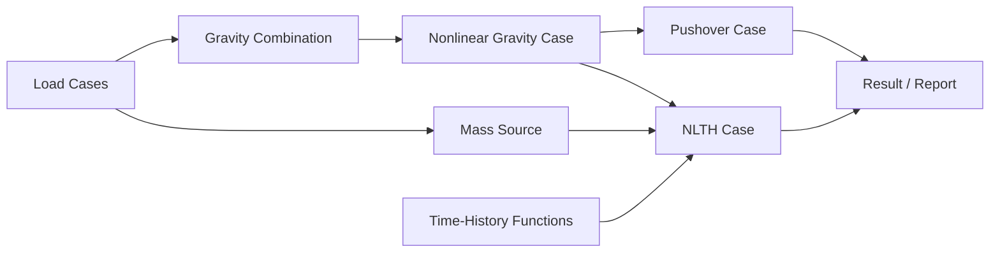

# Phase 8 Modeling and Elastic Integration

```yaml
document_status: governing
integration_rule: one model, one canonical analysis domain, multiple qualified solver adapters
phase7_dependency: modeling and elastic features remain regression-protected
```

## 1. 결론

Phase 8이 별도의 `nonlinear model`을 만들면 안 된다. 사용자가 화면에서 만든 구조물, Phase 7 선형해석이 계산한 구조물, Phase 8 비선형해석이 계산한 구조물이 동일해야 한다.

이를 위해 다음 불변조건을 강제한다.

```text
Modeling object
  -> Canonical Analysis Domain
       -> Linear static adapter
       -> Direct P-Delta adapter
       -> Modal/RSA/Buckling/Linear THA adapter
       -> Nonlinear static/Pushover adapter
       -> MDOF NLTH adapter
```

solver마다 모델 전개, diaphragm, offset, mass, load를 다시 해석하는 구조를 폐기하고 공통 domain의 명시적 capability만 소비한다.

## 2. 현재 코드에서 재사용할 계약

| 현재 자산 | 코드 | Phase 8 사용방법 |
| --- | --- | --- |
| model schema v4 | `src/core/modelFactory.js`, `src/core/schema.js` | schema v5 migration의 입력기준 |
| material snapshot | `src/materials/materialSchema.js` | elastic과 nonlinear material source를 같은 record에 연결 |
| section geometry/property | `src/materials/sectionSchema.js` | elastic A/I/J와 fiber generator의 공통 geometry source |
| load family/case | `src/loads/loadCaseMetadata.js` | gravity/lateral/mass purpose와 provenance 유지 |
| mass source | `src/loads/massSource.js` | modal/RSA/NLTH 공통 mass-domain 입력 |
| story/diaphragm | `src/core/storyModel.js`, `src/core/diaphragmContract.js` | constraint와 story recovery의 공통 객체 |
| linear assembly | `src/solver/linear3dAssembly.js` | 선형극한 reference와 elastic adapter |
| expanded P-Delta domain | `src/solver/pdelta/analysisDomain.js` | canonical domain 전개의 출발점, solver 전용 의미 제거 |
| rigid diaphragm reduction | `src/solver/diaphragm*.js`, `src/dynamics/modalDiaphragm.js` | 일반 `ConstraintTransform`으로 통합 |
| Direct P-Delta audit | `src/solver/pdelta/secondOrder.js` | nonlinear 결과 평형·stability audit 패턴 |
| analysis case | `src/core/analysisCase.js` | engine/formulation/initial state가 있는 v2로 확장 |
| immutable run record | `src/core/analysisRunRecord.js`, `src/ui/phase7AnalysisRecords.js` | nonlinear state·domain·evidence hash를 포함하도록 확장 |
| result dimension | `src/core/resultDimensions.js` | nonlinear/dynamic 차원을 추가 |
| stale workflow | `src/ui/indexNativeModeler.js`, `src/ui/indexElasticSetupWorkflow.js` | granular hash invalidation으로 확장 |
| result popup/selection | `src/ui/indexElasticResultPopup.js`, `src/ui/resultSelectionStore.js` | nonlinear result slice와 동일 selection contract 사용 |

### 재사용 시 수정이 필요한 부분

- `analysisCase.js`는 `pushover`, `nlth`라는 종류만 있고 engine과 formulation을 구분하지 않는다.
- `analysisRunRecord.js`의 trusted evidence 검사는 `p7-` version에 묶여 있어 일반 verification registry로 바꿔야 한다.
- `resultDimensions.js`에는 velocity, curvature, strain, stress, energy, damping force가 없다.
- material `nonlinear.backbone`은 단순 point list이고 상태모델·단위·source·calibration을 표현하지 못한다.
- section schema는 elastic property는 충분하지만 fiber layout, reinforcement snapshot, integration profile을 표현하지 못한다.
- P-Delta, modal, linear static이 domain/constraint 전개를 각기 다르게 수행한다.
- model hash는 whole input snapshot 하나만 제공한다. 부분 cache invalidation과 case continuation에는 domain별 hash가 필요하다.

## 3. Canonical Analysis Domain

### 3.1 Domain 구성

```js
{
  version,
  modelSchemaVersion,
  unitPolicy,
  nodes,
  elements,
  constraints,
  properties,
  loads,
  mass,
  stories,
  originMap,
  capabilities,
  hashes: {
    topology,
    property,
    constraint,
    load,
    mass,
    nonlinear,
    output,
    complete,
  },
}
```

### 3.2 Hash 의미

| Hash | 포함 | 무효화 대상 |
| --- | --- | --- |
| topology | node/member connectivity, element type | 모든 해석과 symbolic pattern |
| property | material/section/modifier/local axis | static, dynamic, nonlinear numeric state |
| constraint | support/spring/diaphragm/release/offset | 모든 solver DOF map |
| load | load object/case/combo/self weight | 해당 static/preload case |
| mass | mass source와 mass ownership | modal/RSA/THA/NLTH |
| nonlinear | hinge/fiber/link property와 assignment | nonlinear cases |
| output | station/history/channel 설정 | result cache만 |

UI의 `lastRun`, panel layout, selection, chart state는 analysis hash에 포함하지 않는다.

### 3.3 Build pipeline

```text
migrate schema
  -> validate references and units
  -> resolve material/section snapshots
  -> resolve member kinematics, release, offset, local axis
  -> expand supported generated objects
  -> build constraint transform
  -> expand loads and self weight
  -> build mass ownership and matrix inputs
  -> resolve nonlinear property assignments
  -> build origin map and capabilities
  -> compute hashes
  -> freeze domain
```

각 단계는 warning/error/unsupported issue를 object ID와 함께 반환한다. solver는 domain builder의 판단을 다시 추측하지 않는다.

## 4. Model schema v5 계획

### 4.1 새 top-level registry

```js
{
  nonlinearMaterials: [],
  nonlinearSections: [],
  hingeProperties: [],
  linkProperties: [],
  timeHistoryFunctions: [],
  analysisStates: [],
}
```

큰 fiber 배열과 history record를 member 객체마다 복제하지 않는다. property registry를 참조하고 project snapshot은 content hash로 고정한다.

`analysisStates`에는 predecessor run record와 checkpoint manifest reference만 저장한다. 전체 committed element state와 time history는 model JSON에 넣지 않고 immutable run/result store에 둔다.

### 4.2 Material 확장

```js
material.nonlinear = {
  modelId,
  parameters,
  stateSchemaVersion,
  units,
  source,
  calibration,
  qualification,
}
```

- `elastic.E/G/rho`는 Phase 7 선형과 Phase 8 초기접선이 공통 사용한다.
- steel, concrete, rebar의 nonlinear model은 별도 model ID와 parameter set을 가진다.
- point backbone만 있는 legacy material은 migration 후 `legacy-envelope-only`다.

### 4.3 Section 확장

```js
section.analysisProfiles = {
  elastic: { propertySetId, modifiers },
  fiber: { generatorId, mesh, materials, reinforcementSnapshotId },
  hingeDefaults: { propertyId, axisPolicy },
}
```

- elastic A/I/J와 fiber mesh는 동일 `shape/params`에서 생성한다.
- 직접입력 `GENERAL` section은 fiber layout을 별도로 입력하지 않으면 concentrated hinge만 사용할 수 있다.
- RC fiber/hinge auto 생성은 bar 좌표, 개수, 면적, cover, tie/confinement가 있는 reinforcement snapshot을 요구한다.
- 설계 모듈의 preliminary 철근량을 자동으로 verified fiber 배근으로 승격하지 않는다.

### 4.4 Member assignment

```js
member.analysis = {
  role: 'beam' | 'column' | 'brace' | 'link' | 'generated',
  formulationId,
  propertyProfileId,
  hinges: [{ propertyId, end, axis, location }],
  integration: { type, points },
  modifiers,
  source,
}
```

- local axis는 모든 hinge/fiber/result 축의 기준이다.
- release와 같은 축의 hinge는 중복 validation error다.
- generated member는 자동 nonlinear assignment를 받지 않는다. source formulation이 명시한 elastic/nonlinear 정책만 따른다.

## 5. Load, mass, analysis case의 분리

### 5.1 Entity 의미

| Entity | 의미 | 예 |
| --- | --- | --- |
| load case/pattern | 물리 하중 묶음 | D, L, WX+, EX |
| load combination | case factor 조합 | 1.2D+1.0L |
| mass source | 질량으로 변환할 물리 source | self + 0.25L |
| analysis case | 하중 적용방법과 해석 알고리즘 | linear static, gravity nonlinear, pushover, NLTH |
| analysis state | accepted nonlinear case의 committed final state | GRAV-NL@run123 |

load combination을 Pushover algorithm 또는 NLTH record와 같은 객체에 섞지 않는다.

### 5.2 Case schema v2

```js
{
  id,
  kind,
  engineId,
  formulation,
  inputRefs: {
    loadCaseIds,
    combinationId,
    massSourceId,
    functionIds,
  },
  initialState: {
    policy: 'zero' | 'nonlinear-case' | 'verified-linear-import',
    caseId,
    runRecordId,
  },
  controls,
  output,
  status,
  lastRun,
}
```

### 5.3 Case dependency DAG



- cycle을 금지한다.
- predecessor의 run record가 `failed`, `stale`, `unsupported`면 dependent case를 실행하지 않는다.
- predecessor를 다시 실행하면 dependent result는 stale이 된다.
- initial state는 mutable case ID만이 아니라 immutable run record ID와 domain hash를 참조한다.

## 6. 탄성해석과 초기상태 연계

### 6.1 허용되는 연계

- 선형 정적결과는 nonlinear solver의 initial guess로 사용할 수 있다.
- Direct P-Delta 결과는 geometric state의 comparison/reference로 사용할 수 있다.
- modal 결과는 lateral pattern 및 damping target mode에 사용할 수 있다.
- RSA/linear THA 결과는 nonlinear analysis case의 직접 초기상태가 아니라 비교·스케일 검토에 사용한다.
- buckling 결과는 instability screening과 step-size 경고에 사용할 수 있다.

### 6.2 허용되지 않는 연계

- 선형 부재력을 nonlinear material committed state로 자동 변환
- 다른 support/release/offset/diaphragm domain의 결과 import
- 다른 material/section/modifier hash의 state continuation
- preliminary RSA/THA 결과를 verified nonlinear input으로 승격
- failed/nonconverged Direct P-Delta 결과를 gravity state로 사용

### 6.3 Verified linear import

특수한 경우 선형 결과를 initial state로 가져오려면 다음을 모두 만족해야 한다.

- topology/property/constraint/load hash 일치
- nonlinear material이 elastic branch에 있음
- imported element force와 nodal reaction의 equilibrium audit pass
- 각 nonlinear element가 imported force에 대응하는 admissible initial state를 생성
- report에 `initialStatePolicy=verified-linear-import` 표시

일반 기본값은 nonlinear gravity preload다.

## 7. Solver adapter 계약

```js
createSolverAdapter(domain, analysisCase) => {
  capabilities,
  validate(),
  initialize(initialState),
  run(callbacks),
  recover(resultPolicy),
}
```

### 공통입력과 solver별 사용

| Domain field | Linear | Direct P-Delta | Modal/RSA | Pushover | NLTH |
| --- | --- | --- | --- | --- | --- |
| topology/properties | 필수 | 필수 | 필수 | 필수 | 필수 |
| constraints | 필수 | 필수 | 필수 | 필수 | 필수 |
| static loads | 필수 | 필수 | 선택 | gravity+lateral | gravity+forcing |
| mass | 제외 | 제외 | 필수 | modal pattern 시 | 필수 |
| nonlinear assignments | 제외 | 제외 | 제외 | 필수 | 필수 |
| initial state | zero | linear seed | optional stiffness state | gravity state | gravity state |

solver는 미사용 field를 무시할 수 있지만 서로 다른 geometry/constraint를 만들 수 없다.

## 8. Feature compatibility matrix

| 모델 기능 | Linear | Direct P-Delta | Pushover R1 | NLTH R1 | 정책 |
| --- | --- | --- | --- | --- | --- |
| 3D frame | 지원 | 지원 | 지원 | 지원 | 공통 element descriptor |
| elastic truss | 지원 | 제한 | 지원 | 지원 | corotational truss 필요 |
| tension/compression-only | 지원 active-set | 미지원 조합 존재 | S2 | S2 | S1에서는 fail-closed |
| rigid diaphragm | 지원 | 현재 제한 | 지원 필수 | 지원 필수 | 공통 constraint transform |
| semi-rigid equivalent | generated truss | 지원 | elastic generated만 | elastic generated만 | 원본 result mapping |
| shell equivalent links | elastic generated | 지원 | elastic generated만 | elastic generated만 | nonlinear shell로 표시 금지 |
| release | 지원 | 일부 조합 차단 | 지원 필수 | 지원 필수 | hinge 중복 차단 |
| rigid offset | 지원 | 지원 | 지원 필수 | 지원 필수 | mass/load/recovery 포함 |
| support spring | 지원 | 지원 | linear spring | linear spring | nonlinear link는 R2 |
| settlement | 지원 | 지원 | gravity preload | gravity preload | dynamic 중 time-varying 제외 |
| member loads | 지원 | 지원 | dead/fixed direction | 제한정책 명시 | follower load 미지원 |
| self weight | 지원 | 지원 | gravity preload | gravity preload | 동일 physical ownership |
| mass source | modal/RSA/THA | 제외 | modal pattern | 필수 | 단일 snapshot |
| wall/slab source | equivalent | equivalent | equivalent elastic | equivalent elastic | 실제 nonlinear wall 아님 |

## 9. 결과 identity와 dimension

### 9.1 Result key

```text
runRecordId / caseId / step-or-time / objectType / objectId / location / component
```

- member end는 `i/j`, section point는 integration index와 local x를 함께 가진다.
- hinge는 member ID, end, local axis, property ID로 식별한다.
- generated element result는 generated ID와 source object ID를 모두 가진다.
- story result는 story ID와 diaphragm ID를 구분한다.

### 9.2 Dimension 확장

기존 `resultDimensions.js`에 다음을 추가한다.

- velocity, angularVelocity
- acceleration, angularAcceleration
- strain, curvature
- stress, forcePerLength, momentPerLength
- energy, power
- dampingForce, inertiaForce, residualForce
- time, frequency, ratio

모든 raw result는 internal unit dimension을 가지고 chart/report에서만 display unit으로 변환한다.

## 10. Run record와 qualification

기존 Phase 7 run record를 다음처럼 일반화한다.

```js
{
  modelInputHash,
  domainHashes,
  analysisCaseSnapshot,
  dependencyRunRecords,
  solverBuild,
  runtimeBackend,
  convergence,
  resultManifest,
  verificationEvidence,
  qualification,
  designTransferAllowed,
}
```

- `p7-` prefix만 신뢰하는 evidence 검사를 versioned verification registry로 교체한다.
- run result 전체를 integrity hash에 직접 넣기보다 chunk manifest와 chunk hash를 사용한다.
- 성공한 이전 결과를 실패 run이 덮어쓰지 않는 Phase 7 정책을 유지한다.
- 현재 모델과 hash가 다르면 UI display는 가능하되 `historical`로 표시하고 design transfer를 차단한다.

## 11. UI 통합

- 모델링 화면의 선택 store를 elastic/nonlinear popup이 공유한다.
- 부재 선택 시 elastic property, nonlinear assignment, 최근 hinge/fiber result를 탭으로 구분한다.
- 탄성해석의 `전체 탄성해석`과 별도로 `비선형 준비/실행` workflow를 둔다.
- nonlinear setup은 기존 section/material/load UI를 복제하지 않고 해당 편집기로 이동한다.
- model/domain diff에서 elastic과 nonlinear에 실제 사용된 element 수, constraint, mass, generated object를 비교한다.
- 결과 popup은 기존 이동·resize·snap workspace controller를 사용한다.
- Pushover/NLTH chart 선택은 viewport step/time과 양방향 동기화한다.

## 12. Migration 순서

1. schema v4 model을 손실 없이 v5로 migration한다.
2. legacy member `nonlinear.hinges`를 project hinge-property registry와 assignment로 변환한다.
3. legacy backbone은 `legacy-envelope-only`로 표시한다.
4. 기존 `pushover/nlth` case에 legacy engine ID를 명시한다.
5. 새 production case는 사용자가 복제·재설정해야 하며 자동승격하지 않는다.
6. 기존 Phase 7 result/run record는 read-only historical record로 유지한다.
7. linear/static/P-Delta/modal/RSA regression이 모두 통과한 뒤 canonical domain adapter를 기본화한다.

## 13. 구현 파일 경계

```text
src/solver/domain/
  buildAnalysisDomain.js
  domainHashes.js
  propertyResolver.js
  constraintTransform.js
  loadDomain.js
  massDomain.js
  originMap.js
  capabilityMatrix.js

src/core/
  analysisCaseV2.js
  analysisStateRef.js
  resultDimensions.js
  analysisRunRecordV2.js

src/nonlinear/properties/
  materialRegistry.js
  sectionRegistry.js
  hingeRegistry.js
  linkRegistry.js
  assignments.js
```

기존 solver 파일을 한 번에 교체하지 않는다. canonical domain과 adapter를 추가하고 Phase 7 golden test를 통과한 solver부터 순차 전환한다.

## 14. 완료조건

- 같은 model/case에서 linear와 nonlinear domain의 topology/property/constraint hash가 일치
- 모델 transaction이 올바른 case와 cache만 stale 처리
- material/section/RC reinforcement snapshot에서 nonlinear property까지 추적 가능
- gravity/mass/initial state의 중복 physical ownership 0
- diaphragm/release/offset/local-axis가 모든 solver에서 같은 의미
- generated object와 원본 result mapping 손실 0
- stale/failed/preliminary result의 state continuation 및 design transfer 0
- UI/report/API가 같은 run record와 result chunk를 사용
- 전체 `NL-MEI-*` 검증 통과
