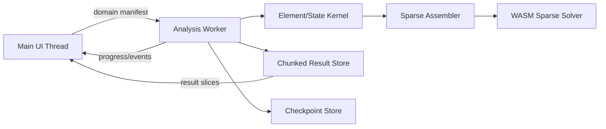

# Phase 8 Performance and Scalability Plan

```yaml
document_status: governing
runtime_target: desktop browser with Web Worker and WASM sparse backend
reference_path: deterministic dense/sparse JavaScript backend for small verification models only
```

## 1. 성능 목표

상용 수준의 비선형 해석은 알고리즘이 존재하는 것만으로 달성되지 않는다. Newton 반복마다 요소상태, 내력, 접선을 갱신하고 수천~수만 번의 time step을 처리하면서도 UI와 모델 데이터를 보호해야 한다.

Phase 8 production path는 다음을 기본 전제로 한다.

- solver는 main UI thread에서 실행하지 않는다.
- production matrix는 dense array-of-arrays가 아니다.
- 숫자 데이터는 `Float64Array`, index는 `Int32Array` 기반이다.
- sparse pattern, ordering, memory pool을 topology 단위로 재사용한다.
- 결과 history는 chunk/stream 저장하며 전체 history를 객체배열로 상주시킬 수 없다.
- 취소, checkpoint, failure가 committed-state 경계에서 동작한다.
- 작은 모델용 reference backend와 production backend의 결과를 교차검산한다.

## 2. Runtime 구조



### Main thread 책임

- 모델 transaction과 immutable domain 생성 요청
- 실행 전 capability/memory estimate 표시
- progress/cancel/restart 제어
- 선택한 result slice만 chart/viewport에 전달
- solver 내부 객체를 직접 참조하지 않음

### Worker 책임

- domain binary packing과 DOF map
- element batch evaluation
- sparse assembly/factorization/solve
- committed/trial state 관리
- convergence, cutback, event, energy audit
- checkpoint와 result chunk 생성

### WASM backend 책임

- ordering과 symbolic analysis
- SPD sparse solve (`P8-M2`: Jacobi-preconditioned CG; direct factorization은 후속 성능 qualification에서 재평가)
- pivoted symmetric-indefinite 또는 general factorization
- multi-RHS solve (`P8-M2` backend는 single-RHS이며 후속 범위)
- condition/pivot diagnostics
- 명시적 memory ownership과 release

P8-M2에서는 외부 수치 library를 도입하지 않고 저장소 내부 Rust/WASM 구현을 선택했다. 결정 근거, license 경계, zero-import build, 제한사항은 [ADR-005](adr/ADR-005-INHOUSE-WASM-SPARSE.md)에 고정한다. 외부 수치 solver 추가 또는 교체는 별도 ADR과 사용자 승인을 요구한다.

## 3. Backend 계층

| Backend | 용도 | 허용 규모 | qualification |
| --- | --- | --- | --- |
| dense-reference | 수학 unit, 작은 independent cross-check | 300 active DOF 이하 | reference only |
| js-sparse-reference | worker/API fallback와 deterministic test | 2,000 active DOF 이하 | candidate |
| wasm-sparse-spd | 안정한 elastic/초기 nonlinear tangent | production | required |
| wasm-sparse-indefinite | post-peak, arc-length, negative tangent | production | required |
| gpu-injected-general | future batched assembly/solve acceleration | unset | unavailable until deterministic float64 parity qualification |

production 실행이 dense-reference로 조용히 fallback하는 것을 금지한다. backend가 없으면 실행 전 `PRODUCTION_BACKEND_UNAVAILABLE`로 차단한다.

### 3.1 GPU 준비 경계

P8-M7은 `auto/cpu/wasm/gpu` 실행목표와 backend metadata(`executionTarget`, `numericPrecision`, `deterministic`)를 도입했다. 이는 GPU 가속 구현 완료가 아니다.

- 사용자가 `backendPreference: "gpu"`와 `gpuEnabled: true`를 지정하면 GPU family backend만 허용한다.
- GPU backend가 없으면 `GPU_BACKEND_UNAVAILABLE`, enable이 꺼져 있으면 `GPU_BACKEND_NOT_ENABLED`로 차단한다.
- production GPU는 현재 deterministic `f64`만 허용한다. 조건을 만족하지 않으면 `GPU_BACKEND_QUALIFICATION_REQUIRED`다.
- CPU/WASM으로 silent fallback하지 않는다.
- 실제 WebGPU sparse assembly/factorization, 데이터 전송비, CPU/GPU parity, 브라우저별 지원성은 별도 ADR과 performance evidence 전에는 제품 capability로 표시하지 않는다.
- arc-length의 작은 augmented solve만 GPU로 보내는 것은 전송비 때문에 이득이 없을 수 있다. GPU 검토 단위는 요소 batch 평가, assembly, 다중 RHS 또는 반복해석 전체 pipeline이다.

## 4. Sparse 구조와 cache

### 4.1 Pattern 생성

- domain topology와 constraint hash에서 CSR/CSC sparsity를 한 번 생성한다.
- element DOF scatter index를 미리 계산한다.
- symbolic factorization과 ordering은 pattern hash로 cache한다.
- numeric value와 factorization은 tangent가 바뀔 때 갱신한다.
- full Newton에서 이전 numeric factor를 재사용하지 않는다.
- modified Newton은 사용자가 선택했고 해당 step에서 tangent 고정이 trace에 기록된 경우에만 재사용한다.

### 4.2 Assembly

- global matrix zeroing 대신 value buffer generation counter 또는 block clear를 비교한다.
- element response를 structure-of-arrays batch로 평가한다.
- 임시 12x12 matrix allocation을 반복하지 않고 reusable workspace를 사용한다.
- constraint transform은 element scatter 또는 reduced assembly 중 검증된 더 효율적인 경로를 사용한다.
- reaction/recovery용 full vector는 필요 시에만 생성한다.

### 4.3 State memory

```text
committed global state
trial global state
one or bounded line-search candidate state
element committed state arrays
element trial state arrays
checkpoint delta
```

line-search 후보마다 전체 domain deep clone을 만들지 않는다. copy-on-write 또는 preallocated branch buffer를 사용한다.

### 4.4 M6.1 PMM preprocessing

PMM surface 생성은 Pushover 반복과 분리된 source-derived artifact 단계다. 기준 입력은 Phase 7 material/section/reinforcement snapshot과 result-affecting numerical options이며, topology·load·mass 변경만으로 유효한 PMM artifact를 폐기하지 않는다.

- production browser cache miss는 dedicated PMM Worker에서만 계산한다.
- 동일 source 조합 member는 한 번만 계산하고 member ID에 다시 bind한다.
- 고유 interaction 1개를 Worker run과 persistent commit의 최소 단위로 사용한다.
- memory cache는 LRU 64개를 기본 상한으로 사용한다.
- IndexedDB record는 cache key, payload hash, source hash, surface hash를 모두 검증한다.
- PMM source가 실행 중 변경되면 결과를 attach하지 않는다.
- owned Worker는 AbortSignal 수신 시 terminate하고 현재 미완료 interaction을 폐기한다.
- PMM preflight는 고유 interaction, fiber, section solve, fiber evaluation, result byte를 보수적으로 추정한다. 이 값은 계측값이 아니라 실행 차단용 estimate다.

기준 fixture `existing-rc-400x600-cold`는 격리 Node process, process-memory cache 초기화, persistent cache 비활성 조건으로 측정한다. 합격 gate는 60초이며, evidence에는 명령 전체 wall time과 PMM 함수 elapsed time을 구분해 기록한다. warm cache 검증은 section solve가 0회인지를 우선 판정하고, 최종 UI latency budget은 P8-M11 reference hardware에서 별도 확정한다.

M6.1은 angle/curvature/axial 표본 수를 줄이지 않는다. 적응형 표본은 별도 수치 qualification 없이는 성능 최적화로 사용할 수 없다.

## 5. Result 저장정책

### 5.1 Output policy

| 채널 | 기본 저장 |
| --- | --- |
| global convergence/event | 모든 accepted/rejected iteration summary |
| base/story response | 모든 saved step/time |
| selected node/member/hinge | full history |
| 전체 node/member | envelope + configured decimation |
| fiber point | selected section만 full, 나머지는 peak/state summary |
| checkpoint state | 주기 및 major event 기준 |

사용자가 모든 fiber의 모든 time step 저장을 선택하면 예상 용량과 runtime을 계산하고 hard limit를 넘으면 차단한다.

### 5.2 Chunk manifest

```js
{
  runRecordId,
  chunkSize,
  channels,
  chunks: [{ id, start, end, count, byteLength, hash }],
  envelopes,
  checkpoints,
}
```

- chart는 raw 전체를 로드하지 않고 min/max-preserving downsample slice를 요청한다.
- peak 검색은 envelope index를 사용한다.
- report는 immutable chunk hash와 주요값을 참조한다.
- browser storage quota가 부족하면 실행 전 또는 checkpoint 시점에 명시적으로 실패한다.

## 6. 대표 workload

### 구조 규모

| Tier | active DOF | element 범위 | 용도 |
| --- | ---: | ---: | --- |
| S | <= 1,000 | <= 1,500 | CI, component, 소형 portal/저층 |
| M | <= 10,000 | <= 15,000 | 일반 중층 3D 골조 production release |
| L | <= 50,000 | <= 75,000 | 확장성·메모리 qualification |

### 실행 fixture

| ID | workload |
| --- | --- |
| PERF-PUSH-S | S tier, gravity 10 step + Pushover 50 saved step |
| PERF-PUSH-M | M tier, gravity 20 step + Pushover 100 saved step |
| PERF-PUSH-L | L tier, 100 saved step, 제한된 nonlinear assignment |
| PERF-NLTH-S | S tier, 5,000 input step, 2성분 중 1성분 활성 |
| PERF-NLTH-M | 5,000 active DOF 이상, 20,000 input step |
| PERF-RESULT-M | M tier history slice, chart, envelope, report 생성 |

L-tier NLTH는 P8-S1 필수 release가 아니라 확장성 측정이다. 수치적으로 지원 가능한 범위와 사용자에게 보장하는 범위를 구분한다.

## 7. Release performance budget

절대 계산시간은 P8-M0에서 reference hardware를 고정하고 첫 baseline을 측정한 뒤 승인한다. 다음 값은 S1 최소 UX budget이며 임의로 완화할 수 없다.

| 항목 | S1 budget |
| --- | --- |
| UI input acknowledgement | solver 실행 중 p95 100 ms 이하 |
| progress update | 1초 이내 갱신, 과도한 message flooding 금지 |
| cancel acknowledgement | 2초 이내, 현재 안전경계 후 종료 |
| preflight estimate | M tier 5초 이하 |
| result popup initial render | cached summary 500 ms 이하 |
| chart pan/selection | downsampled data 기준 p95 100 ms 이하 |
| memory hard limit | 설정값 또는 사용가능 메모리의 60% 중 작은 값 |
| unexpected worker crash | model 불변, 마지막 checkpoint와 failure record 보존 |

### 계산시간 승인 절차

1. reference hardware, OS, browser, power mode, backend build를 기록한다.
2. warm-up 1회를 제외하고 fixture별 5회 실행한다.
3. median, p95, peak committed memory, result bytes를 기록한다.
4. 수렴한 동일 해만 성능표본으로 인정한다.
5. dense/reference와 production backend의 결과오차를 함께 기록한다.
6. P8-M2에서 baseline, P8-M5/M8/M11에서 regression budget을 고정한다.

초기 engineering target은 `PERF-PUSH-M <= 10분`, `PERF-NLTH-M <= 30분`, peak analysis memory `<= 1.5 GiB`다. P8-M2 baseline이 이를 충족하지 못하면 범위를 축소해 문구만 바꾸지 않고 backend/algorithm을 개선하거나 release를 차단한다.

## 8. Parallelism과 determinism

- element batch evaluation은 병렬화 가능하지만 global reduction 순서를 고정한다.
- multithread WASM은 COOP/COEP와 browser 지원을 preflight한다.
- deterministic single-thread production mode를 항상 제공한다.
- 병렬/단일 결과는 지정 norm 이내에서 일치하고 event order 차이를 정규화한다.
- race로 committed state가 두 번 갱신되지 않도록 worker 내부 run token을 사용한다.
- 한 모델에 동시에 쓰는 analysis run은 허용하지 않고 read-only 병렬 run만 별도 worker에서 허용한다.

## 9. Failure containment

| 실패 | 동작 |
| --- | --- |
| singular/indefinite pivot failure | step rollback, cutback 또는 명시 종료 |
| out-of-memory estimate | 실행 전 차단 |
| actual allocation failure | worker 종료, model 불변, failure record |
| storage quota | checkpoint/result policy 축소 안내 후 사용자 재실행 |
| corrupted chunk/hash | 해당 run qualification 차단 |
| worker crash | 마지막 committed checkpoint까지만 복구 |
| cancellation | uncommitted trial 폐기, status cancelled |
| browser tab suspend | resume 시 wall time와 checkpoint integrity 검사 |

## 10. Profiling과 telemetry

로컬 제품은 외부 전송 없이 다음 profile을 run record에 선택적으로 저장한다.

- domain build, assembly, factorization, solve, recovery, serialization 시간
- step/iteration/substep 분포
- tangent rebuild/factorization count
- element formulation별 evaluation count
- peak buffer, state, factor, result memory
- result chunk write/read bytes
- worker message count와 main-thread long task
- backend/version/thread count

profile은 수치결과와 분리하되 동일 run ID를 사용한다.

## 11. 성능 검증

| ID | 검증 |
| --- | --- |
| NL-PERF-07 | M tier에서 UI p95 input latency budget |
| NL-PERF-08 | cancel acknowledgement와 committed-state 보존 |
| NL-PERF-09 | dense production fallback 부재와 backend preflight |
| NL-PERF-10 | symbolic pattern/order reuse와 numeric refactor count |
| NL-PERF-11 | line-search/cutback에서 bounded state memory |
| NL-PERF-12 | M tier Pushover time/memory budget |
| NL-PERF-13 | M tier NLTH time/memory budget |
| NL-PERF-14 | history streaming 시 memory가 output step 수에 비례해 무제한 증가하지 않음 |
| NL-PERF-15 | chunk hash, checkpoint, restart와 연속실행 일치 |
| NL-PERF-16 | single/multithread deterministic tolerance와 event ordering |

## 12. 완료조건

- production solver가 Worker+WASM sparse backend를 사용
- M tier에서 full dense matrix 생성 0
- 실행 전 정확한 order-level memory estimate 제공
- Pushover/NLTH workload budget 통과
- main thread responsiveness와 cancel budget 통과
- checkpoint/restart와 failure containment 통과
- result streaming, downsampling, hash integrity 통과
- reference backend와 production backend의 수치 결과 일치
- performance artifact가 release manifest에 포함
