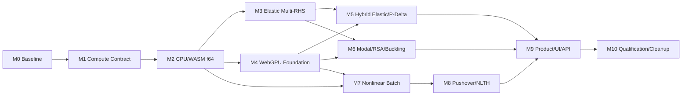

# Phase 9 Milestone Execution Plan

```yaml
version: p9-milestone-plan-v1
status: planned
milestones: [P9-M0, P9-M1, P9-M2, P9-M3, P9-M4, P9-M5, P9-M6, P9-M7, P9-M8, P9-M9, P9-M10]
active_milestone: none
```

## 1. 의존관계



M6과 M7은 각각 M3/M4와 M2/M4가 끝나면 병행할 수 있다. M8은 state·element batch가 안정되기 전 착수하지 않는다.

## 2. 공통 완료조건

모든 마일스톤은 다음을 충족해야 한다.

- scope의 production code 또는 계획된 evidence가 실제로 존재
- 새 verification ID 자동시험 통과
- 기존 관련 golden/parity와 전체 회귀 범위 통과
- performance/memory telemetry 갱신
- open Critical/High code-review finding 0
- debt inventory, public export, Agent/API와 문서 갱신
- unrelated worktree 변경 제외
- 하나의 의도적인 milestone commit 생성

kernel이 빠르다는 이유만으로 마일스톤을 완료 처리하지 않는다.

## P9-M0 - Truthful Baseline and Debt Freeze

### 목표

GPU 구현 전에 실제 병목, 수치기준, workload와 code-debt를 재현 가능한 evidence로 고정한다.

### 구현·산출물

- 실제 S/M elastic, Direct P-Delta, modal/RSA, buckling, Pushover, NLTH fixture
- operation별 wall time, count, memory와 main-thread latency
- M11 synthetic kernel과 실제 frame 측정 구분
- CPU `f64` golden result와 independent small reference
- sync API caller, sparse implementation, Worker protocol과 legacy export inventory
- Phase 9 evidence schema와 release manifest skeleton

### 최소 실행 정책

- S-tier elastic은 실제 생성한 골조 전체를 현재 solver로 계산한다.
- M/L-tier는 현재 dense allocation 위험을 숨기지 않기 위해 입력 생성, hash, DOF와 메모리 preflight까지만 수행하고 미실행 사유를 blocker로 기록한다.
- M-tier end-to-end elastic은 P9-M2/P9-M3의 sparse·multi-RHS 경로가 준비된 뒤 필수 자격 시험으로 실행한다.
- Pushover와 MDOF NLTH는 P9-M0에서 기존 Phase 8 PASS evidence를 hash 검증하며 solver를 재실행하지 않는다. 관련 compute code가 바뀌는 후속 마일스톤에서는 영향 범위 회귀를 다시 수행한다.

### 리팩토링 gate

- 파일/contract owner map 작성
- 모든 debt row에 owner와 target milestone 지정
- generated artifact retention 규칙 고정

### 검증

`P9-BASE-01~10`, `P9-REF-01`

### 완료판정

동일 명령으로 baseline이 재현되고 실제 frame total time이 단계별 합과 일치해야 한다. GPU code는 이 마일스톤 범위가 아니다.

## P9-M1 - Common Compute Contract and Async Worker

### 목표

수치알고리즘을 바꾸지 않고 탄성·비선형이 공유할 binary/backend/execution-plan/job 계약을 만든다.

### 구현·산출물

- DomainBinary, SparsePattern, StateArena, ResultChunk schema
- AnalysisExecutionPlan과 operation capability
- backend descriptor/preflight/session lifecycle
- common Worker message, progress, cancel, terminal state
- resource ledger와 telemetry schema
- current elastic/nonlinear backend adapters
- sync compatibility facade와 deprecation inventory

### 리팩토링 gate

- backend policy 중복의 공통 owner 지정
- 새 UI 또는 solver가 old Worker protocol을 추가하지 못하는 contract test
- architecture dependency test

### 검증

`P9-CMP-01~12`, `P9-API-01~03`, `P9-REF-02~03`

### 완료판정

old/new adapter가 byte-equivalent domain/pattern과 동일 결과를 반환하고 cancellation/state ownership이 통과하면 G1 `Contract-Integrated` 후보가 된다.

## P9-M2 - Unified CPU/WASM f64 Runtime

### 목표

GPU 없이도 production 성능과 유지보수성을 개선하고 탄성·비선형의 canonical compute backend를 통합한다.

### 구현·산출물

- 공통 typed CSR/CSC와 sparse diagnostics
- reusable symbolic handle와 numeric factor lifecycle
- multi-RHS WASM ABI
- bounded copy/zero-copy memory strategy
- SIMD와 optional WASM threads capability
- SPD/general solver 분리와 cooperative cancellation
- missing backend, OOM, singular failure containment

### 리팩토링 gate

- old production sparse writer 제거
- dense conversion verification allowlist
- `src/solver/sparse`와 nonlinear typed sparse의 owner 중복 해소
- memory allocation/free balance test

### 검증

`P9-CPU-01~14`, `P9-CMP-08~12`, `P9-REF-04~05`

### 완료판정

Phase 7·8 CPU 결과 parity, M-tier memory, no-dense/no-fallback와 single/multi-RHS 일치가 통과해야 한다.

## P9-M3 - Elastic Execution Plan, Factor Groups and Multi-RHS

### 목표

탄성해석을 async Worker production 경로로 옮기고 동일 stiffness 조합의 중복 조립·분해를 제거한다.

### 구현·산출물

- `analyzeModel` 책임 분리
- stiffness/factor group classifier
- multi-combination RHS assembly와 solve
- recovery/envelope/design/audit parity
- support settlement, unilateral active set, P-Delta invalidation rule
- elastic job progress/cancel/result slices
- small-model sync compatibility boundary

### 리팩토링 gate

- UI/Agent production 호출이 product service를 사용
- linear orchestrator의 validation/dynamics/design 직접 책임 분리
- sync caller count와 제거계획 갱신

### 검증

`P9-ELA-01~16`, `P9-API-04~06`, `P9-PERF-01~04`

### 완료판정

모든 조합·포락·설계상태가 기존과 일치하고 factorization count가 group 수와 일치해야 한다. CPU M-tier total runtime 회귀가 없어야 한다.

## P9-M4 - WebGPU Platform and Independent Batch Kernels

### 목표

해석결과와 분리된 GPU platform, resource lifecycle와 독립 kernel을 G2 수준으로 검증한다.

### 구현·산출물

- adapter/device/feature/limit preflight
- error scope, queue completion, device-loss와 resource disposal
- buffer pool, staging/readback과 segmented storage
- vector, reduction, CSR SpMV, scaling/preconditioner kernel
- PMM/fiber independent sample batch
- deterministic reduction candidate 비교
- CPU/GPU microbenchmark와 raw parity evidence

### 리팩토링 gate

- GPU API가 compute backend 아래에만 존재
- shader source/build/version owner 단일화
- per-dispatch allocation과 unbounded buffer cache 금지

### 검증

`P9-GPU-PLT-01~12`, `P9-GPU-NUM-01~14`, `P9-PERF-05~07`

### 완료판정

G2 `Kernel-Qualified`까지만 허용한다. 이 단계 GPU kernel을 설계결과에 연결하지 않는다.

## P9-M5 - Hybrid Elastic Static and Direct P-Delta

### 목표

지원 SPD 범위의 탄성·Direct P-Delta를 mixed precision과 CPU f64 audit로 production 후보화한다.

### 구현·산출물

- conditioning/scaling eligibility
- GPU f32 preconditioned solve
- CPU f64 residual과 iterative correction
- elastic element local-matrix batch
- factor group별 GPU/CPU operation plan
- design/envelope parity와 explicit GPU failure behavior
- auto-selection threshold와 profile lookup

### 리팩토링 gate

- 별도 GPU elastic orchestrator 금지
- CPU/GPU recovery와 design path 단일화
- old duplicated matrix conversion 제거

### 검증

`P9-GPU-ELA-01~16`, `P9-PERF-08~10`, `P9-FAIL-01~04`

### 완료판정

지원 fixture에서 CPU f64 residual·status parity와 end-to-end speed threshold가 통과하면 G3 `Elastic-Candidate`다. ill-conditioned/general case는 정확히 CPU route 또는 차단돼야 한다.

## P9-M6 - Sparse Modal, RSA and Buckling

### 목표

dense full-matrix 의존을 줄이고 requested-mode sparse operator를 공통 compute architecture에 연결한다.

### 구현·산출물

- K/M/Kg operator와 eigen backend contract
- sparse Lanczos/subspace 또는 승인된 requested-mode algorithm
- optional GPU SpMV/block-vector operation
- mode sign/order canonicalization과 MAC
- participation, CQC/SRSS, buckling recovery의 CPU f64 audit
- rigid/mechanism mode와 convergence diagnostics

### 리팩토링 gate

- modal/buckling에서 eigen solver와 구조 recovery 분리
- dense path를 small-reference allowlist로 제한
- duplicated Cholesky/submatrix helper 정리

### 검증

`P9-GPU-EIG-01~14`, `P9-PERF-11`, `P9-REF-06`

### 완료판정

요청 mode 수, eigenpair correlation, participation/RSA/buckling result와 eligibility가 CPU 기준과 일치해야 한다.

## P9-M7 - Nonlinear SoA Batch and GPU State Arena

### 목표

비선형 element/fiber inner loop를 CPU batch로 먼저 정리하고 검증된 종류를 GPU state arena에 연결한다.

### 구현·산출물

- type/property별 SoA element/fiber batch
- reusable local workspace와 state offset table
- batch validation과 bounded hash
- committed/trial GPU state arena
- deterministic assembly reduction
- support matrix class와 capability partition
- CPU batch, GPU batch와 기존 element contract parity

### 리팩토링 gate

- per-element deep clone과 nested temporary matrix 제거
- batch owner와 adapter expiry 지정
- element formulation을 compute backend에서 분리

### 검증

`P9-GPU-NL-01~10`, `P9-REF-07~09`, `P9-PERF-12`

### 완료판정

element force/tangent/state/energy와 rollback byte parity가 통과하고 unsupported 조합이 정확히 분리돼야 한다.

## P9-M8 - Hybrid Pushover and MDOF NLTH

### 목표

GPU resident element/fiber state를 production Pushover/NLTH에 연결하고 transfer·checkpoint·device-loss를 검증한다.

### 구현·산출물

- gravity checkpoint부터 resident session 생성
- Pushover iteration과 NLTH substep operation route
- bounded host-device transfer와 saved-boundary readback
- CPU f64 residual/energy audit
- general solve CPU/WASM coupling
- device-loss, OOM, cancel, restart와 checkpoint integrity
- capacity/history/story/member/hinge/fiber result parity

### 리팩토링 gate

- static/dynamic element kernel 단일화 유지
- GPU 전용 checkpoint/result schema 금지
- transfer와 correction helper 중복 제거

### 검증

`P9-GPU-NL-11~24`, `P9-FAIL-05~10`, `P9-PERF-13~15`

### 완료판정

S/M Pushover·NLTH의 state·event·energy·result parity와 device failure containment가 통과하면 G4 `Nonlinear-Candidate`다.

## P9-M9 - Product Workflow, UI and Agent/API

### 목표

사용자가 자동/CPU/GPU 실행을 정확히 이해하고 같은 product service를 UI와 Agent에서 사용할 수 있게 한다.

### 구현·산출물

- capability와 hardware profile 화면
- 자동/CPU 정밀/GPU 가속 segmented control
- unavailable/blocked reason과 remediation
- operation route, correction, audit와 qualification 결과표시
- elastic/nonlinear progress·cancel·retry·history 통합
- calculation report와 raw telemetry export
- Agent/MCP validate/plan/run/status/result 계약
- sync API deprecation UI/API 처리

### 리팩토링 gate

- UI의 직접 solver/backend 호출 0
- elastic/nonlinear duplicate job/result control 제거
- public export와 Agent manifest 정리

### 검증

`P9-UI-01~12`, `P9-API-07~14`, `P9-REF-10`

### 완료판정

UI·Agent settings bytes, plan hash, run/result가 일치하고 unsupported GPU가 기능처럼 표시되지 않아야 한다.

## P9-M10 - Qualification, Cleanup and Release Gate

### 목표

필수 hardware/browser matrix를 검증하고 남은 compatibility/debt를 정리해 production compute release를 판정한다.

### 구현·산출물

- CPU-only, integrated/discrete multi-vendor와 device-loss evidence
- S/M/L end-to-end performance report
- CPU/GPU numerical comparison artifact
- full regression과 package/build
- deprecated caller, duplicate sparse/helper와 dead export 제거
- final debt/risk/code review
- fail-closed G0~G5 release manifest
- 운영·사용자·Agent 문서 갱신

### 리팩토링 gate

- owner 없는 debt 0
- expired compatibility caller 0
- architecture/dependency violation 0
- generated artifact hygiene 통과

### 검증

`P9-REL-01~12`, `P9-PERF-16~20`, `P9-REF-11~14`

### 완료판정

필수 evidence가 없으면 구현이 완료돼도 G5와 design transfer를 부여하지 않는다. Phase 8 외부 해석검증은 별도 gate로 남는다.

## 3. 사용자 판단이 필요한 변경

다음은 구현 중 자동 결정하지 않는다.

- 외부 수치/GPU library 도입과 license
- production f32-only 허용 또는 tolerance 완화
- native sidecar와 설치구조 변경
- public API의 호환성 파괴
- 지원 browser/GPU 범위 축소
- hardware budget 또는 auto-selection 기준 완화
- Phase 8 qualification 상태 변경

## 4. 상태 갱신 규칙

`IMPLEMENTATION_STATUS.md`는 실제 commit과 evidence가 생긴 뒤 한 마일스톤씩 갱신한다. 여러 마일스톤을 한꺼번에 complete로 표시하지 않는다. 각 마일스톤 종료 후 codebase review와 milestone commit을 기록한다.
