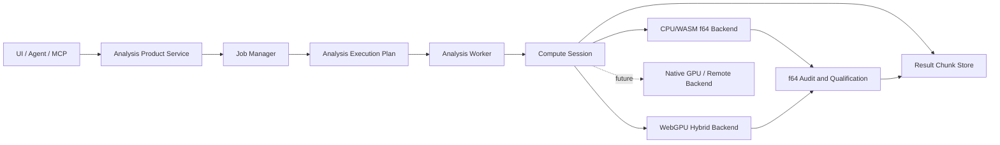

# Phase 9 Target Architecture

```yaml
version: p9-target-architecture-v1
status: proposed
architecture_style: worker-owned operation-routed hybrid compute
canonical_precision: cpu-wasm-f64
```

## 1. 목표 구조



UI와 API는 backend를 직접 호출하지 않는다. 제품 서비스가 analysis case를 검증하고 `AnalysisExecutionPlan`을 만든 뒤 Worker가 하나의 `ComputeSession`을 소유한다. backend는 element evaluation, assembly, solve, eigen, reduction 같은 operation을 제공하며 결과 schema와 해석 의미를 소유하지 않는다.

## 2. 계층별 책임

| 계층 | 책임 | 금지 |
| --- | --- | --- |
| UI / Agent | 사용자 의도, capability 표시, job 제어 | GPU API 직접 호출 |
| Product service | case validation, execution plan, qualification | 행렬·요소 내부 구현 |
| Job manager | queue, progress, cancel, retry, checkpoint | backend별 결과 schema |
| Analysis Worker | domain packing, state, operation orchestration | main-thread 계산 위임 |
| Compute session | buffer residency, route, lifecycle, telemetry | model 의미 변경 |
| Backend | 선언한 operation의 수치계산 | silent fallback, 결과 승인 |
| Audit | CPU f64 잔차·평형·에너지·parity | 미검증 결과 승격 |
| Result store | chunk, envelope, hash, paging | solver object 참조 유지 |

## 3. AnalysisExecutionPlan

plan은 실행 전에 확정되고 immutable하다.

```js
{
  version,
  runId,
  caseId,
  domainHash,
  workloadClass,
  userPolicy: 'auto' | 'cpu' | 'gpu',
  operations: [
    {
      id,
      kind,
      backendId,
      executionTarget,
      precision,
      matrixClass,
      qualification,
      estimatedBytes,
      reason
    }
  ],
  correctionPolicy,
  auditPolicy,
  fallbackPolicy,
  planHash
}
```

### 불변조건

- 같은 `planHash`는 같은 model/case/backend build와 operation route를 의미한다.
- `gpu` 명시 요청에서 GPU operation이 하나라도 필수인데 사용할 수 없으면 plan 생성이 실패한다.
- `auto`는 CPU를 정상 선택할 수 있으며 선택 근거를 기록한다.
- 실행 중 device loss는 plan을 몰래 변경하지 않는다. 기존 run은 실패 또는 checkpoint 종료되고 새 run으로 재계획한다.
- qualification이 다른 backend로 restart하면 새 run ID와 provenance edge를 만든다.

## 4. ComputeBackend 계약

backend descriptor는 다음 capability를 선언한다.

```js
{
  id,
  buildHash,
  family: 'wasm-cpu' | 'webgpu-hybrid' | 'native-gpu' | 'reference',
  production,
  precisionModes,
  deterministicScope,
  matrixClasses,
  operations,
  limits,
  qualification
}
```

필수 lifecycle:

```text
describe -> preflight -> createSession -> upload/prepare
         -> execute operation(s) -> read audit/result slice
         -> checkpoint/cancel -> dispose
```

필수 operation capability:

| Operation | 입력 | 출력 |
| --- | --- | --- |
| `elementBatch` | kinematics, properties, committed state | resisting force, tangent, trial state |
| `assembleSparse` | pattern, scatter, element blocks | numeric sparse values |
| `solveSpd` | sparse matrix, RHS batch | solution, residual diagnostics |
| `solveGeneral` | general/indefinite matrix, RHS | pivoted solution diagnostics |
| `eigenSymmetric` | K/M operator, mode request | eigenpairs and convergence |
| `reduceEnvelope` | result channel batch | min/max/governing indices |
| `fiberBatch` | strain state, fiber/material arrays | section force/tangent/state |

모든 backend가 모든 operation을 제공할 필요는 없다. router는 capability와 qualification이 있는 operation만 선택한다.

## 5. Versioned binary data contracts

### 5.1 DomainBinary

canonical analysis domain을 계산용 Structure-of-Arrays로 pack한다.

```text
DomainBinary
├─ node coordinates and DOF maps
├─ element type and connectivity
├─ local axes, offsets and releases
├─ material/section property tables
├─ constraint transform and prescribed values
├─ load and mass source tables
├─ nonlinear property and assignment tables
└─ origin map and component hashes
```

문자열 ID는 dictionary table로 분리하고 inner loop는 integer index만 사용한다. pack 결과는 schema version, byte length, endianness, unit system과 hash를 가진다.

### 5.2 SparsePattern

하나의 symbolic owner가 다음을 생성한다.

- CSR/CSC pointer와 index typed arrays
- symmetric storage policy
- element scatter index와 coefficient
- constraint reduction map
- permutation과 ordering
- pattern hash와 factor group key

backend가 독자적인 topology interpretation을 만들 수 없다.

### 5.3 StateArena

```text
StateArena
├─ committed global vectors
├─ trial global vectors
├─ element committed arrays
├─ element trial arrays
├─ material/fiber state arrays
├─ line-search workspace
└─ checkpoint staging buffer
```

state layout은 element type별 fixed header와 variable slab로 구성한다. commit은 pointer/index swap 또는 bounded copy로 수행하고 deep clone을 금지한다.

### 5.4 ResultChunk

result는 backend 독립 canonical units로 기록한다. GPU buffer를 UI가 직접 참조하지 않는다. chunk에는 channel schema, start/end index, extrema, provenance, byte length와 hash가 포함된다.

## 6. ComputeSession

session은 한 run의 계산자원 owner다.

- Worker 하나가 session을 생성·폐기한다.
- domain과 pattern은 run 동안 immutable하다.
- stiffness/factor/state/result workspace는 operation별 residency를 가진다.
- device buffer와 WASM allocation은 resource ledger에 등록한다.
- cancel은 token만 바꾸지 않고 backend safe point와 state discard를 확인한다.
- session 종료 시 resource ledger가 0이 아니면 leak failure를 기록한다.

한 model에 대한 read-only run은 별도 session으로 병렬 실행할 수 있지만 같은 committed project state를 두 run이 수정할 수 없다.

## 7. Backend routing

### `cpu`

- 모든 production 지원범위의 canonical path
- deterministic WASM `f64`
- GPU capability와 무관

### `gpu`

- 사용자가 명시적으로 선택
- 필요한 GPU operation과 correction path가 모두 qualification되어야 함
- 미지원 matrix class 또는 device limit에서 실행 전 차단
- CPU `f64` audit/correction은 선언된 hybrid algorithm의 일부이며 fallback이 아님

### `auto`

router는 다음 순서로 판단한다.

1. 해석기능 qualification과 matrix class
2. device·precision·memory capability
3. workload threshold와 예상 전송비
4. 해당 hardware profile의 검증된 성능
5. CPU correction과 audit 가능 여부

예상 end-to-end 개선이 없거나 profile이 없으면 CPU를 선택한다.

## 8. CPU/WASM backend

기존 Phase 8 WASM backend를 공통 production 기준으로 승격하되 다음 operation을 추가한다.

- reusable symbolic handle
- numeric factor handle과 명시적 invalidation
- multi-RHS solve
- typed buffer zero-copy 또는 bounded-copy ABI
- cooperative cancellation safe point
- SIMD와 선택적 WASM threads
- SPD/general capability와 diagnostics 분리

일반/부정정 solver는 GPU 구현 여부와 무관하게 유지한다. CPU backend는 fallback이 아니라 완전한 production target이다.

## 9. WebGPU hybrid backend

### 첫 지원 operation

- PMM/fiber independent sample batch
- elastic frame/truss local matrix batch
- nonlinear element/fiber response batch 중 상태가 정형화된 종류
- CSR SpMV와 vector kernels
- Jacobi/block-Jacobi preconditioner
- envelope/min/max reduction

### 첫 범위에서 제외

- pivoted general sparse LU 전체
- 비결정 float atomic을 이용한 직접 global scatter
- host readback이 매 Newton iteration 필요한 분절 pipeline
- CPU audit 없이 완결되는 design solve

global assembly는 element-coloring, sorted contribution buffer와 segmented reduction 중 수치·성능 검증을 통과한 방식을 사용한다. reduction order는 run record에 남긴다.

## 10. 향후 backend 확장

native CUDA/HIP/Vulkan, remote HPC 또는 새 CPU solver는 같은 descriptor/session/operation 계약을 구현한다. 다음은 금지한다.

- backend 전용 model schema
- backend 전용 analysis case
- backend마다 다른 member/result ID
- UI에서 vendor API 직접 호출
- 공통 audit를 우회하는 `trusted` flag

외부 library를 사용하는 backend는 license inventory와 별도 ADR이 필요하다.

## 11. 탄성 실행 흐름

```text
model validation
  -> canonical domain and binary pack
  -> combination stiffness grouping
  -> one symbolic pattern per group
  -> one numeric factor or iterative operator per group
  -> multi-RHS solve
  -> displacement/reaction/member recovery
  -> envelope and design checks
  -> f64 equilibrium audit
  -> result chunks and report
```

support settlement, unilateral active set, Direct P-Delta tangent처럼 stiffness가 바뀌는 조건은 잘못된 factor group에 포함하지 않는다.

## 12. Modal/RSA/Buckling 흐름

고유치 해석은 full dense matrix가 아닌 operator contract를 사용한다.

- `K*x`, `M*x` 또는 factorized shift-invert operation
- requested mode count와 convergence tolerance
- rigid-body/constraint mode filtering
- mass normalization과 participation recovery는 CPU `f64` audit
- mode sign/order canonicalization

GPU는 SpMV와 block vector operation을 가속할 수 있지만 eigenpair acceptance는 CPU 기준과 비교한다.

## 13. Pushover/NLTH 흐름

```text
gravity checkpoint
  -> resident domain/pattern/state upload
  -> element/fiber trial evaluation
  -> deterministic sparse assembly
  -> solve/correction
  -> CPU f64 residual and convergence audit
  -> commit or rollback
  -> bounded result/checkpoint chunk
```

첫 hybrid 구현은 element/fiber batch만 GPU에 두고 general solve는 CPU/WASM에 둘 수 있다. operation boundary와 transfer cost가 telemetry에 남아야 한다. 충분한 evidence 없이 전체 해석을 `GPU`라고 표시하지 않는다.

## 14. 오류와 복구

| 오류 | 동작 |
| --- | --- |
| GPU unavailable | 명시 GPU는 차단, auto는 새 plan에서 CPU 선택 가능 |
| device lost | run 실패, trial 폐기, canonical checkpoint 보존 |
| buffer limit/OOM | 실행 전 차단 또는 run 실패, 자동 workload 축소 금지 |
| precision gate 실패 | 명시 GPU는 design-blocked, auto는 새 CPU run 제안 |
| residual correction 실패 | GPU 결과 폐기, committed state 불변 |
| backend trap | failure record와 resource disposal, model 불변 |
| result hash mismatch | run qualification 차단 |

## 15. Public API migration

production API는 모두 job 기반 비동기 계약을 사용한다.

```text
validate -> create plan -> start -> status/progress
         -> pause/cancel/restart -> result slice/report
```

기존 sync `analyzeModel` 호출은 small-model compatibility로 제한하고 owner와 제거 마일스톤을 기록한다. UI, Agent, test fixture가 production async service를 우회하지 못하도록 public export를 정리한다.

## 16. 권장 모듈 경계

```text
src/compute/
├─ contracts/
├─ domain-binary/
├─ sparse/
├─ execution-plan/
├─ runtime/
├─ backends/wasm-cpu/
├─ backends/webgpu/
├─ audit/
└─ telemetry/

src/solver/
├─ elastic/
├─ pdelta/
├─ dynamics/
└─ recovery/

src/nonlinear/
├─ elements/
├─ fiber/
├─ equilibrium/
├─ dynamics/
└─ product/
```

`src/compute`는 구조공학 의미를 소유하지 않는다. 요소·해석 알고리즘은 기존 domain module에 남고 compute layer에는 typed operation과 자원관리만 둔다.

## 17. Dependency rule

```text
core/model -> solver/nonlinear formulation -> compute contracts
           -> product service -> UI/Agent

compute backend -> compute contracts only
UI/Agent        -> product service only
```

backend가 UI, catalog, design report 또는 project persistence를 import하면 architecture violation이다.

\n