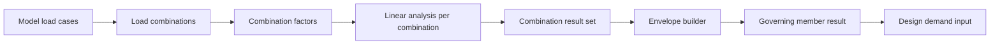

# M4 Load Combination And Envelope

문서 버전: 0.1  
작성일: 2026-06-24  
대상: S-Structures M4 하중조합 및 포락

## 1. 목적

M4의 목적은 선형 탄성해석 결과를 단일 하중케이스 수준에서 벗어나 하중조합과 포락 결과로 확장하는 것이다. 이 단계부터 설계검토 모듈은 단일 결과가 아니라 조합별 결과와 부재별 지배값을 입력으로 받을 수 있다.

## 2. 구현 범위

이번 단계에서 구현한 범위:

- 하중조합 추가, 수정, 삭제 유틸리티
- factor 문자열 파서와 표시 포맷
- 조합별 해석 결과에 조합 메타데이터 보존
- 포락 결과의 source combination 목록 보존
- 부재별 축력, 전단력, 비틀림, 휨모멘트 포락값 산출
- 부재별 지배 조합, 지배 위치, 지배 검토비 추적
- M3 화면의 조합 편집 패널
- Envelope 또는 개별 조합 결과 선택
- 부재 테이블의 지배 조합 표시

## 3. 주요 파일

- [combinations.js](</C:/Users/mill/Downloads/dcr/S-Structures-main/src/core/combinations.js>)
- [linear3d.js](</C:/Users/mill/Downloads/dcr/S-Structures-main/src/solver/linear3d.js>)
- [m3State.js](</C:/Users/mill/Downloads/dcr/S-Structures-main/src/ui/m3State.js>)
- [m3App.js](</C:/Users/mill/Downloads/dcr/S-Structures-main/src/ui/m3App.js>)
- [m4-combinations.mjs](</C:/Users/mill/Downloads/dcr/S-Structures-main/tests/m4-combinations.mjs>)

## 4. 데이터 흐름



## 5. 포락 결과 구조

포락 결과는 기존 해석 결과와 같은 형태를 유지하되, 다음 추적 정보를 추가한다.

```js
{
  isEnvelope: true,
  sources: [
    { id: "CO1", name: "1.0D + 1.0L", type: "strength", factors: { D: 1, L: 1 } }
  ],
  governing: {
    maxDisplacement: { comboId: "CO1", comboName: "1.0D + 1.0L", value: 0.003 },
    maxUtilization: { memberId: "M4", comboId: "CO1", comboName: "1.0D + 1.0L", ratio: 0.42 }
  },
  memberResults: {
    M4: {
      governing: {
        utilization: { comboId: "CO1", comboName: "1.0D + 1.0L", x: 3.0, ratio: 0.42 },
        quantities: {
          Mzmax: { comboId: "CO1", comboName: "1.0D + 1.0L", x: 3.0, value: 144 }
        }
      }
    }
  }
}
```

## 6. 완료 기준

M4 완료 기준:

- 조합 factor가 실제 해석 하중에 반영된다.
- 조합별 결과와 포락 결과를 구분해서 조회할 수 있다.
- 포락 결과가 지배 조합과 지배 위치를 보존한다.
- 화면에서 조합을 추가, 수정, 삭제할 수 있다.
- 설계검토 단계에서 사용할 member demand 입력이 준비된다.

## 7. 검증

검증 명령:

```powershell
npm.cmd run test:m4
```

검증 항목:

- `D=1.2, L=1.6` factor 문자열 파싱
- 조합 추가, 수정, 삭제
- 조합별 총 하중 값
- 포락 source combination 보존
- 최대 검토비의 지배 조합 추적
- UI 상태 모듈의 조합 저장, 추가, 삭제
