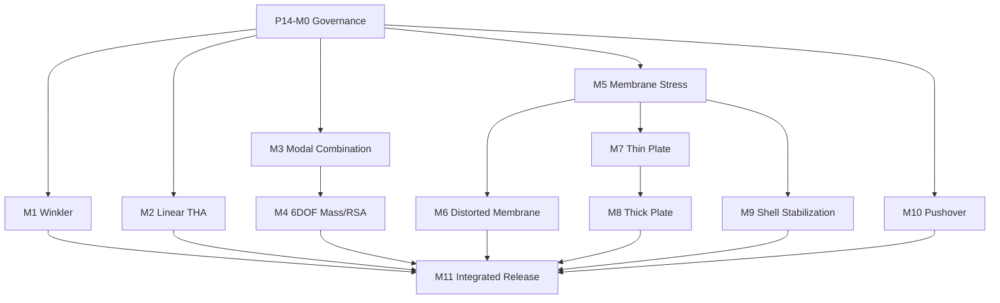

# Phase 14 Milestone Execution Plan

```yaml
version: p14-milestone-plan-v1
plan_status: proposed
created_at: 2026-08-27
active_milestone: none
next_milestone: P14-M0
implementation_started: false
status_authority: docs/phase14/IMPLEMENTATION_STATUS.md
```

## 0. 실행 원칙

이번 문서 작성은 개발 착수가 아니다. benchmark 모델·결과도 생성하지 않는다. 구현은 P14-M0에서 기준 commit/build와 requirement·reference·tolerance 계약을 승인한 뒤 시작한다.

각 milestone은 두 lane을 가진다.

```text
Development lane: schema → engine → result → CLI/Agent/UI/report
Qualification lane: invariants → metamorphic → independent reference → cross-solver → release
```

`implementation-complete`는 Development lane 완료다. benchmark PASS는 최소 `independently-qualified`이며, 제품 릴리스는 migration·failure·NFR·review까지 추가로 필요하다.

## 1. 의존관계



M1·M2·M3와 M5 shell foundation은 코드 owner 충돌이 없을 때 병렬 구현할 수 있다. M10은 nonlinear state와 Phase 8 자산 audit가 끝난 뒤 별도 branch/feature flag로 진행한다.

## 2. 공통 개발 사이클

1. 작업트리와 사용자 변경·기준 commit/build를 기록한다.
2. requirement, risk, reference, tolerance와 test ID를 동결한다.
3. 실패 fixture와 feature-off baseline을 먼저 만든다.
4. schema/migration/hash → math kernel → assembly → recovery → product surface 순으로 구현한다.
5. production 함수와 independent expected generator의 import graph를 분리한다.
6. unit → contract → numeric invariant → metamorphic → integration → UI/API/report → failure → performance 순으로 시험한다.
7. code review와 evidence hash 검증 후 implementation 상태만 승격한다.
8. benchmark는 개발 완료 뒤 frozen manifest로 실행한다.
9. 차이는 숨기지 않고 discrepancy record로 남긴다.
10. full mandatory regression이 끝나기 전 release를 주장하지 않는다.

## P14-M0 — Governance·Baseline

### 목표

Phase 13 contract를 소비 가능한 기준선으로 고정하고 Phase 14 capability·reference·evidence 상태기계를 만든다.

### 구현

- current worktree/commit/build/test inventory
- `CapabilityQualificationRecord`, `ReferenceRecord`, `ToleranceManifest`, `DiscrepancyRecord`
- impact map과 qualification stale propagation
- Phase 14 runner/evidence schema/manifest validator
- external solver runtime dependency audit
- docs/STATUS/PROGRAM_OVERVIEW 간 모순 inventory

### 완료조건

- requirement-risk-verification-reference 추적률 100%
- Phase 13 public contract·mandatory regression inventory 누락 0
- uncommitted/untracked baseline을 release source로 오인 0
- benchmark expected production import 0
- P13 qualification backlog를 P14 PASS로 대체하는 행 0

## P14-M1 — Distributed Winkler Foundation

### 목표

SB7에 필요한 연속 선형 탄성지반을 frame 자체 요소 경로에 production 기능으로 추가한다.

### 구현

- `foundationProperties[]`, member assignment, unit derivation·migration
- EB/Timoshenko `∫NᵀkN dx`, 3D local/global assembly
- structural/foundation/total local matrix 분리와 release·offset·partial-fixity coupling
- structural member force와 soil reaction의 분리 recovery
- reaction/resultant/centroid/energy, global force·moment 평형
- property/element/factor/wire hash와 stale invalidation
- full/stiffness-only/modal/P-Delta, dense/sparse/cache parity
- CLI·Agent API·Inspector·diagram·report

### 개발 완료조건

- `k=0` feature-off baseline 무회귀
- analytical Hermite matrix parity, symmetry/PSD, unit/rotation/member-reversal 시험
- force·moment equilibrium, energy closure와 recovery owner 분리
- foundation 변경 시 stale result·factor·qualification invalidation
- save/reopen/undo/failure/performance PASS

### 후속 자격

개발 완료 후 exact continuum → mesh refinement → SB7 → MIDAS/STRIX 순으로 실행한다.

## P14-M2 — THA Qualification & Modal Damping

### 목표

이미 구현된 MDOF Newmark·ground-motion interpolation·Rayleigh 경로를 재사용하고, modal damping·독립 dt 수렴·제품 자격을 완성한다.

### 구현

- ground motion canonical series와 unit/sign/interpolation validation
- modal damping `C=MΦ diag(2ζω)ΦᵀM`, Rayleigh snapshot와 `Kref` policy
- 기존 MDOF Newmark coordinator의 cancellation/checkpoint hardening
- u/v/a/reaction/energy/peak result query
- dt convergence runner와 report surface

### 개발 완료조건

- zero excitation zero response
- undamped free-vibration energy bound
- SDOF closed-form independent test와 dt² order
- modal vs direct/Rayleigh cross-path consistency
- long-record cancellation, memory, partial publish 0

### 후속 자격

TH1 excitation sample hash를 확보한 경우에만 frozen input을 재현한다. 미확보 시 `TH1-SS` exact/RK4 fixture를 먼저 자격화하고 공개 peak 전사 비교는 차단한다.

## P14-M3 — Modal Combination Completion

### 목표

SR2가 요구하는 ABS·NRC-10%를 signed modal contribution과 trace를 보존하며 추가한다.

### 구현

- `modalCombination.js`로 SRSS/CQC owner를 추출·정리
- ABS·NRC10 enum, formulas, close-mode grouping
- scalar/vector/member response 공통 combination contract
- mode별 contribution·correlation/group trace
- UI/Agent/report method·damping·mode set 표시

### 개발 완료조건

- single-mode에서 네 방식 동일
- same-sign/opposite-sign synthetic vectors와 permutation invariance
- NRC close-mode boundary·CQC close frequency 안정성
- 기존 SRSS/CQC numeric regression

### 후속 자격

SR2의 4 periods·4 roof responses와 MIDAS/STRIX 비교는 개발 완료 뒤 실행한다.

## P14-M4 — 6-DOF Mass & RSA Member Recovery

### 목표

SR2b의 명시적 회전질량과 Ux/Uy/Rz·가새축력 RSA를 동일 mass/mode/result owner에서 계산한다.

### 구현

- 기존 nonlinear path와 공통인 6성분 `node.mass=[mx,my,mz,jx,jy,jz]` schema·unit·migration
- full 6DOF lumped mass matrix와 rigid diaphragm `TᵀMT`
- direct inertia와 offset translational mass dedup audit
- rotational modal DOF·mode normalization·eigen residual
- nodal Ux/Uy/Rz, frame/truss force modal recovery와 combination

### 개발 완료조건

- analytical eccentric point-mass reduction parity
- direct Izz와 symmetric offset mass 등가시험
- total translational mass·polar inertia conservation
- member force equilibrium·mode sign/permutation invariance
- existing translational-only model 무회귀

### 후속 자격

SR2b 2 frequencies·roof 9 responses·member 9 forces를 frozen manifest로 실행한다.

## P14-M5 — Membrane Stress Qualification Surface

### 목표

QM6-EAS를 NAFEMS LE1 같은 curved membrane stress benchmark에 적용할 수 있도록 geometry→mesh→probe→convergence 제품 경로를 만든다.

### 구현

- deterministic quad mesh/refinement lineage와 curved-boundary approximation audit
- plane-stress material·thickness·local-axis contract
- 임의 `(xi,eta)`/Gauss 위치의 integration-point/raw/extrapolated/averaged stress result 구분
- in-plane consistent edge traction과 resultant/moment audit
- point/edge probe와 mesh-level comparison
- contour·table·report provenance

### 개발 완료조건

- patch/rigid/body rotation/Jacobian/energy regression
- stress probe가 node order·element order·rotation·unit에 불변
- invalid curvature/aspect/Jacobian fail-closed
- mesh load/resultant equilibrium

### 후속 자격

SB2 refinement series와 R2/R4 비교는 M5 implementation 후 수행한다.

## P14-M6 — Distorted Membrane Robustness

### 목표

왜곡 quadrilateral에서 in-plane bending/shear와 drilling stabilization이 물리응답을 오염시키지 않게 한다.

### 구현

- Cook membrane deterministic mesh family
- distortion metric·quality budget·warning/block policy
- mid-edge response probe와 normalized result
- enhanced mode/drilling energy provenance
- distortion sweep·orientation/reversal regression

### 개발 완료조건

- regular patch 무회귀
- mesh distortion 증가 시 NaN·negative Jacobian·false PASS 0
- reflected/rotated normalized response parity
- displacement·energy convergence lineage 보존

### 후속 자격

SB3 64×64 reference는 개발 완료 후 실행하고, 단일 fine mesh가 아니라 refinement trend까지 판정한다.

## P14-M7 — Thin Plate Bending Completion

### 목표

MITC4 plate의 support/load/result 경로를 얇은 판 8개 configuration에 적용 가능한 production 기능으로 닫는다.

### 구현

- hard/soft simply-supported와 clamped boundary templates
- uniform pressure consistent vector와 central point load contract
- center displacement·plate moment/shear result
- dimensionless coefficient calculator는 result/report layer에 구현
- 1:1·5:1 mesh/refinement templates

### 개발 완료조건

- pressure resultant·centroid moment, point load exact resultant
- rigid-body/patch/thin-limit/rotation/unit 시험
- support template DOF preview와 direct constraints parity
- coefficient 계산이 production displacement와 별도 reference를 섞지 않음

### 후속 자격

SB5의 8개 계수와 MIDAS/STRIX 비교는 M7 implementation 후 수행한다.

## P14-M8 — Thick Plate Transverse Shear

### 목표

MITC4가 `a/t=50…5` 범위에서 Reissner-Mindlin transverse shear를 안정적으로 재현하도록 formulation·criteria·result를 닫는다.

### 구현

- shear correction factor와 constitutive provenance
- thickness/aspect qualification envelope
- bending/shear energy split과 locking diagnostic
- thin-limit SB5 recovery와 thick-plate refinement report
- out-of-envelope fail/warn policy

### 개발 완료조건

- thickness scaling, shear factor sensitivity, energy positivity
- thin limit에서 M7 결과로 수렴
- aspect ratio/Jacobian limits와 mesh refinement monotonicity
- feature-off·thin plate regression

### 후속 자격

SB6의 6개 계수와 R1/R4 비교는 M8 implementation 후 수행한다.

## P14-M9 — Shell Stabilization Qualification

### 목표

S-Structures 고유 drilling stabilization이 spurious mode만 제거하고 물리 모드·정적응답을 오염시키지 않는지 제품 수준으로 판정한다.

### 구현

- `drillingAlpha` canonical criteria, allowed range와 default provenance
- parameter sweep runner, modal classification과 physical-mode tracking
- stabilization/physical energy ratio와 mode-shape correlation
- auto-tune 금지 또는 별도 승인 ADR
- S-Structures-specific report/claim label

### 개발 완료조건

- 2-order sweep에서 physical period·static response tolerance
- zero-energy mechanism removal
- mode swapping을 단순 mode number 비교로 오판하지 않는 correlation
- STRIX parameter name/result를 직접 재사용 0

### 후속 자격

P3S2와 장르 비교는 가능하지만 동일 benchmark PASS가 아니라 `analogous custom qualification`으로 기록한다.

## P14-M10 — Pushover Qualification & Hardening

### 목표

기존 `runProductionPushover`의 current-step consistent tangent, displacement control과 optional arc-length를 재사용하고 CSI-neutral moment-hinge fixture, 외부 qualification과 post-peak failure safety를 완성한다.

### 구현

- 기존 residual/tangent/step transaction·strategy의 independent audit
- benchmark-neutral explicit M-θ backbone·elastic body stiffness·control contract
- adaptive increment, cutback, rollback, checkpoint hardening
- hinge trial/commit/revert, base reaction/control displacement/energy provenance
- false convergence·limit/snap-through/back reason code
- UI/Agent step monitor, cancel/resume, report

### 개발 완료조건

- linear limit와 single-hinge closed-form
- multi-hinge simultaneous yielding and equilibrium
- forced nonconvergence rollback·state hash
- load vs displacement path equivalence in monotonic range
- snap-through/softening diagnostic corpus와 no-hang budget

### 후속 자격

SP1 pre-peak를 먼저 비교하되 post-peak driver corpus가 green이 아니면 production release를 허용하지 않는다.

## P14-M11 — Integrated Qualification & Release

### 목표

개별 capability를 한꺼번에 green으로 만들지 않고, 증거가 있는 capability만 독립적으로 release한다.

### 구현·검증

- 10-case qualification registry와 metamorphic batch
- MIDAS/STRIX offline comparison importer·mapping/discrepancy audit
- capability manifest와 UI/CLI/Agent/report eligibility parity
- full Phase 7~14 mandatory regression
- schema migration, backup/restore, security, performance, accessibility
- 최소 실제 frame/dynamic/shell/nonlinear pilot set

### 완료조건

- mandatory evidence/review coverage 100%
- Critical/High 0, skip/timeout/flake 0
- external solver runtime/process/network dependency 0
- PASS result의 reference/tolerance/input/build/result hash 재검증 100%
- unsupported/N/A 이유 누락 0
- `finalDesignTransferAllowed`는 별도 owner 승인 없으면 false

## 3. 예정 파일 관례

```text
tools/run-phase14-tests.mjs
tests/p14-m{n}-*.mjs
tests/references/phase14/*
verification/evidence/validation/phase14/p14-m{n}-*.json
verification/evidence/validation/phase14/p14-release-manifest.json
docs/phase14/reviews/P14-M{n}-CODE-REVIEW.md
```

실제 파일명과 module path는 M0 import graph·ownership ADR에서 확정한다.
