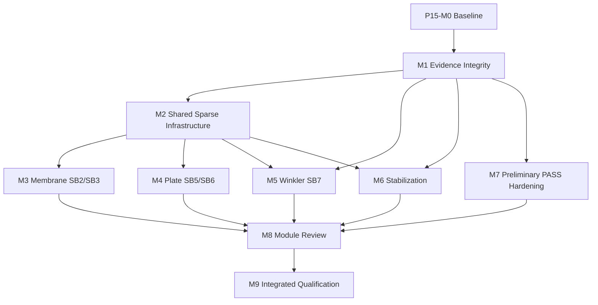

# Phase 15 Milestone Execution Plan

```yaml
version: p15-milestone-plan-v1
plan_status: proposed
created_at: 2026-08-27
status_authority: docs/phase15/IMPLEMENTATION_STATUS.md
```

## 0. 실행 원칙

이 문서 작성은 개발 착수가 아니다. P15-M0 승인 전에는 production code, reference, tolerance와 기존 evidence를 변경하지 않는다.

각 milestone은 다음 두 lane을 별도 완료한다.

```text
Development lane: contract → numeric owner → assembly/recovery → result → product surfaces
Qualification lane: red reproduction → invariant → negative control → metamorphic → R1~R3 → R4 → release
```

reference/tolerance 변경, behavior-preserving extraction, numeric behavior 변경과 release artifact 생성은 각각 별도 변경으로 제출한다.

## 1. 의존관계



M3과 M7은 owner 충돌이 없으면 병렬 가능하다. M4·M5는 공통 solve policy를 소비하므로 M2 public contract가 동결된 뒤 진행한다. M8 전에는 compatibility wrapper를 제거하지 않는다.

## 2. 공통 개발 사이클

1. active WP와 영향 파일의 dirty 상태·source hash를 기록한다.
2. requirement·risk·discrepancy·reference·tolerance·test ID를 연결한다.
3. 수정 전 실패를 재현하고 false-green mutation을 추가한다.
4. 필요한 behavior-preserving extraction을 별도 변경으로 완료한다.
5. 최소 numeric 변경을 구현한다.
6. unit → contract → invariant → metamorphic → independent → integration → performance 순으로 실행한다.
7. producer/consumer와 UI·CLI·Agent·JSON·report parity를 확인한다.
8. solver implementer 외 numerical·structural-domain reviewer가 검토한다.
9. evidence hash와 stale propagation을 검증한 뒤 implementation 상태만 승격한다.
10. clean environment 재실행과 release owner 승인은 M9에서만 수행한다.

## P15-M0 — Baseline & Discrepancy Freeze

### 목표

현재 dirty 작업트리와 1차 비교 산출물을 훼손하지 않고 Phase 15의 reference·tolerance·discrepancy·성능 기준을 사전 등록한다.

### 작업

- source revision, dirty/untracked inventory, runtime/toolchain과 기존 test 결과 보존
- 1차 JSON/PDF 및 Phase 14 manifest를 immutable input으로 등록
- `P15-D001~D016` 재현 절차와 영향 capability map 승인
- reference manifest schema와 tolerance fraction schema 작성
- structural-domain owner가 geometry/support/load/probe/sign/unit 해석 승인
- benchmark 실행 전 reference/tolerance PR 동결
- unchanged representative case의 runtime·memory·hash baseline 측정
- Phase 15 runner/evidence/review 경로와 status authority 생성

### 완료조건

- baseline source/build/dirty/result hash 누락 0
- requirement-risk-discrepancy-test 예정 mapping 100%
- reference에 source/page/hash/probe/unit/axis/sign/tolerance 근거 100%
- production expected import 0
- 기존 artifact overwrite 0
- P15-M1~M9 owner와 reviewer 역할 할당

## P15-M1 — Benchmark & Evidence Integrity

### 목표

case 실행, independent reference, metric 판정, evidence serialization과 report를 분리하고 false PASS를 구조적으로 차단한다.

### 주요 변경

- `strix21FirstBatch.js`를 thin compatibility façade로 축소
- case model factory, common runner, signed metric, mandatory gates 분리
- canonical model/calculation/result/run-record hash 도입
- timestamp·hardware를 deterministic hash에서 제외
- null result hash, partial model hash와 `compareMagnitude` 제거
- reference/tolerance/probe 변경 시 stale 자동화
- report generator를 artifact-only renderer로 변경
- benchmark test를 상태개수 snapshot에서 수치·gate·mutation 시험으로 교체

### 완료조건

- 동일 환경 3회 calculation/result hash 3/3 일치
- invalid reference/tolerance/probe/hash/evidence mutation 탐지율 100%
- failed/blocked/stale/partial case가 PASS 되는 경로 0
- signed-force negative control PASS
- report field가 artifact에 없는 수치·설명을 생성하는 경우 0
- verification expected → production import 0

## P15-M2 — Shared Sparse Numeric Infrastructure

### 목표

fine membrane·plate·foundation 모델을 dense materialization 없이 안정적으로 풀 수 있는 공통 sparse assembly와 SPD solve policy를 만든다.

### 주요 변경

- `linear3dAssembly` private accumulator를 common compute module로 추출
- deterministic symmetric triplet/CSC assembler와 submatrix API
- diagonal equilibration, preconditioner·breakdown 진단과 true residual
- IC(0)-CG 실패 시 정책 기반 sparse-direct fallback
- solver residual과 equilibrium/energy tolerance 정렬
- factor session diagnostics·cache identity 확장
- dense/sparse shadow comparison fixture

### 완료조건

- SB2 96×48와 SB5 published fine mesh가 dense K 없이 조립됨
- matrix symmetry residual ≤ `1e-12`
- qualified static fixture true residual·평형·에너지 residual ≤ manifest 기준, 기본 목표 `1e-8`
- dense/sparse 변위 ≤ `1e-9`, force/result ≤ `1e-8` relative parity
- known SPD fixture의 false pivot 0
- failure/fallback reason·iterations·scaling evidence 100%
- memory가 DOF/nnz에 선형이고 M0 performance budget 충족

## P15-M3 — Membrane Assembly Repair

### 목표

QM6-EAS의 local/global matrix 계약을 명시하고 SB2·SB3를 production sparse workflow로 재검증한다.

### 주요 변경

- global compatible membrane matrix block projection owner
- local matrix global assembly fail-fast metadata
- membrane assembly/solve production service
- SB2 24×12→48×24→64×32→96×48 lineage
- SB3 4×4→8×8→12×12→16×16 lineage
- curved contour averaging 전 global tensor rotation
- raw Gauss/probe/resultant/energy provenance

### 완료조건

- SB2 reference 오차 ≤3%, 동일 메시 STRIX 차이 ≤0.75%
- SB3 reference 오차 ≤1%
- load resultant·moment와 energy gate PASS
- 30°·90° 회전, 반사, node/element permutation, unit round-trip PASS
- local-as-global mutation 반드시 FAIL
- QM6-EAS kernel coefficient 변경 0 또는 별도 승인 ADR

## P15-M4 — Plate Boundary & Workflow Repair

### 목표

plate 경계 의미와 sparse solve/recovery 계약을 닫고 SB5·SB6을 각 행의 수렴으로 판정한다.

### 주요 변경

- explicit `simply-supported-soft|hard|clamped` enum과 legacy migration
- edge/component별 constrained DOF preview·hash
- plate dense K 제거와 공통 sparse solve 사용
- characteristic side `min(width,height)` 정규화
- actual shear correction factor를 recovery에 전달
- SB5 8행 short-side refinement와 SB6 6행 hard-SS refinement
- bending/shear energy, load resultant·centroid audit

### 완료조건

- SB5 8/8 각각 reference 오차 ≤1%, 3개 이상 level, final change ≤1%
- SB6 6/6 각각 reference 오차 ≤1%, hard support contract PASS
- hard/soft negative control과 90° boundary transformation PASS
- pressure/point resultant와 energy gate PASS
- fine level solve failure 0
- MITC4 kernel coefficient 변경 0 또는 별도 승인 ADR

## P15-M5 — Winkler Recovery Repair

### 목표

foundation stiffness와 structural section force를 섞지 않으면서 station 평형을 양단에서 닫고 1차·P-Delta 결과를 통합한다.

### 주요 변경

- `foundationRecovery` canonical owner 추출
- `structuralEnd`, `foundationEnd`, `equilibriumEnd` additive result schema
- station constitutive/equilibrium channel과 endpoint closure
- `equivalentActionLocal=-Kf·d`·resultant·first moment·energy audit
- linear/P-Delta common recovery
- SB7 center signed endpoint probe와 8→16→32→64 lineage
- frame sparse solver/audit tolerance alignment

### 완료조건

- SB7 center displacement·moment 각각 정확해 대비 ≤0.1%
- element station endpoint closure와 `structural+foundation=equilibrium` PASS
- global force/moment·foundation resultant·energy PASS
- dense/sparse 64-element parity PASS
- member reversal·axis rotation·unit·load/k/EI scaling PASS
- `Kf·d` 누락 mutation 반드시 FAIL

## P15-M6 — Real Stabilization Qualification

### 목표

합성 self-test를 실제 wall-dominant 정적·모달 parameter qualification으로 교체한다.

### 주요 변경

- 실제 3층 wall model과 canonical M/K/load fixture
- alpha와 rotation-floor 각 point의 actual solve
- 질량가중 MAC·participation 기반 mode matching
- static/period shift, physical/stabilization energy와 null-mode 분류
- dense/sparse 공통 unsupported-rotation classifier
- clamp/range/baseline/log-span/solve-count mandatory gates
- internal invariant와 custom qualification 상태 분리

### 완료조건

- physical static response와 period shift 각각 <0.5%
- matched physical mode MAC ≥0.99
- modal stabilization energy ratio ≤1e-3, static energy ratio ≤1e-4
- 예상 spurious mode 제거, physical/rigid mechanism masking 0
- sweep point별 실제 solve와 unique effective parameter evidence 100%
- `identicalToStrixP3S2=false` 강제

## P15-M7 — Preliminary PASS Hardening

### 목표

SB1·SB8·SB9·SB10·PD1·SM5의 유망한 수치를 독립 qualification 증거로 강화한다.

### 주요 변경

- SB1 signed closed-form quantities와 energy
- SB8 32→64→128→256, Timoshenko scope, eigen residual·MAC·mass audit
- SB9 bending-only·axial-only·combined identity
- SB10 signed axial force·reaction·displacement와 magnitude mutation
- PD1 mesh/load-step convergence, stage residual·work balance
- SM5 mass-unit audit, eigen residual, MAC·orthogonality·participation

### 완료조건

- 6건의 frozen primary response tolerance PASS
- 각 사례의 mandatory convergence·invariant·metamorphic·negative control PASS
- sign·component·mode 상쇄 false PASS 0
- reference/probe/tolerance provenance 100%
- 기존 PASS 수치의 설명되지 않은 regression 0

## P15-M8 — Module Extraction & Codebase Review

### 목표

임시 compatibility wrapper와 중복 구현을 정리하고 수치·아키텍처·제품 표면을 독립적으로 검토한다.

### 주요 변경·리뷰

- sparse assembler, boundary, foundation recovery, stabilization classifier owner 수 1 확인
- old dense benchmark helper·중복 sparse accumulator 제거
- barrel import와 dependency direction 정리
- UI/CLI/Agent/report consumer migration·parity
- schema migration·save/reopen·undo·backup/rollback
- performance·memory·determinism·security audit
- 각 milestone review finding closure와 limitation 정리

### 완료조건

- compute cycle 0, UI numeric-core import 0, production→reference import 0
- public API consumer parity 100%, unowned/dead compatibility path 0
- Critical/High finding 0
- Medium finding은 owner·release 영향·closure milestone 100% 기록
- feature-off·legacy project 회귀 PASS
- M0 성능 budget PASS

## P15-M9 — Integrated Qualification & Capability Release

### 목표

clean environment에서 Phase 15 전체를 재실행하고 증거가 완전한 capability만 독립적으로 release 판정한다.

### 작업

- Phase 7~15 mandatory regression과 mutation suite
- 11 published cases + 1 custom stabilization qualification 재실행
- 동일 환경 결정성 3회, 별도 clean environment 재실행
- 가능한 MIDAS·STRIX R4 mapping audit와 full-precision import
- JSON/Markdown/PDF report 재생성 및 surface parity
- requirement/risk/discrepancy/evidence/review coverage validator
- capability manifest·limitations·stale checks와 owner sign-off

### 완료조건

- mandatory fail/skip/timeout/flake 0
- negative-control mutation kill rate 100%
- requirement→risk→code→test→evidence→review 추적 100%
- evidence schema/hash/stale 검증 100%
- unresolved Critical/High 0
- external runtime solver dependency 0
- capability별 release 조건을 만족한 항목만 `releaseAllowed=true`
- 구조전문가 별도 승인 없으면 `finalDesignTransferAllowed=false`

## 3. 예정 파일 관례

```text
tools/run-phase15-tests.mjs
tests/p15-m{n}-*.mjs
tests/references/phase15/strix21/*.json
verification/evidence/validation/phase15/p15-m{n}-*.json
verification/evidence/validation/phase15/p15-release-manifest.json
docs/phase15/reviews/P15-M{n}-CODE-REVIEW.md
```

이 경로는 계획이며 P15-M0 ADR·import graph 승인 후 생성한다.
