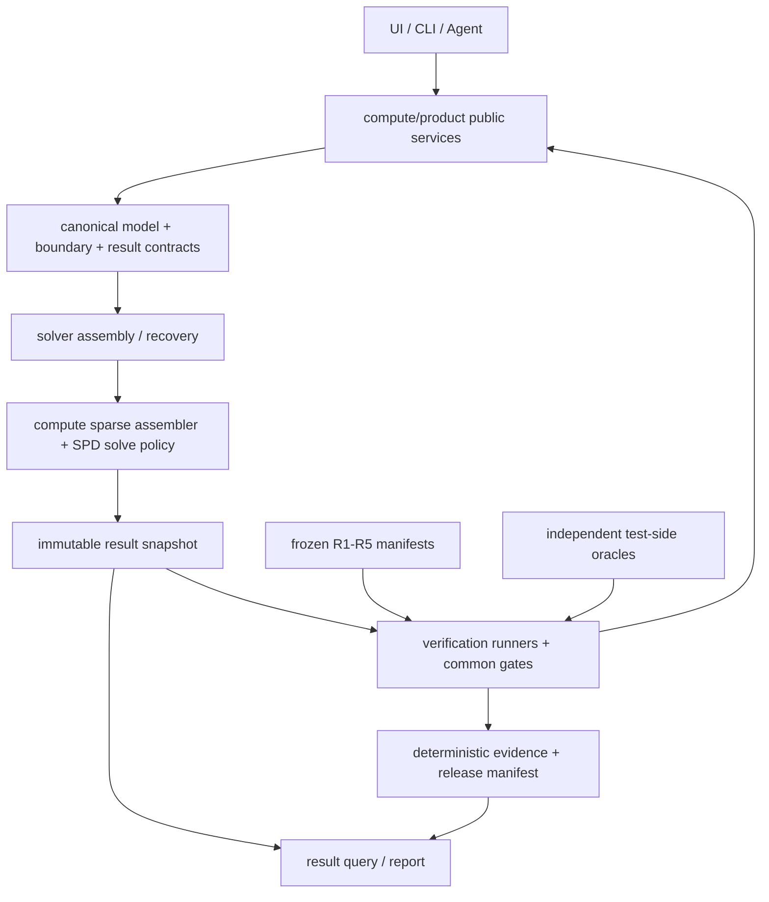

# Phase 15 Module Architecture

```yaml
version: p15-module-architecture-v1
status: proposed
created_at: 2026-08-27
status_authority: docs/phase15/IMPLEMENTATION_STATUS.md
```

## 1. 목표 구조



Reference와 oracle은 production 계산그래프에 들어가지 않는다. verification runner는 production public service를 호출할 수 있지만 production owner를 복제하거나 expected value를 공급하지 않는다.

## 2. Canonical owner

| 관심사 | Canonical owner | 소비자 | 금지 |
| --- | --- | --- | --- |
| sparse matrix/triplet | `src/compute/sparse/` | frame, membrane, plate, verification | shell·benchmark별 accumulator 복제 |
| SPD solve policy | `src/compute/elastic/` | production workflows | case별 threshold/fallback 하드코딩 |
| shell DOF projection | `src/solver/shell/` | membrane/plate/full shell assembly | local/global matrix 이름 추정 |
| plate boundary semantics | `src/solver/shell/` canonical boundary module | workflow, UI, CLI, report | 문자열 alias로 hard/soft 혼용 |
| Winkler kernel | `src/solver/foundation/winklerLine.js` | assembly/recovery | benchmark별 foundation stiffness |
| foundation result contract | `src/solver/foundation/` recovery owner | linear, P-Delta, report | linear/P-Delta 별도 station 식 |
| stabilization classifier | `src/solver/shell/` one owner | dense/sparse assembly, qualification | diagonal-only·row-norm 별도 판정 |
| reference/oracle | `tests/references/phase15/`, `src/verification/phase15/` | qualification only | production import 또는 bundle 유입 |
| evidence/release | `src/verification/phase15/` | report, release gate | report generator의 숨은 재계산 |

## 3. 계획 모듈

실제 파일명은 P15-M0 import graph와 ADR에서 확정한다. 아래 이름은 책임 경계를 고정하기 위한 계획 경로다.

```text
src/compute/sparse/
  symmetricTripletAssembler.js   # deterministic add/finalize, duplicate sum, CSC output

src/compute/elastic/
  spdSolvePolicy.js              # scaling, preconditioner, residual, fallback decision
  factorSession.js               # public/reuse façade, policy consumer

src/solver/shell/
  shellDofProjection.js          # full shell matrix → approved active component block
  plateBoundary.js               # soft/hard/clamped canonical constraints
  membraneWorkflow.js            # mesh/load/assembly/solve/recovery orchestration
  plateWorkflow.js               # mesh/load/assembly/solve/recovery orchestration
  shellStabilization.js          # sweep orchestration only
  unsupportedRotationFloor.js    # canonical null-rotation classifier

src/solver/foundation/
  winklerLine.js                 # stiffness/reaction kernel
  foundationRecovery.js          # structural/foundation/equilibrium end contract

src/verification/benchmarks/strix21/
  manifest.js                    # case list only, no expected values in production path
  runner.js                      # common runner composition
  cases/*.js                     # model factory + public execution call

src/verification/phase15/
  referenceManifest.js
  toleranceManifest.js
  qualificationGates.js
  convergenceChecks.js
  metamorphicRunner.js
  evidenceArtifact.js
  discrepancyRegistry.js
  releaseManifest.js

tests/references/phase15/strix21/
  *.json                         # immutable expected/provenance/probe/tolerance
```

## 4. Public API 계약

### 4.1 Sparse assembly

```js
const assembler = createSymmetricTripletAssembler({ size, storage: 'upper' });
assembler.addBlock(globalDofs, elementMatrix);
const matrix = assembler.finalizeCsc();
```

필수 보장:

- row/column 범위·nonfinite fail-closed
- duplicate entry 결정적 합산
- 입력순서 permutation 후 같은 canonical CSC/hash
- upper/lower/full 입력의 명시적 정책
- symmetry audit와 nonzero statistics

### 4.2 SPD solve

```js
solveSpdSystem(matrix, rhs, {
  equilibriumTolerance,
  residualTolerance,
  scaling: 'symmetric-diagonal',
  preferred: 'iccg',
  fallback: ['sparse-direct'],
});
```

결과는 `x`, true residual, scaled residual, iterations, scaling, preconditioner, selected/fallback backend와 reason code를 포함한다. fallback은 성공을 숨기지 않고 evidence에 남긴다.

### 4.3 Shell DOF projection

```js
projectShellElementMatrix({
  matrix: built.compatibleMatrix,
  nodeCount: 4,
  fullDofPerNode: 6,
  activeComponents: [0, 2],
});
```

projection은 matrix coordinate system과 formulation channel을 필수 metadata로 요구한다. `coordinateSystem:'local'` 행렬을 global assembly에 전달하면 예외를 발생시킨다.

### 4.4 Plate boundary

```js
resolvePlateBoundary(mesh, {
  type: 'simply-supported-hard',
  contractVersion: 2,
});
```

결과는 `constrainedDofs`, edge별 component, preview, migration source와 boundary hash를 포함한다.

### 4.5 Foundation recovery

```js
recoverFoundationMember({
  structuralEnd,
  foundationMatrix,
  localDisplacement,
  spanLoads,
  stationCount,
});
```

결과는 `foundationEnd`, `equilibriumEnd`, constitutive/equilibrium station channels, endpoint closure, resultant·first moment·energy audit를 포함한다.

## 5. Import 경계

1. `src/compute/`는 `solver`, `verification`, UI를 import하지 않는다.
2. `src/solver/`는 `verification`, report, UI를 import하지 않는다.
3. `src/verification/`은 production public API를 호출할 수 있으나 production owner가 verification expected/oracle을 import하지 않는다.
4. `src/report/`는 immutable result/evidence만 읽고 solver를 실행하지 않는다.
5. UI·CLI·Agent는 `compute/product` 또는 승인된 public service를 소비하며 numeric core를 직접 import하지 않는다.
6. tests의 independent oracle은 production solver/assembly/recovery import 수 0을 유지한다.

## 6. 기존 코드의 이동·유지 정책

- `linear3dAssembly.js`의 private sparse accumulator는 공통 compute module로 추출하고 기존 호출은 adapter로 유지한다.
- `factorSession.js`는 public façade로 유지하되 threshold·IC/fallback 선택을 `spdSolvePolicy`에 위임한다.
- `plateWorkflow.js`의 boundary builder는 새 `plateBoundary` owner로 옮기고 기존 export는 호환 wrapper로 유지한다.
- `linear3dRecovery.js`는 공통 foundation recovery를 소비하며 report-facing legacy fields는 deprecation 기간 동안 additive로 보존한다.
- `strix21FirstBatch.js`는 thin façade로 축소하고 case별 model factory와 공통 gate를 분리한다.
- `shellStabilization.js`는 실제 solve callback/result contract를 소비하고 synthetic matrix/vector 계산은 unit self-test로 분리한다.

## 7. Architecture acceptance

- compute dependency cycle 0
- UI numeric-core direct import 0
- production → verification/reference import 0
- internal production module → root `src/index.js` import 0
- sparse accumulator production owner 1
- plate boundary semantics owner 1
- foundation end/station recovery owner 1
- dense/sparse unsupported-rotation classifier owner 1
- case runner 내부 reference literal 0
- report의 solver 재실행 0
- public wrapper parity와 deprecation test 100%
