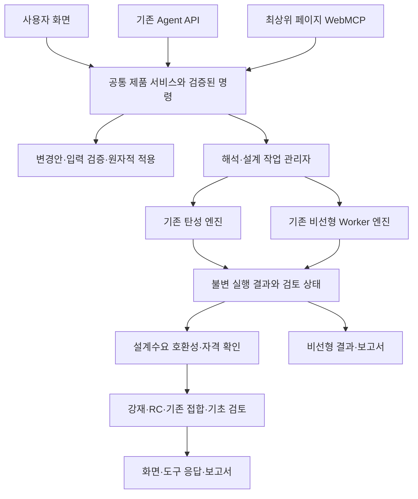

# Phase 19 — 탄성설계 WebMCP와 비선형해석 제품화

작성일: 2026-09-07 · 계획 버전: v1 · M0~M2 구현 및 검증 상태는 [진행 상태](IMPLEMENTATION_STATUS.md)에서 관리한다. M2 입력 방법은 [설계 입력 계약](M2_CONTRACT.md)을 참고한다.

## 목표

사용자와 에이전트가 같은 모델에서 설계기준·하중·조합을 설정하고, 탄성해석과 강재·RC 검토를 실행하며, 근거가 연결된 보고서를 확인한다. 이어서 기존 MDOF Pushover와 비선형 시간이력 엔진을 동일한 실행·결과 계약에 연결하고 지원 범위 안에서 수치·브라우저·배포 검증을 완료한다.

완료는 도구 등록 수로 판단하지 않는다. **동일 입력의 UI·기존 Agent API·WebMCP 실행이 동일한 결과 기록을 만들고, 오류·미수렴·오래된 결과·검토 보류 상태도 일치해야 한다.**

실행 항목은 [작업계획](WORKPACKAGES.md), 합격 기준은 [검증계획](VALIDATION_PLAN.md), 실제 진행 상태는 [상태 문서](IMPLEMENTATION_STATUS.md)에서 관리한다.

## 코드 기준선과 실제 차이

- 개발 기준선: `7bb55d7ec6bd6b155361b26b7830c70b45043acb`.
- 공개 main 기준선: `e18d5b432c780523496f8aad489b502934ae0ebd`.
- 2026-09-06 비교에서 src·server·진입 HTML 688개 중 실행 파일 차이는 없었다. 제외된 4개는 빈 폴더 유지용 .gitkeep다. 설계 파일 60개도 동일했다.
- [WebMCP v1](../WEBMCP.md)은 9개 도구로 기존 탄성 케이스의 조회·검증·실행만 제공한다. 설계 입력, 케이스 생성, 설계 검토와 보고서 생성의 도구 연결은 없다.
- 기준선의 [Agent API](../../src/ui/indexAgentApi.js)는 일부 설계 조회에서 재해석을 일으켰다. M1에서 계산형 설계·보고서 조회와 명시적 준비를 분리했다. 사용 방법은 [구현 계약](M0_M1_CONTRACT.md)을 따른다.
- WebMCP와 [기존 실행 기록](../../src/ui/phase7AnalysisRecords.js)의 해시는 길이와 제외 필드가 다르다. M1은 기존 해시를 유지하고 버전이 명시된 입력 식별을 별도 필드로 추가했다.
- [비선형 capability](../../src/nonlinear/capabilities.js)에 실제 MDOF Pushover·fiber/PMM·Newmark NLTH가 있으나 candidate다. [기존 자격 판정](../../verification/specs/phase8/QUALIFICATION_RELEASE.md)은 Q0이며 외부 비교·규모 시험·독립 pilot 검토가 남아 있다.
- 공개 CI의 13개 시험은 이번 전체 제품화 범위의 합격 증거가 아니다. Phase 7~15의 과거 PASS와 Phase 18 증거는 각 당시 버전에 한정해 보존한다.

## 제품 구조

기존 `src/compute/product/`, `src/nonlinear/`, `src/design/`, `src/report/phase11/`를 재사용한다. 제품 서비스에 없는 연결부만 추가하고 동일 해석기나 작업 관리자를 별도로 만들지 않는다.

입력은 모델뿐 아니라 해석 케이스, 설계기준, 하중조합, 재료·단면 revision, 설계 규칙 버전, solver 설정을 포함한다. 결과에는 실행 ID와 해당 입력 식별자를 보존한다. 조회 도구는 새 해석이나 설계 계산을 시작하지 않으며, 결과가 없으면 `RESULT_REQUIRED`를 반환한다.

### 화면과 브라우저 진입

기존 모델링 탭과 사용자 작업 위치는 유지하면서 첫 화면에 ‘모델링 → 탄성설계 → 비선형해석 → 결과·보고서’ 경로를 명확히 안내한다. 각 화면에서 현재 모델·실행·검토 상태와 에이전트 변경 이력을 확인할 수 있게 한다.

최상위 `index.html`은 직접 등록한다. `app.html`은 최상위 호스트에서 동일 도구를 등록하고, 같은 origin의 현재 모델러와 검증된 브리지로 연결한다. iframe 교체·프로젝트 전환 시 세션을 폐기해 이전 모델의 도구 핸들이 새 모델에 작용하지 않게 한다. OpenAI 내장 브라우저는 현재 iframe 내부 도구를 발견하지 않으므로 호스트 등록이 필요하다. [OpenAI Site tools](https://learn.chatgpt.com/docs/webmcp)

GitHub Pages에서는 모델·로컬 결과를 다루며, 서버 저장·계정 기능은 Node 실행 환경에서 검증한다. 브라우저를 닫아도 계속 실행되는 서버 작업은 이번 기본 범위에 포함하지 않는다. 완료 결과 재열람과 명시적 체크포인트 복구는 별도 계약으로 제공한다.

## 세 번의 단계적 배포

| 배포 | 포함 범위 | 완료 조건 |
|---|---|---|
| 19A 탄성설계 연동 | 설계 입력·하중·조합·케이스 → 탄성해석 → 강재·RC 검토 → 보고서 | M0~M4 및 M8~M10 중 해당 범위 통과 |
| 19B 비선형 정적 | 중력 초기상태 → 집중힌지/fiber Pushover → 수렴·용량곡선·힌지 상태 | M5~M6 및 해당 범위 재검증 |
| 19C 비선형 동적 | 모델 기반 MDOF NLTH → 시간이력·에너지·잔류변형 → 보고서 | M7 및 전체 M8~M10 통과 |

19A·19B·19C는 동일 Phase의 배포 순서다. 비선형 동적을 계획에서 제외하거나 19A 완료를 전체 완료로 표시하지 않는다. 코드 공개, 기능 시험 통과, 독립 수치 자격, 생산 배포 가능, 최종 설계 전달 가능 상태는 각각 기록한다.

## 범위 결정

**포함:** 현재 구현된 탄성 설정·해석·강재/RC 검토, 기존 접합/기초 예비검토의 계산 adapter와 근거 조회, 지원 집중힌지와 fiber 단면, PMM 연계, MDOF Pushover, 지원 지반가속도 입력의 MDOF NLTH, 작업 취소·실패 진단·결과 복구, 로컬 및 공개 정적 배포 검증. 접합·기초의 신규 설계 규칙과 비선형 셸 설계는 포함하지 않는다.

**별도 자격이 필요한 범위:** GPU 비선형, 미지원 단부해제·질량 조합, 다지점 지반운동, 열화·파괴 모델의 신규 구성식, 일반 접촉/SSI, 모든 형상의 대변형·붕괴 추적. 지원하지 않는 입력은 실행 전에 이유를 반환한다. 필요한 범위가 새로 확인되면 작업계획과 시험 대상을 먼저 추가한다.

일반 `nonlinearStatic`은 현재 reserved capability다. 변위제어 Pushover와 구분하고, 중력 초기화가 성공했다는 이유로 일반 비선형 정적 기능을 완료 처리하지 않는다.

## 작업 순서와 의사결정

`M0 → M1 → M2 → M3 → M4`가 탄성설계의 우선 경로다. M1 이후 비선형 기반 감사 M5를 병행할 수 있으며 `M5 → M6 → M7`로 진행한다. 각 배포 전에 M8~M10을 반복 적용한다.

M0에서 실제 지원 모델의 크기·시간 예산과 기존 blocker를 다시 측정한 뒤 일정을 산정한다. 내부 구현 일정과 외부 비교 자료·검토자 확보 일정은 분리한다. 외부 자료가 미확보여도 연결·내부 검증을 진행하되 자격 상태를 임의로 올리지 않는다.

다음 실행은 M0의 현재 상태표와 시험 목록 확정, M1의 입력·실행·설계 결과 계약부터 시작한다. 이 문서는 계획이며 제품 코드 수정·실행 검증·새 GitHub 배포 완료를 의미하지 않는다.

## 조사 근거

- [WebMCP 등록·지원 범위·기존 앱 로직 재사용](https://learn.chatgpt.com/docs/webmcp) — 2026-09-07 조회. API 변동은 M0와 배포 직전에 다시 확인한다.
- [OpenSees Energy Increment](https://opensees.github.io/OpenSeesDocumentation/user/manual/analysis/test/NormEnergyIncr.html) — 수렴 진단 설계 참고. 반복 내 에너지 증분 검사는 전체 시간이력 에너지 평형 검증을 대신하지 않는다.
- [OpenSees Newmark](https://opensees.github.io/OpenSeesDocumentation/user/manual/analysis/integrator/Newmark.html) — 관성·감쇠·내력의 반복 평형과 유효 접선 시험 참고. 생산 runtime에 외부 solver를 도입한다는 뜻이 아니다.
