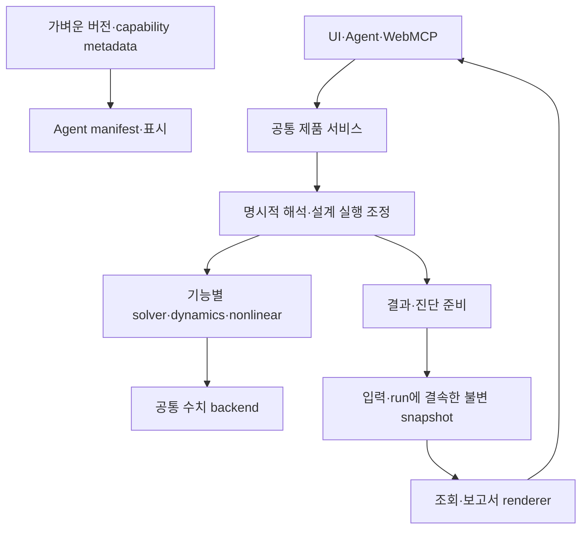

# Phase 20 목표 구조와 API 이행

계획 v1 · 실제 상태는 [IMPLEMENTATION_STATUS.md](IMPLEMENTATION_STATUS.md)를 따른다.

## 현재 구조

| 역할 | 현재 소유자 | 보존할 경계 |
| --- | --- | --- |
| 정적 조립·요소·복원 | `solver/linear3dFirstOrder.js`, `linear3dAssembly.js`, `linear3dElement.js`, `linear3dRecovery.js`, `linear3dPost.js` | 기능별 분리와 결과 의미 |
| P–Delta | `solver/pdelta/` | method·직접해석·설계 전달 적격성 |
| 동적·좌굴 | `dynamics/` 및 `compute/product/eigenAnalysisService.js` | modal/RSA/좌굴/linear THA의 개별 실행 |
| 비선형 | `nonlinear/pushover/`, `dynamics/`, `equilibrium/`, `elements/`, `materials/`, `fiber/`, `core/` | production MDOF와 명시적 engineId |
| 제품 실행 | `compute/product/`, `nonlinear/product/jobManager.js`, 각 Worker/runtime | 실행·취소·결과·자격 상태 |
| 준비·조회 | `ui/resultViewCache.js`, `compute/product/workflowResults.js`, `core/workflowIdentity.js`, `core/workflowResultProjection.js` | 기존 `prepareResultView`, 입력 식별, 저장 결과 |
| 상세보고서 | `report/detailedReport.js`, `report/calculationPackage.js` | snapshot 생성과 순수 renderer 구분 |

현재 정적 감사 41건은 `agentManifest.js` 34, `indexAgentApi.js` 3, 동일 shellLab 모듈을 참조하는 workspace 2, badge 1, detailedReport trace 1이다. 단순 import 수 외에 **버전·표시·파생 계산·실제 solver 실행**을 분류한다. 보고서가 간접 호출하는 `buildP3IntegratedResults`·비선형 trace까지 조사한다.

## 실행·데이터 흐름

아래 화살표는 실행 요청과 결과 전달을 나타낸다. 정적 import 그래프는 별도로 검사하며 import cycle은 허용하지 않는다.

핵심 규칙은 snapshot을 읽는 도중 solver·설계·trace 생성기로 되돌아가지 않는 것이다. metadata도 solver·제품 서비스·보고서 renderer를 import하지 않는다. 모델 입력 진단 준비는 해석을 요구하지 않으며 분석 결과 준비와 계약을 구분한다.

## A. 버전과 표시

- 버전 상수의 canonical 값을 계산 구현과 분리한 가벼운 metadata 모듈로 옮긴다. 제안 위치는 `src/metadata/`; 세부 분할은 M0에서 결정한다.
- 기존 수치 모듈의 상수 export는 같은 값·이름으로 재수출해 public import를 보존한다. Agent는 metadata를 직접 소비한다. **metadata가 다시 수치 모듈을 재수출하는 방향은 금지**한다.
- 버전 문자열을 manifest에 수동 복사해 두 개의 진실을 만들지 않는다. 기존 상수 전체와 metadata의 동등성, 가벼운 의존 그래프를 검사한다.
- `design/designDemandVersion.js`, `results/combinationEnvelopeVersion.js`, `platform/platformVersion.js`의 기존 분리 방식을 참고한다. 불필요한 새 registry를 중복 도입하지 않는다.
- `equivalentShellBadge` 같은 표시 함수는 계산 실행 없는 결과 표시 소유자로 분리한다. 쉘 lab의 상태/containment 판단은 제품 정책 또는 결과 준비 소유자로 옮기며 수치 로직 자체를 UI로 복사하지 않는다.
- capability·설계전달 차단은 metadata 분리로 승격하지 않는다. 번들 크기·첫 로딩 개선은 실제 측정 후에만 보고한다.

## B. 결과 준비와 조회

기존 `installResultViewCache`는 23종 getter를 snapshot 읽기로 교체한다. `getDetailedReport`, `getWallSlabEquivalentTrace` 등의 함수 본문만 보고 매 조회 때 계산한다고 판정하지 않는다. 실제 설치 이후 공개 메서드와 standalone Agent fallback을 모두 추적한다.

| 계약 | 이행 방안 |
| --- | --- |
| `prepareResultView(name, options)` | 명시적 준비 진입점 유지. builder 소유자를 제품 결과 준비 서비스로 이동 |
| 기존 캐시 getter | 준비되지 않으면 `RESULT_REQUIRED`, 현재 입력 불일치면 `STALE_INPUT`; 계산으로 복구하지 않음 |
| `getElasticExpansionTrace`, `getLoadsV2Trace` 등 입력 진단 | 기존에는 즉시 파생 계산 가능. 별도 `prepareInputDiagnostics`/`getPreparedInputDiagnostics`(제안) 계약을 도입하고, 기존 즉시 getter는 한시 호환 API로 명시 |
| 상세보고서/계산서 builder | model+analysis의 파생 계산은 명시적 준비로 이동. `renderDetailedReportHtml`, `renderCalculationPackageHtml`은 준비된 데이터를 표시 |
| 누락된 옛 snapshot | 자동 재해석 금지. 재준비 필요 상태·필요 입력을 반환하고 명시적 준비 작업으로 변환 |

준비 식별은 기존 버전이 있는 workflow identity에 결속한다. 모델/설정만 같아도 서로 다른 해석 run을 혼용하지 않도록 source analysis run IDs, designRunId(해당 시), input identity, view/schema version, options hash를 키에 포함한다. Locale·표시 단위·그림 선택 등 결과를 바꾸는 옵션을 누락하지 않는다. 입력 진단은 input identity와 진단 버전으로 식별하며 가짜 analysisRunId를 만들지 않는다.

준비 시작 시 모델·결과·정책 입력을 복제하고 완료 전 현재 식별을 재검사한다. 비동기 준비를 도입하면 오래된 완료가 새 결과를 덮어쓰지 못하도록 generation/run 결속을 사용한다. 동일 키 동시 요청은 하나의 준비를 공유한다. 캐시는 모델 전환·세션 종료 때 해제하고 메모리 상한·퇴출 정책을 M0에서 고정한다. 일반 getter가 준비를 예약하거나 진행시키는 방식도 금지한다.

단순 표시 변환·날짜/문자열 formatting과 수치·설계 파생 계산을 구분한다. 결과 준비가 명시적 설계 실행을 대체하지 않는다. 신규 강재/RC 설계는 기존 `elasticReviewService`가 담당하고 보고서는 그 기록을 소비한다. 옛 통합 보고서 계약은 별도 compatibility adapter로 보존한다.

기본 결과 준비와 옵션별 진단 준비를 구분해 비싼 trace를 모든 해석 종료 시 일괄 생성하지 않는다. `buildNonlinearAnalysisTrace()`에는 formal Pushover·moment-curvature·SDOF NLTH·assembly 같은 실행이 포함되므로 표시 함수로 취급하지 않는다. 기존 `includeBenchmarks`·`includePushover` 기본값은 호환 경로에서 보존하고, 신규 제품은 필요한 trace를 명시적으로 요청한다. `createDetailedHtmlReport(model, analysis, options)` 등 과거 public builder는 준비와 렌더링을 수행하는 호환 adapter로 유지하며 신규 순수 조회 계약과 구분한다.

## C. 탄성 실행 조정

현재 `finalizeElasticAnalysis()`는 조건부 `analyzeDynamics()`와 `runDesignChecks()`를 호출한다. P–Delta method, incomplete 조합, 쉘 차단, envelope 선택과 경고/audit도 연결되어 있어 import 두 줄만 옮겨서는 충분하지 않다.

1. 정적 준비·조합 해석·복원·완결성 검사·P–Delta 결과 처리를 순수 단계로 추출한다. 제안 위치 `src/solver/elastic/stages.js`; 기존 요소·조립 모듈은 재사용한다.
2. 상위 제품 조정 계층은 정적 결과 → 필요한 동적 결과 → 적격한 설계수요 선택 → 강재 검토/호환 출력 → 최종 audit를 명시한다. 현재 호출 순서·조건·경고를 먼저 보존한다.
3. `elasticProductionAdapter`, `analysisAdapters`, `analysisCaseEngine`, `syncFacade` 등 내부 소비자를 순수 단계 또는 canonical 제품 조정기로 전환한다. Worker 취소·진행률·factor 재사용도 보존한다.
4. 기존 `analyzeModel`·`prepareElasticAnalysis`·`finalizeElasticAnalysis`와 `src/index.js` 공개 export는 이름·인자·동기 반환·기본 동작을 유지한다. 새 products의 개별 실행 계약과 옛 통합 반환을 같은 함수로 무리하게 통일하지 않는다.

공개 `solver/linear3d.js` 경로를 유지하며 조정을 상위로 옮기면 호환 façade의 상향 의존이 남을 수 있다. 이를 숨기지 않는다. canonical 내부 소비자는 façade를 import하지 않게 전환하고, façade는 leaf를 소비하는 호환 조정기로 연결한다. 호환 조정기가 façade를 다시 import하면 안 된다. 원시 그래프와 허용 예외를 모두 보고한다.

필요한 호환 edge는 **정확한 파일·symbol·허용 소비자·소유자·사유**로 등록한다. 경로 전체 예외는 금지한다. M0에서 제안하는 예산은 `linear3d.js` 공개 façade용 bridge 최대 1개이며, 더 필요하면 구현 전에 설계를 갱신한다. 이는 canonical solver의 상향 호출을 허용하는 규칙이 아니다. 공개 경로 삭제는 소비자 0 및 명시적 breaking release 결정 뒤 별도 작업으로 수행한다.

`hybridElasticSession`의 capture/resume, GPU P–Delta override·bounded-slices도 이행 대상이다. `analysisCaseEngine`의 buckling preload는 기존 analyzeModel 호출 결과부터 보존하며, preload에서 불필요한 동적/설계 실행을 줄이는 변경은 동일성 확인 뒤 별도 최적화로 다룬다. `nonlinear/assembly.js`의 stiffness와 기존 `nonlinear/pushover.js`의 analyzeAll 소비자는 각각 이미 있는 leaf 모듈로 직접 연결할 수 있는지 검토한다.

## D. Trace·production·sparse 호환

- `nonlinear/control/` 초기 trace, `nonlinear/legacy/`, `nonlinear/equilibrium/` MDOF, `pushover/productionPushover.js`, `dynamics/productionNlth.js`를 파일명이 아닌 실제 engineId·호출·state/backend 계약으로 분류한다.
- 현 `analysisRouter.js`의 명시적 engine 선택, async production 강제, unsupported 거부와 묵시적 legacy fallback 금지를 유지한다.
- `solver/sparse/`와 `compute/sparse/`는 기능·행렬 형식·factor 수명·backend 정책·소비자를 대조한다. 이번 페이즈는 수치 알고리즘 통합이 목적이 아니므로 이름이 같다는 이유로 교체하지 않는다.
- public/legacy API는 owner, allowedCallers, replacement, sync/async, input/output, errors, qualification, reviewAt, removalGate를 기록한다. 미문서 wrapper 후보 5개와 기존 기한 경과 policy는 실제 소비자 검토 후 처리하며 날짜만 연장하지 않는다.
- 원래 지원하지 않던 조합·설계전달은 계속 차단한다. 호환 wrapper를 production 엔진으로 표시하거나 결과에 승인 서명을 만들지 않는다.

자동 감사의 wrapper 후보 5건에는 `solver/domain/compatibility.js`의 현역 도메인 동일성 계약과 `nonlinear/legacy/contract.js`의 자격 강제 정책도 들어 있다. façade·정책 adapter·canonical 계약으로 재분류해 각자 검증하며 모두 제거 대상으로 보지 않는다. `solver/sparse/solveSparse.js`도 실제 실행 정책이 있어 단순 재수출 파일과 다르다. `cscMatrix`·`ldlt`·`symbolicFactor`·`typedSparse`·`wasmSparseBackend`의 재수출은 대응하는 compute owner와 소비자를 확인해 이행한다.

router가 명시적 legacy 선택을 제공하기 위한 import는 compatibility inventory에 기록한다. production의 실행 중 legacy fallback이 없다는 것과 로딩 그래프에 legacy 모듈이 전혀 없다는 것은 다른 기준이다. 생산 실행 경로 검사와 shared router의 로딩 예외를 구분한다.
