# Phase21 상가주택 실제 업무 흐름 재시험 보고서

시험일: 2026-09-10 시작 · CPU / Windows · 개발 검증 · 최종 설계 승인 아님

## 검증 판정

M0-M5 계약 범위 구현과 집중 회귀를 완료했다. M6에서는 실제 내부 브라우저로 20개 1차해석, 강체 다이어프램 Direct X/Y, RC 예비 검토, 보고서 생성, IndexedDB 저장 및 재열기 복원을 수행했다. M6 전체 게이트와 M7 배포 완료 판정은 IMPLEMENTATION_STATUS.md 및 release-gate.json을 따른다.

이 문서는 제품 시험 보고서다. 해당 건물의 구조안전 확인서나 최종 구조계산서가 아니다. 예비 검토 결과는 NG이며 최종 설계 전달은 차단 상태다. 외부 비교 2건·pilot 5건 및 독립 검토를 완료한 것으로 세지 않는다.

## 입력과 적용 범위

태평동 4392 상가주택 3층 검토의 복원 입력을 사용했다. 원래 RUN-001 입력 hash와 동일하다고 주장하지 않는다. 대지 78.7㎡, 기존 건축면적 50.05㎡는 이전 조사 기록이고 신축 가정은 층당 36㎡ × 3층 = 108㎡다. 기존 연면적 117.5㎡와 EUM 0㎡ 불일치는 미확정으로 유지한다.

24 절점, 39 부재, 138 하중, 20 하중조합, 층별 강체 다이어프램 3개. RC 400×400 기둥 18개와 300×500 보 21개, 기초 고정 및 Fc24·탄성 총단면 강성을 가정했다. 실제 지반·배근·접합부 상세 검증을 대체하지 않는다.

층 고정하중 8 kPa, 지붕 6 kPa, 부재 자중은 명시 하중이며 엔진 자중 중복 적용을 껐다. 활하중·적설·풍압 1 kPa·지진계수 0.15 등은 구조계획 가정이다. 이 검증에서 법정 하중값을 새로 확정하지 않았다.

제품 가져오기 후 inputHash: 5660492cee2627fd50c519fd92ec4928a383d9e8692a75c2f34952c83634122c

## 수치 재시험

D-only 최대변위 1.390754 mm, 1.4D 1.947055 mm: 선형 배율 1.4 일치. X 방향 1차 9.425820 mm → Direct 9.505956 mm. Y 방향 1차 7.689735 mm → Direct 7.696129 mm. 강체 구속을 포함한 CPU Direct 수렴을 확인했다.

RC 검토 5,724개: OK 4,968 / WARN 122 / NG 76 / NOT_CHECKED 120 / N_A 438. 실패 부재 13개. 지배 항목 BX11, MAX-EX-P, Direct X, rc-shear-y: 143.094973 / 84.323684 kN = 1.696972. 이 수치는 합격이 아니라 예비 설계 개선 필요를 뜻한다.

20개 고유 조합마다 authoritative source를 하나 선택하고 X/Y 해당 조합에는 Direct 결과를 채택했다. 22개 해석 기록은 모두 보존했다. 1차와 Direct 동일 조합을 중복 집계하지 않는다.

## 실제 발견한 장애와 수정

M6 r1: 전체 결과와 보고서 저장 시 MANAGED_MEMORY_BUDGET_EXCEEDED. 원인은 전체 clone·직렬화 staging의 중첩이다. 예산을 늘리지 않고 v2 조각 저장으로 수정했다. 메모리 ledger는 관리 데이터의 보수적 추정이며 브라우저 전체 heap 상한은 아니다.

v2는 하나의 IndexedDB transaction에서 조각과 manifest를 확정하고, 조각별 SHA-256 및 read-back을 검사한다. 완료 결과와 보고서를 immutable하게 공유하며 복원 시 전체 결과를 또 복제하지 않는다. 이전 v1 읽기는 호환한다.

M6 r2: 52,488,161 bytes 저장 및 reload 후 복원 성공. 저장 hash: 9bcd63246c249899557e1241098a4f2ccc6772f14cf436ab8d9d41c60fbc318b

실제 IndexedDB 합성 장애 시험에서 중간 중단 시 이전 저장본 보존, orphan 조각 없음, 덮어쓰기 세대 정리, 변조 거부, 임시 자원 ledger 0을 확인했다.

복원 뒤 샘플 조합 목록과 상태 문구가 남는 UI 문제도 발견했다. 복원 시 조합 목록 재구성, 상태 초기화, 복원 review 연결을 수정했다. 커스텀 케이스는 해석 케이스 선택기로 확인한다.

## 보고서와 메모리 관측

실제 복원된 UI에서 HTML·JSON·CSV를 내려받아 native WebMCP artifact manifest의 전체 SHA-256과 일치함을 확인했다. download 이벤트는 timeout이었지만 실제 다운로드 파일은 존재했고 바이트와 hash를 검증했다.

Node 제품 Worker 전체 pilot r4: 저장/복원 후 입력 hash와 세 원본 보고서 hash 일치. peak managed 208,710,774 bytes, 최대 RSS 889,132 KiB. 단일 실행 RSS를 반복 leak 없음의 증거로 사용하지 않는다.

제품 자동 PDF는 PDF_EXPORT_BLOCKED. export adapter, 필수 7개 figure 등록, 보고서 qualification이 미충족이다. 이 별도 캡처 PDF를 만들었다고 제품 자동 PDF를 지원으로 표시하지 않는다.

## 가능·제한·추가 검증

확인: 제품 입력 가져오기, 조회 중 입력 보존, 단일 조합 실행·선택, CPU 강체 다이어프램 Direct, RC 예비 검토 집계, 원본 3포맷 다운로드, 실제 저장·재열기·변조 검출.

제한: 실제 GPU 강체 Direct 미자격, 최종 RC 배근 설계·지반·접합 상세 미검증, 자동 PDF 차단. Chrome 동일 모델 UI 비교는 확장 프로그램 파일 URL 권한 때문에 아직 완료하지 못했다.

125 절점/260 부재/750 full DOF의 중간 규모 반복·취소 시험과 Win/Ubuntu 동일 후보 회귀는 별도 증거로 기록한다. 미실행·미측정 항목에 PASS를 부여하지 않는다. 최종 상태는 상태 문서 및 배포 gate를 우선한다.

화면은 원본 viewport 캡처이며 아래 각 경로와 SHA는 capture-manifest.json에 보존한다. r1은 저장 수정 전 단계 기록, r2는 저장 수정·복원 재시험 기록이다.

## 원본 보고서 파일 검증

| 포맷 | UTF-8 bytes | SHA-256 |
|---|---:|---|
| html | 1321268 | `7c58785c9f2d488c589934a7f101a7021b67b9c51919a60d3e6df61232aef5a1` |
| json | 4918660 | `698e33c8eeae3d3e9412d90ab6519f28e998e1ee3be088b6c12d0363de5c7d90` |
| csv | 3839136 | `be08b860064517b86a00b6f9a4c0f46a78487c2a9570a4d50bd1eb578349a939` |

## 단계별 화면

### m6-browser-r1-000-start

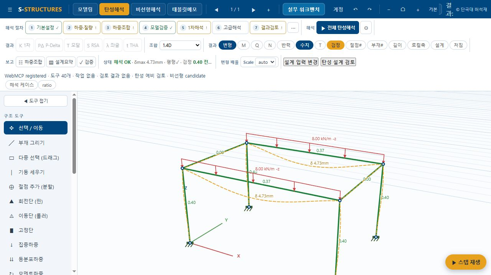

### m6-browser-r1-001-import

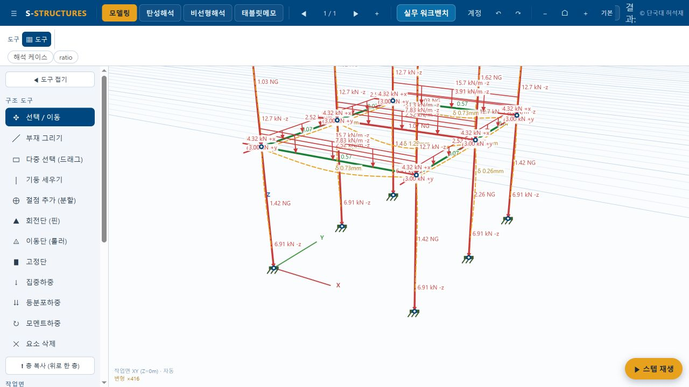

### m6-browser-r1-002-basis

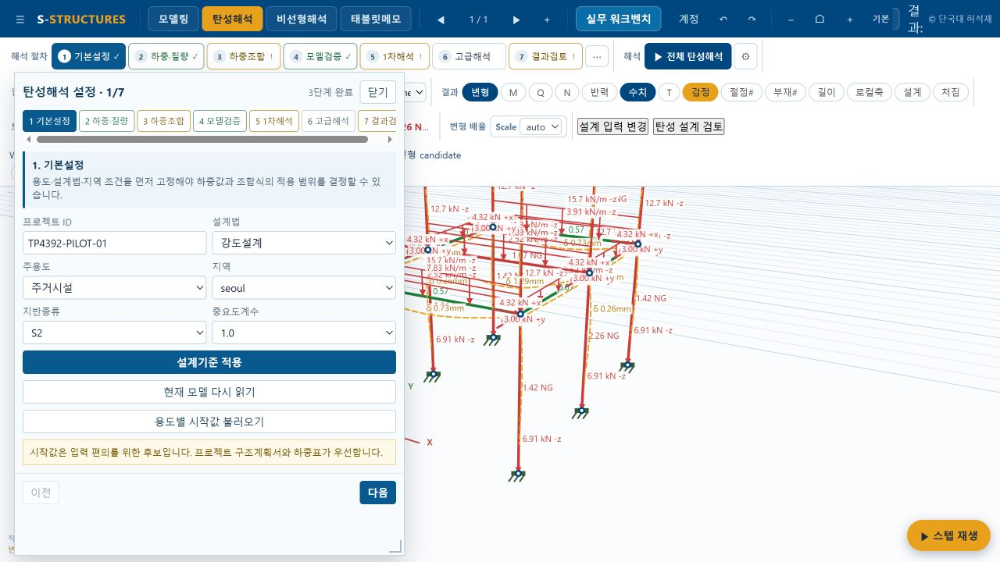

### m6-browser-r1-003-step2

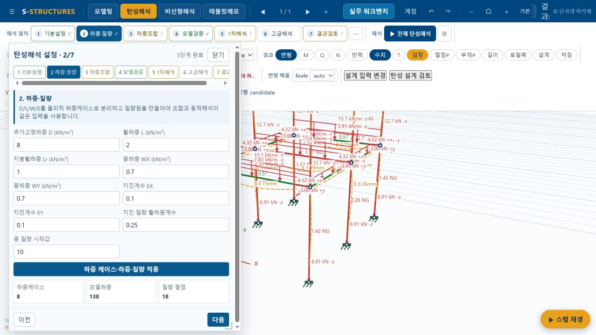

### m6-browser-r1-004-step3

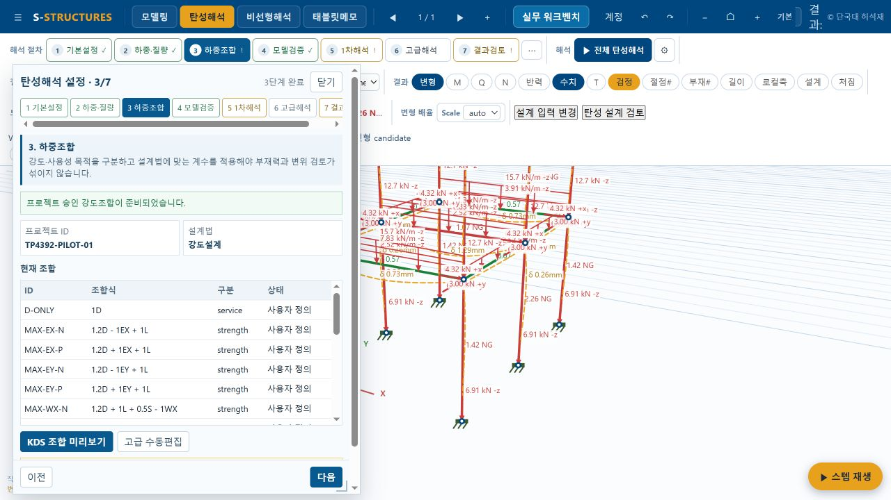

### m6-browser-r1-005-step4

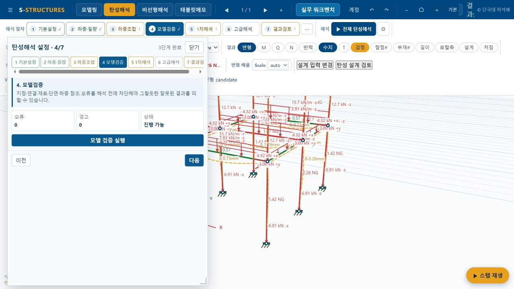

### m6-browser-r1-006-step5

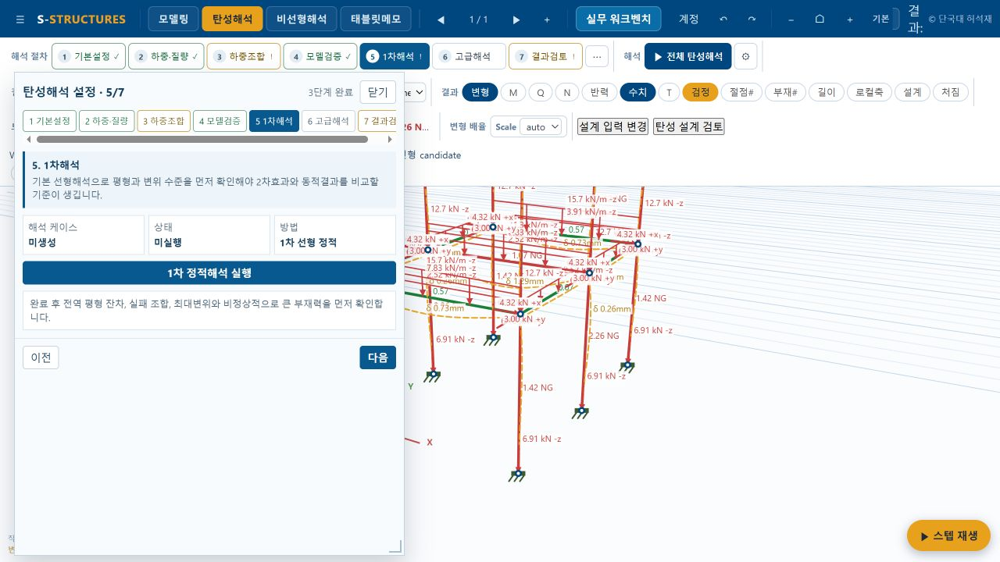

### m6-browser-r1-007-step6

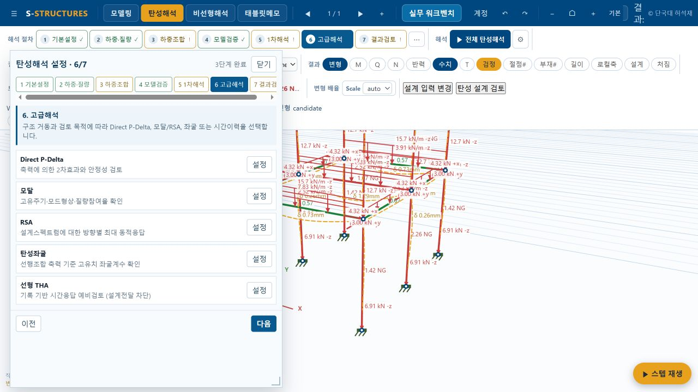

### m6-browser-r1-008-step7

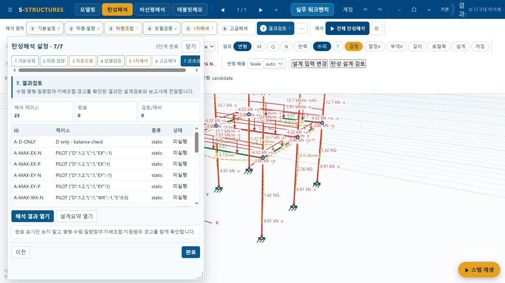

### m6-browser-r1-009-static-running

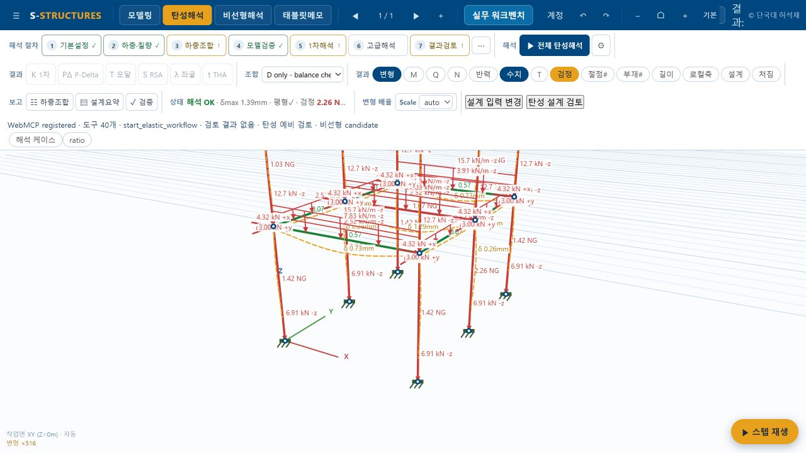

### m6-browser-r1-select-A-D-ONLY

### m6-browser-r1-select-A-DIRECT-X

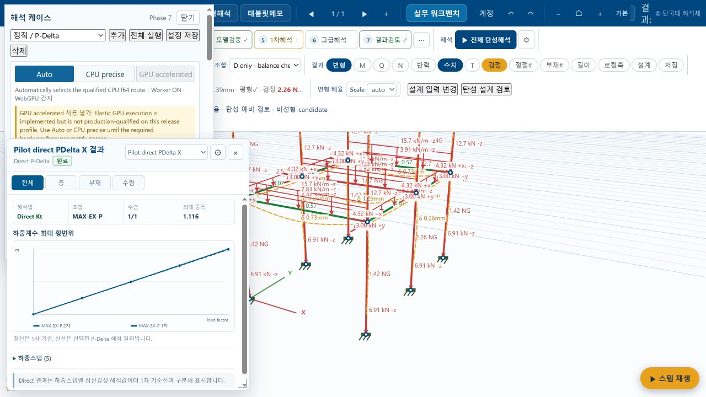

### m6-browser-r1-select-A-DIRECT-Y

### m6-browser-r1-select-A-MAX-EX-P

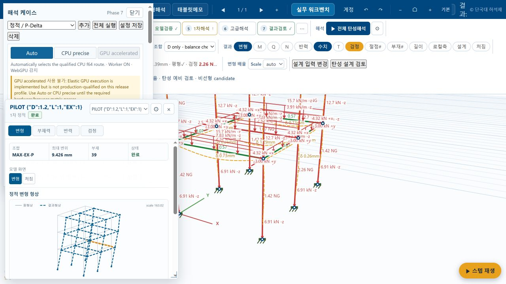

### m6-browser-r1-select-A-ULS-G1

### m6-browser-r2-001-import

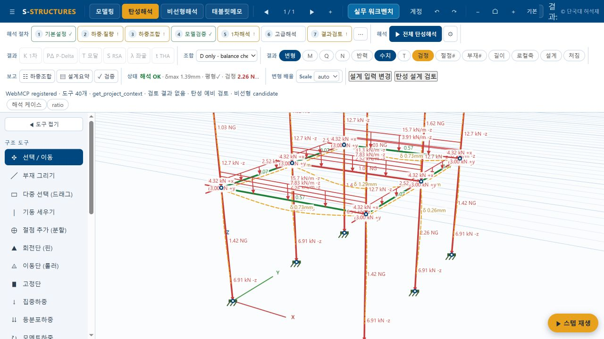

### m6-browser-r2-006-checkpoint-save

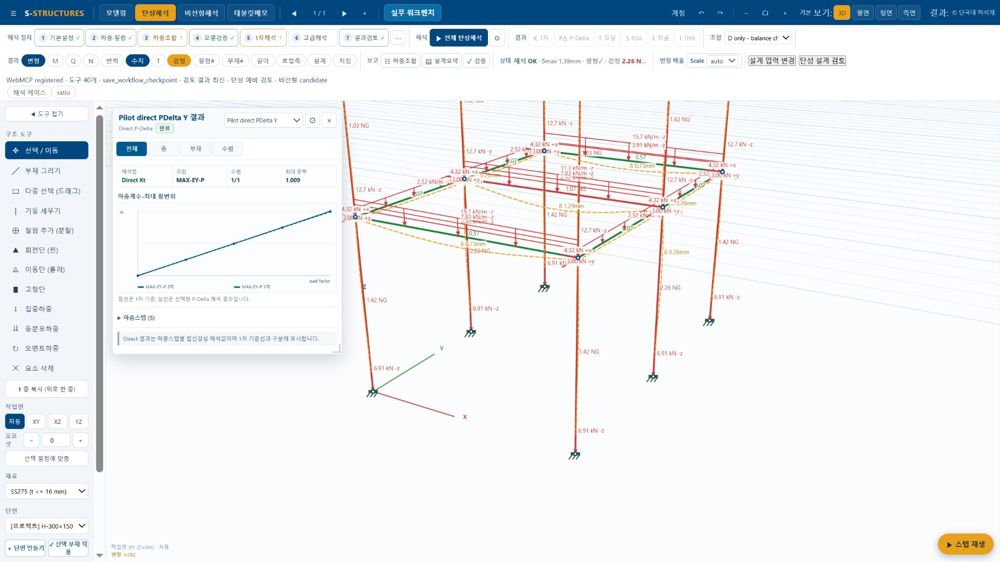

### m6-browser-r2-007-reloaded

### m6-browser-r2-011-reload

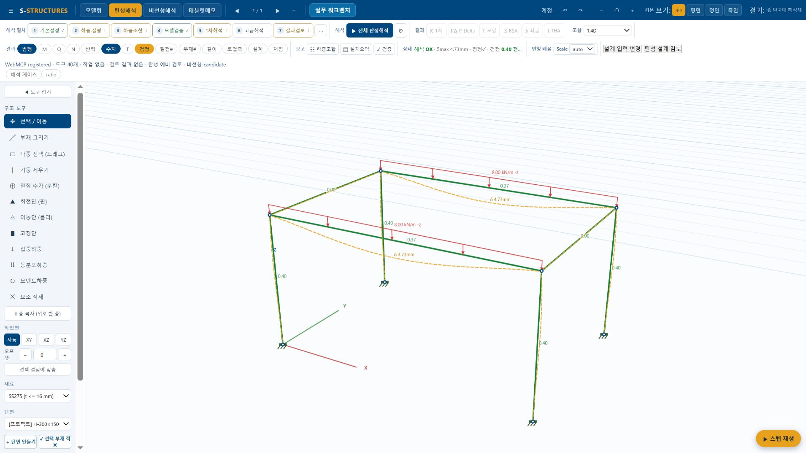

### m6-browser-r2-012-report-ui

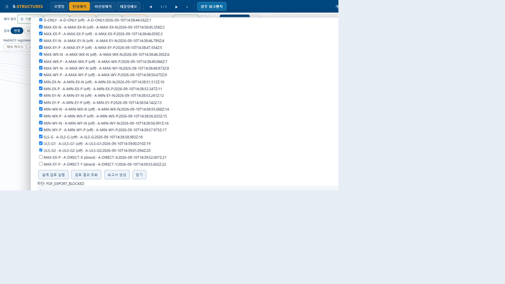

### m6-browser-r2-013-idb-atomic

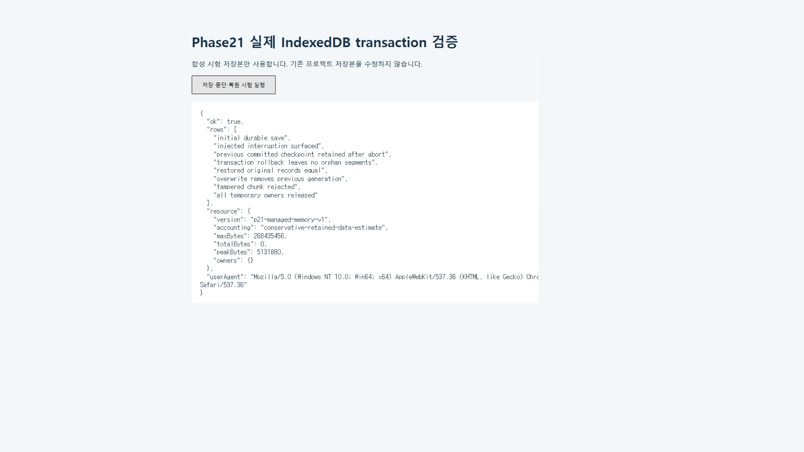
