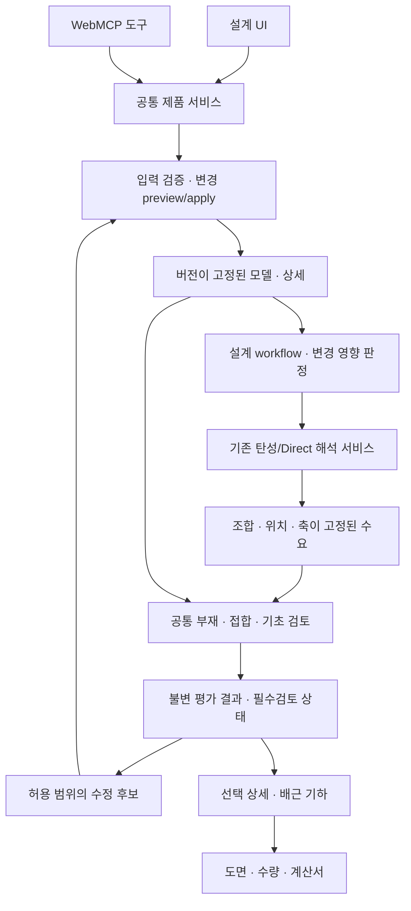

# Phase24 목표 아키텍처와 데이터 계약

> 2026-09-11 재계획: Phase24는 부분 구현 기준선으로 보존하고 미완료 범위를 [Phase25](../phase25/README.md)로 이관했다. 아래 계획/실적은 당시 기록이며 전체 마일스톤 완료가 아니다. 현재 잔여 작업의 정본은 [32건 재점검 대장](../phase25/GAP_AUDIT.md)이다.

2026-09-11 · 설계 제안. 아래 이름·상태·필드는 구현 시 고정할 새 계약이며 현재 API의 완료 목록이 아니다.

## 1. 계산과 제어의 경계

모든 업무 모듈은 WebMCP에서 제어할 수 있는 공통 제품 서비스에 연결한다. 순수 계산 함수는 DOM·전역 UI·WebMCP transport를 import하지 않는다. WebMCP 도구는 동일한 입력/작업/결과 서비스의 얇은 adapter이고, UI도 이 서비스를 호출한다. 모듈별 연산을 제어하기 위해 화면 클릭·직접 전역 변수 수정·임의 JavaScript 실행이 필요한 경로를 만들지 않는다.

| 책임 | 기존 위치 | Phase24 변경 원칙 |
| --- | --- | --- |
| 입력·라이브러리 | materials registry, designInputCommands | 종류별 schema·실제 상세·preview/apply를 공통화 |
| 해석 준비 | `src/solver/elastic/stages.js`의 prepareElasticAnalysis | 해석용 정규화 입력만 수용; 재료·요소·좌표·지지 조건 검증 |
| 탄성/Direct | 기존 CPU/Worker/후보 GPU 서비스 | 수치 경로와 자격 유지, 변경된 물성·강성·하중을 반영 |
| 완료 후 준비 | elasticAnalysisWorkflow.finalizeElasticAnalysis | 정규 수요/공통 평가를 요청하고 결과를 등록 |
| 상세 검토 | elasticReviewService.calculateReview | 선택 source를 공통 평가에 전달; 별도 계산기 제거 |
| 자동 설계 조정 | elasticReviewService.planWorkflow/runWorkflow | 기존 해석 workflow 위에 설계 후보 계보·재계획 서비스 추가 |
| 저장·조회 | workflowIdentity/workflowResults·checkpoint | 종속 identity·불변 결과·상세/도면 참조와 제한된 조회 |
| UI·WebMCP·출력 | indexDesignReview, ui/webmcp, report 서비스 | 같은 검사·상태·후보·상세를 표시하고 제어 |

신규 위치 제안은 `src/design/evaluation/`(규칙 routing·검토), `src/design/optimization/`(순수 후보/제약), `src/design/detailing/`(상세/수량), `src/compute/product/designWorkflowService.js`(비동기 실행), `src/reports/drawings/`(출력)다. 실제 기존 책임과 겹치면 기존 모듈을 이동·확장하고 같은 계산을 새 경로에 복사하지 않는다.

## 2. 입력 객체

| 객체 | 필수 내용 | 불변 조건 |
| --- | --- | --- |
| DesignBasis | 기준/판본/규칙 묶음, 구조계·내진 상세 범위, ULS/SLS·하중 가정, 입력 출처 | 혼합 기준/판본은 명시된 조합 정책 없이 실행하지 않음 |
| MaterialRecord | id@version, kind, 분석 물성, 설계 강도, 제품·환경 조건, 단위, 출처/가정 상태 | 미확인 kind를 강재로 치환하지 않음; concrete와 rebar 별도 참조 |
| SectionRecord | id@version, 형상/실치수, 국부축, A/I/J 및 산정/수동 override 근거 | 형상과 파생값의 불일치 차단; 수동 override를 조용히 폐기하지 않음 |
| MemberDetail | memberId, 구간/위치, reinforcement 참조, 좌굴/지지·서비스 조건 등 재료별 설계 입력 | 필요 철근량과 제공 배근을 별도 저장; 기본 철근비는 assumed |
| Reinforcement | 철근 재료/마크, 중심선·구간·층·위치, 직경/수·간격/다리 수, 후크/정착/이음/피복 | 배근 기하·면적·d·수량의 원본은 하나; 충돌 면적 override 차단 |
| Connection | 형식/재료, 연결 member/face/end, 좌표계·편심, 강성 가정, 실제 상세, 제약 | 접합 수요의 같은 조합과 절점 평형 보존 |
| Foundation | 형식, 지점/기둥 위치, B/L/t, 배근, 지반 참조, 수위·자중/상재 규칙 | fixed 경계조건을 기초 치수로 해석하지 않음 |
| GroundBasis | 지반 근거, 지지력의 순/총 정의·단위·검토 형식, 마찰/침하 등 필요한 자료 | assumed 값은 근거 있는 설계값과 구분; 자동 후보의 수정 대상에서 제외 |
| DesignConstraints | 허용 치수/제품/간격/그룹, 고정 조건, 목적함수, 실행 한도, 적용 모드 | 후보가 제약을 넘으면 불가능 사유를 반환 |

정규 단위는 기존 core/solver 단위 정책과 합치고 한 입력 경계에서 변환한다. UI 표시 단위와 API 수치 단위를 명시한다. 규칙 내부의 mm·MPa 변환은 선언된 adapter를 사용한다. 단위 문자열만 바꾸고 값은 유지하는 수정은 허용하지 않는다.

초기 강재/목재/조적 입력에는 `analysisSupported`, `designSupported`, `detailingSupported`를 조건부로 분리한다. 현재 요소가 방향별 물성을 수용하지 못하면 임의 평균 E로 계산하지 않고 지원되는 명시적 모델 가정 또는 미지원 사유를 반환한다.

## 3. 수요와 평가 결과

`DemandRef`는 project/model revision, analysisRunId, analysis fingerprint, comboId와 목적(ULS/SLS), 결과 집합, member/connection/foundation ID, station/end, 국부좌표·부호·단위·동시 N/V/T/M을 가진다. 접합부에는 연결 부재의 같은 조합 수요를 묶고 기초에는 같은 조합의 반력과 자중 정책을 묶는다.

두 조합의 Nmax·Mymax·Mzmax를 합친 가상 벡터는 P-M-M 또는 접합 검토 수요로 허용하지 않는다. 검토별 scalar 포락이 타당한 경우에만 그 규칙이 지배 조합/위치를 선택한다. 포락만 남은 이전 결과로 동시 수요를 복원할 수 없으면 새 해석 또는 필요한 원본을 요구한다.

공통 평가 서비스는 수요 묶음·상세·규칙·조건을 받아 `DesignEvaluation`을 반환한다. 제품 완료/검토 서비스는 동일한 평가 key를 재사용하며, envelope 요약과 선택 조합 상세는 평가 결과의 집계만 수행한다. 보고서/조회에서 이 서비스를 다시 실행하지 않는다.

`CheckResult` 제안 필드:

- 안정적인 checkId, entity type/id, limitState, DemandRef, detail revision, rule ID/edition/clause/version.
- status (`OK`, `NG`, `WARN`, `NOT_CHECKED`, `N_A`), reasonCode, applicability와 근거, blocking 여부.
- demand/capacity/ratio와 각 단위, 필요량/제공량, 실제 사용한 입력·내력 성분·독립 검토 가능한 trace.
- assumptions, missingInputs, supportedScope, source qualification, current/stale, solver/convergence provenance.

`ratio=null`은 데이터가 없거나 비율 검사가 아니라는 뜻이다. 0/OK로 변환하지 않는다. 경고의 차단 여부는 규칙에서 지정하며 화면이 임의로 없애지 않는다.

## 4. 필수검토 목록과 상태 집계

검토 전 `CoverageManifest`가 해당 모델의 부재·접합부·기초·상세 형식에 필요한 검사를 생성한다. 아직 계산이 구현되지 않은 항목도 목록에 남는다. 목록 버전은 identity에 포함한다.

필요한 접합/기초 객체가 아직 없더라도 topology·부재 역할·지점에서 검토 필요 대상을 찾아 누락으로 등록한다. 객체가 없어서 검사 대상 수가 0이 되는 경로를 막는다. 적용성이 불명확하면 근거 입력을 요구하고 `N_A`로 추정하지 않는다.

| 이유 예시 | 처리 |
| --- | --- |
| MISSING_INPUT / MISSING_REINFORCEMENT / MISSING_FOUNDATION_GEOMETRY | 필요한 입력 경로·단위·출처 요구를 반환 |
| RULE_UNAVAILABLE / UNSUPPORTED_MATERIAL / UNSUPPORTED_DETAIL | 규칙/형식 지원 범위와 이유를 반환 |
| CHECK_NOT_CONNECTED | 구현은 있으나 현재 수요/제품 흐름에 미연결인 개발 결함으로 표시 |
| STALE_INPUT / STALE_RESULT / SOURCE_NOT_QUALIFIED | 현재 설계/출력 완료에 사용하지 않음 |
| NUMERIC_FAILURE / SOLVER_FAILED / RESOURCE_LIMIT | 실패 stage·run·원인 기록; 미검토와 구분 |
| INSUFFICIENT_REINFORCEMENT / LIMIT_STATE_EXCEEDED | 유효 계산에서 내력 또는 상세 조건 부족 |
| NOT_APPLICABLE | 적용 제외 규칙과 근거를 함께 제공 |

기존 상태 문자열과 호환 adapter를 두되 새 사유를 단순 `UNKNOWN` 또는 `OK`로 손실 변환하지 않는다. 예비 접합 지표는 진단용 이력으로 남고 실제 접합 필수검토를 충족하지 않는다.

요약에는 검사 행 수, 고유 대상 수, 필수 항목 수, 실제 평가 수, 적용 제외 수, NG/차단 경고/미검토를 각각 둔다. 필요한 검사마다 대응 결과가 있고, 평가 key 중복이 없으며, 합계가 보존돼야 한다. `NG=0`이어도 필수검토가 없거나 source가 차단된 상태면 완료가 아니다.

규칙별 수치 OK, 지원 범위 내 설계 검토 충족, 종합 자격/최종 설계 전이는 서로 다른 상태다. 자동 후보가 수치적으로 적합해도 source가 Phase23 GPU 후보처럼 설계 전이 차단이면 차단을 상속한다.

계획/평가에는 명시적 assessment scope(부재·접합·기초·프로젝트)를 둔다. M4/M5의 부재 시험에서는 부재 범위 결과를 완료할 수 있지만 아직 연결되지 않은 접합/기초 검사는 프로젝트 상태에서 미완료로 남는다. 조회 필터나 자동 후보의 대상 축소가 프로젝트 필수검토 목록을 줄이지 않는다.

## 5. identity와 재실행 결정

현행 `p19-input-v1`은 model 전체를 포함하므로 상세만 바뀌어도 stale이 된다. 이를 조용히 바꾸지 않고 새 projection version과 reader/adapter를 도입한다.

| identity | 종속 입력 |
| --- | --- |
| analysisFingerprint | 정규화된 topology·좌표·요소/축·resolved E/G/밀도/강성·질량·하중/조합·구속/경계/접합강성·방법·solver/수치 모듈 버전·관련 설정 |
| designFingerprint | source analysis와 수요 집합, 재료 설계값·실제 단면/상세·design basis·규칙/coverage 버전·필요 환경 조건 |
| detailFingerprint | 선택된 배근/접합/기초 기하·가공 조건·상세 규칙·설계 평가 참조 |
| artifactFingerprint | design/detail 참조, 도면/보고서 template·renderer·표현 옵션·폰트/단위 정책 |

Fc 변경으로 Ec도 달라지는 등 파생 물성의 종속성은 입력 필드 이름이 아니라 **실제로 해석 준비에 사용한 값과 계산 정책**에서 추적한다. 반대로 UI 글꼴만 바뀐 경우 해석 hash를 바꾸지 않는다. 모듈 버전 분리를 입증할 수 없는 build 변경은 보수적으로 재실행한다.

| 변경 | 최소 재실행 | 조건 |
| --- | --- | --- |
| 주근·스터럽·피복 | 설계→상세→출력 | 적용 강성·질량·수요 산정이 불변임을 입증할 때만 |
| 단면·E·밀도·균열강성 | 영향 해석 케이스→설계→상세→출력 | 자중/질량 재생성 정책까지 포함 |
| 접합 상세 | 접합/인접 부재 검토→출력 | 강성·오프셋·정착 수요 영향 시 관련 해석/부재 검토도 포함 |
| 기초 B/L/t·배근 | 기초·정착 검토→출력 | 하중/지지 모델 불변일 때; 스프링/질량/경계 변경 시 재해석 |
| 지반 설계값 | 기초 검토→출력 | 지지 강성 등 해석 종속값 변화 시 재해석 |
| 규칙/판본·하중 조합 | 종속 단계부터 | 조합/하중도 달라지면 해석, 검사 규칙만 달라지면 설계 |
| 도면 배치·글꼴 | 출력 | 수량/가공/설계 의미를 바꾸지 않을 때 |
| 해석 종속성 불명확 | 해석→모든 후속 단계 | 자동 재사용 금지 |

과거 hash·source run은 보존한다. 이전 snapshot으로 새 projection을 산출해 재사용하려면 원본 완전성·해석 입력 동등성·solver 버전/자격을 확인하는 명시적 migration record가 필요하다. 기본 경로는 재실행이다. 저장 형식 버전과 identity 버전을 별도로 관리한다.

## 6. 자동 보완 workflow와 transaction

계획 상태 예시: `planned → evaluating → candidate_ready → applying → reanalyzing/rechecking → evaluated`. 각 상태 전이는 상위 workflow ID, candidate ID, base/new revision, plan ID, source run ID와 requestId를 기록한다. 중간 해석/설계 run은 고정 입력에서만 실행한다.

종료 상태는 `COMPLETE_WITHIN_SCOPE`, `NEEDS_INPUT`, `NO_FEASIBLE_DESIGN`, `UNSUPPORTED`, `BUDGET_EXHAUSTED`, `STALE_INPUT`, `CANCELLED`, `SOLVER_FAILED`, `RESOURCE_LIMIT` 등으로 구분한다. `COMPLETE_WITHIN_SCOPE`도 아직 종합검증이 끝나지 않은 프로그램을 production-qualified로 만들지 않는다.

후보 목적함수는 필수검토·고정 제약을 만족한 후보 사이에서만 적용한다. 목적은 기록된 철근량/단면량/치수 변화/제품 수 등의 순서로 명시하고 실제 가격 근거가 없으면 금액을 만들지 않는다. 반복 순서·동률 처리·중복 제거는 결정론적으로 정의한다. 후보 범위·누락 근거·한도를 반환하며 전역 최적해를 주장하지 않는다.

평가는 격리 snapshot에서 수행하고 live model을 매 후보마다 바꾸지 않는다. 선택 후보 apply에서 base revision을 비교하고 하나의 model transaction으로 변경한다. 새 plan에서 재계산한다. 실패/취소 후보는 원본을 변경하지 않으며, 적용 후 되돌리기는 기존 undo 계약을 통해 새 revision을 생성하고 결과의 현재성을 재평가한다. 참조 중인 원본 결과를 덮지 않는다.

## 7. 메모리·취소·오류 복구

- 실행 한도: maxCandidates, maxIterations, wallTimeBudget, CPU/Worker managedBytes, 보존 결과 수/바이트, artifact 큐/바이트를 실행 계획에 고정한다. 숫자는 M0에서 기준 환경·기존 budget과 함께 설정하고 측정값과 계획값을 구분한다.
- 동시에 하나의 후보/solver 작업을 실행한다. 원본과 선택 최선 결과는 참조로 보존하고 후보 대형 데이터는 현재 평가에 필요한 범위만 소유한다. 무제한 전체 model/result structuredClone과 모든 후보 full tensor 보존을 금지한다.
- `BudgetMap`·공통 resource ledger·bounded queue를 재사용한다. 상태/진행 응답은 metadata, 상세 결과는 페이지/slice, 도면/PDF는 artifact 참조로 반환한다. 한도에 닿으면 전처리 차단 또는 예측 가능한 퇴거를 수행한다.
- GPU 후보 사용 시 기존 256MiB buffer pool 총예산·active/cached 분리·해제 대기와 장치 한도를 유지한다. 새 설계 기능 때문에 buffer cap이나 자격을 자동 완화하지 않는다.
- 취소 신호는 후보 선택/검사 묶음 사이 및 Worker에 전달한다. 동기식 장기 계산은 청크/Worker로 분리한다. timeout은 성공 결과가 아니며 원자적 결과 등록 전후 경계를 구분한다.
- 실패 경로에도 try/finally와 소유권 해제를 적용한다. Worker 종료, GPU readback/queue 완료, export URL revoke, report/font/canvas 해제를 각각 담당 owner가 처리한다. dispose 이후 결과 재등록을 막는다.
- 작은 자원 시험은 객체/관리 바이트 회수와 제한 동작을 검증한다. JS 전체 heap·브라우저/GPU 실제 메모리의 장시간 누수 부재는 이 시험으로 주장하지 않고 종합검증 Q에 남긴다.

## 8. 도면·계산서의 단일 원본

철근 추천 문자열을 SVG에 옮기는 방식으로 배근도를 구현하지 않는다. 실제 중심선/층/구간/후크/정착/이음 객체에서 치수·마크·단면·입면·기초 평면과 가공표를 파생한다. 부재·상세·철근 마크의 참조 무결성을 검사하고, 절단 길이와 수량은 고정한 가공 규칙으로 계산한다.

도면과 계산서는 같은 `DesignSnapshot`을 읽는다. source/currentness, 적용 기준·assumed 입력, 지원 범위·미검토를 함께 전달한다. 생성 중 입력이 달라져도 서로 다른 revision을 한 파일에 섞지 않는다. 원 snapshot을 완성한 경우 생성 파일의 기준 revision과 현재성 상실을 분명히 표시한다.

벡터 PDF는 한글 폰트·치수·선 굵기·페이지 여백·텍스트 추출을 갖춘 별도 출력 capability다. Phase22 예비 raster PDF는 호환 경로로 남고 새 도면 지원을 자동 상속하지 않는다. DXF 출력은 다음 도면 확장의 별도 계약으로 둔다.

## 9. 호환·릴리스 불변 조건

기존 CPU 탄성/Direct 경로, 임의 입력 실행 방지, source qualification, 설계 전이 차단을 유지한다. API·identity·규칙 묶음·저장 형식은 각자 버전을 갖고 migration 경계를 테스트한다. 이전 예비 trace는 legacy 표시로 조회 가능하게 하되 새 확정 상세의 계산 원본으로 섞지 않는다.

각 모듈은 [WebMCP 제어 계약](WEBMCP_CONTROL_CONTRACT.md)의 자기 작업을 제공해야 개발 완료다. UI만 연결되거나 내부 함수만 존재하면 해당 milestone은 미완료다. 시험·evidence는 [TDD 계획](TDD_VALIDATION_PLAN.md), 실제 상태는 [구현 상태](IMPLEMENTATION_STATUS.md)에서 관리한다.
## 당시 입력 계약 기록 (M1 첫 구현분, 2026-09-11)

`practicalInputContract.js`의 필드 정의·검증을 UI와 WebMCP schema가 공유하고, 모든 변경은 기존 designInputService의 preview/apply transaction을 통과한다. 조회는 get_design_modules, get_design_input_schema, get_design_records를 사용한다. registry 입력은 재료/단면의 id@version을 보존하고 상세는 designDetails 아래 버전 객체로 저장한다.

| 입력 | 공개 단위·범위 | 현재 구현 경계 |
| --- | --- | --- |
| steel/concrete/timber/masonry | 탄성계수·강도 MPa, 밀도 t/m3, 규격·출처·가정 상태 | 물성 입력 및 재료 routing. 목재는 frame-longitudinal 해석 이상화 명시; 전용 목재/조적 설계 아님 |
| RECT/SQUARE/H/BOX/PIPE/CIRC | 단면 치수 mm → A/I/J 등 SI 성능값 | 치수 기반 계산, 직접 성능값 덮어쓰기 금지 |
| RC 직사각형 보·기둥 배근 | 국부 y/z·피복 m, 철근 직경·스터럽 간격 mm → 내부 m | 실물 좌표/직경/기하 면적·버전/겹침 검사. 공칭 규격별 철근 면적표와 코드 최소 간격은 M4 잔여 |
| 접합/정착 | 절점·부재 ID, 회전강성 kN.m/rad, 형상 m, 구속철근 mm | 연결 참조·물성 종류·선택 배근 입력. solver 구속 매핑·접합 강도 판정은 잔여 |
| 지반·독립기초 | 허용지지력 kPa(net/gross), 반력계수 kN/m3, 기초 치수 m, 하부 철근 mm | 지반 버전 참조·실제 치수·선택 배근 입력. 지반 조사 자격 및 지내력/펀칭/휨 설계는 잔여 |

기존 등록값은 UI의 등록값 불러오기와 같은 record→command adapter로 편집한다. 값 변경은 새 버전을 입력하고 preview 후 apply한다. 입력된 새 상세는 아직 기존 예비 RC 내력 계산을 대체하지 않는다. Product Book v2 및 상세 재검증은 M2 첫 구현분이며 해석 재사용 identity는 아직 구현하지 않았다.
