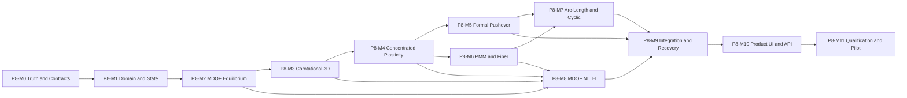

# Phase 8 Milestone Execution Plan

```yaml
plan_version: 2026-07-13
milestones: P8-M0..P8-M11
current_status: complete-p8-m4-next-p8-m5
execution_rule: one milestone at a time; code, tests, evidence, review, and status update are all required
```

## 1. 실행 순서



M8은 M2~M4가 완료되면 concentrated-plasticity 경로로 시작할 수 있다. fiber NLTH qualification은 M6 완료 이후 별도 gate를 통과해야 한다.

## 2.1 Phase 7 연계 gate

Phase 8은 다음 Phase 7 자산을 선행계약으로 사용한다.

- model schema v4와 lossless migration
- material/section registry와 source snapshot
- story, diaphragm, release, offset, support spring
- load case/combination, mass source, self weight ownership
- 선형 정적, Direct P-Delta, modal/RSA의 golden result
- analysis case, stale status, immutable run record와 design-transfer guard

P8-M1에서 이 자산을 canonical domain으로 일반화하되 Phase 7 결과를 한 번에 재작성하지 않는다. adapter별 golden test가 통과한 뒤 순차 전환한다.

상용 수준의 판정은 [PRODUCTION_REQUIREMENTS.md](PRODUCTION_REQUIREMENTS.md), 통합계약은 [MODELING_ELASTIC_INTEGRATION.md](MODELING_ELASTIC_INTEGRATION.md), runtime budget은 [PERFORMANCE_AND_SCALABILITY.md](PERFORMANCE_AND_SCALABILITY.md)를 따른다.

## 2. 공통 완료 절차

각 마일스톤은 다음 순서를 지킨다.

1. 관련 검증 ID를 실패하는 테스트 또는 fixture로 먼저 등록한다.
2. public contract와 unsupported 범위를 고정한다.
3. 구현 중 기존 legacy 경로의 수치 결과를 의도 없이 변경하지 않는다.
4. 단위, component, solver, integration 테스트를 실행한다.
5. 자기참조가 아닌 기준해와 비교한 evidence artifact를 생성한다.
6. 실패, nonconvergence, rollback, unsupported 경로를 테스트한다.
7. correctness, 상태 오염, 단위/부호, 성능, UI 전달을 코드리뷰한다.
8. `IMPLEMENTATION_STATUS.md`와 verification evidence index를 갱신한다.
9. 필수 검증이 하나라도 없으면 `complete`로 표시하지 않는다.

## 3. 상태 규칙

| 상태 | 판정 |
| --- | --- |
| `planned` | 범위와 검증 ID만 확정 |
| `in-progress` | 해당 마일스톤 코드와 테스트를 수정 중 |
| `implemented` | 코드가 실행되나 독립 기준 검증 전 |
| `candidate` | 필수 자동검증 통과, 독립 비교 또는 pilot 전 |
| `complete` | 완료조건, evidence, review를 모두 충족 |
| `blocked` | 선행 계약 또는 외부 기준이 없어 진행 불가 |

마일스톤 상태와 결과 qualification은 별개다. 예를 들어 M8이 구현 완료되어도 NLTH 기능은 독립 동적검증 전 `candidate`일 수 있다.

## P8-M0 - 상태 정직성, 계약, legacy 격리

**상태: complete (2026-07-11).** 완료 증거와 잔여 범위는 [IMPLEMENTATION_STATUS.md](IMPLEMENTATION_STATUS.md) 및 `reports/validation-evidence/phase8/`를 기준으로 한다.

### 목표

현재 preliminary 코드를 정식 엔진으로 오인하지 않도록 제품, API, 테스트, 문서의 의미를 먼저 바로잡는다.

### 작업

- 기존 `runPushover`, `runFormalPushover`, `runNewmarkNlth`의 실제 범위와 limitation을 machine-readable metadata로 고정
- 기존 Pushover를 `legacy-preliminary-stepwise-secant` engine ID로 분리
- 기존 NLTH를 `legacy-sdof-bilinear-newmark` engine ID로 분리
- 모든 legacy 결과에 `qualification=legacy-preliminary`, `designBlocked=true`, `modelBound=false/true`를 명시
- displacement/arc-length가 실제로 구동되지 않는 UI option은 disabled 또는 `intent-only`로 표시
- 새 `NonlinearAnalysisCase`, `NonlinearRunRecord`, `NonlinearCapability` schema 정의
- schema v5의 nonlinear property registry, time-history function, analysis-state reference 계약 정의
- `PRODUCTION_REQUIREMENTS.md`의 R1/R2 scope와 Q0~Q5 qualification을 machine-readable feature catalog로 등록
- `REFERENCE_BASIS.md` source registry와 evidence schema 연결
- 기존 case migration과 output compatibility adapter 작성
- legacy regression suite와 Phase 8 qualification suite 분리
- `test:p8` runner와 evidence artifact schema 생성
- reference hardware/browser/backend profile과 S/M/L workload fixture 생성
- topology/property/constraint/load/mass/nonlinear/output hash 계약 고정
- Phase 3 문서의 완료 표현을 Phase 8 status와 충돌하지 않게 교차참조

### 주요 코드 영역

`src/nonlinear/legacy`, `src/core/analysisCase*.js`, `src/core/analysisRunRecord*.js`, schema/migration, `src/ui/analysisRunners.js`, `src/ui/indexAnalysisCenter.js`, `src/ui/agentManifest.js`, `tools/run-phase8-tests.mjs`

### 완료 조건

- legacy Pushover/NLTH가 일반 `verified` 또는 design-eligible 결과로 반환될 수 없다.
- UI, report, agent API가 동일한 engine/qualification을 표시한다.
- legacy case round-trip에서 수치결과가 보존된다.
- 새 정식 case type은 capability gate 없이 실행되지 않는다.
- model schema v4 round-trip과 v5 migration에서 geometry/property/load 손실이 없다.
- production scope, source, reference hardware와 performance budget이 versioned artifact로 고정된다.
- `NL-GOV-01`~`NL-GOV-06` 통과

## P8-M1 - Immutable domain과 committed/trial 상태

**상태: complete (2026-07-11).** `NL-DOM-01~08`, `NL-STATE-01~07`, `NL-MEI-01~08`과 M1 code review가 완료되었다.

### 목표

모델 전개, 자유도 제약, 상태 전이, rollback을 정적·동적 해석이 공유하는 기반으로 만든다.

### 작업

- nonlinear analysis domain builder와 stable domain hash
- nonlinear 전용이 아닌 `src/solver/domain` canonical analysis-domain builder
- topology/property/constraint/load/mass/nonlinear/output 분리 hash
- node/member/material/section/load/mass snapshot
- support, prescribed displacement, rigid diaphragm용 일반 constraint transformation
- semi-rigid/generated member 전개와 origin mapping
- offset, release, local axis의 immutable element descriptor
- element state registry와 타입별 serializer
- committed/trial branch, atomic commit, rollback, checkpoint/restart
- line-search 후보별 격리된 trial branch
- deterministic event sequence와 random-free 재현
- unsupported feature capability scan
- 원본 model mutation 검출
- Phase 7 linear/P-Delta/modal adapter가 같은 topology/property/constraint를 소비하는 compatibility harness
- result dimension의 velocity/curvature/strain/stress/energy 확장

### 주요 코드 영역

`src/solver/domain`, `src/nonlinear/core/stateStore.js`, `elementContract.js`, `src/core/resultDimensions.js`, Phase 7 domain/diaphragm utilities

### 완료 조건

- 동일 model/case가 동일 domain hash와 자유도 map을 만든다.
- 실패 반복, line search reject, cutback 뒤 committed state가 byte-equivalent로 복원된다.
- checkpoint에서 재시작한 결과가 연속실행 결과와 일치한다.
- rigid diaphragm과 prescribed displacement가 같은 constraint 계약을 사용한다.
- Phase 7 선형·P-Delta·modal golden model의 domain identity가 유지된다.
- `NL-DOM-01`~`NL-DOM-08`, `NL-STATE-01`~`NL-STATE-07`, `NL-MEI-01`~`NL-MEI-08` 통과

## P8-M2 - MDOF 잔차·접선 조립과 Newton 평형

**상태: complete (2026-07-12).** 검증 artifact는 `reports/validation-evidence/phase8/p8-m2-equilibrium.json`, 코드 리뷰는 `p8-m2-code-review.md`, sparse backend 결정은 [ADR-005](adr/ADR-005-INHOUSE-WASM-SPARSE.md)를 기준으로 한다. M2 완료는 corotational·소성·Pushover·NLTH qualification을 의미하지 않는다.

### 목표

요소 내력과 접선을 매 반복 재조립하는 실제 전역 MDOF 비선형 평형 커널을 완성한다.

### 작업

- element response의 `Pint`, `Kt`, trial state 조립
- constraint 축약 전후 외력·내력·잔차 변환
- full Newton-Raphson과 검증된 line search
- force, displacement, energy convergence의 absolute+relative 기준
- MDOF load control과 adaptive step/cutback
- 실패 스텝 rollback과 최소 step 종료
- SPD sparse, pivoted indefinite/general, dense reference solver interface
- production Web Worker protocol과 WASM sparse backend ADR/adapter
- typed sparse matrix, precomputed scatter index, symbolic pattern/order cache
- 실행 전 memory/runtime preflight와 worker cancellation
- matrix symmetry, pivot, singularity, condition diagnostics
- 고정단력/member load를 포함한 external load assembly
- global force/moment equilibrium audit
- linear elastic element adapter로 선형극한 검증
- 취소와 progress callback
- production dense fallback 금지와 backend-unavailable failure

### 완료 금지 조건

다음 중 하나라도 남으면 M2는 완료가 아니다.

- 내력을 `K * u`로 대신함
- 접선을 반복 전에 한 번만 조립함
- element state를 solve 전에 commit함
- nonconvergence 뒤 상태를 유지한 채 다음 step으로 진행함
- arc-length용 비정정 행렬을 SPD solver로 강제함

### 완료 조건

- 선형 모델에서 Phase 7 정적해석과 변위·반력·부재력 일치
- smooth nonlinear spring에서 finite-difference tangent 일치
- 2자유도 이상 nonlinear equilibrium 기준문제 수렴
- cutback/rollback 및 singular/indefinite failure가 명확히 분기
- worker가 main thread를 차단하지 않고 작은 model에서 dense/production backend가 일치
- `NL-EQ-01`~`NL-EQ-12`, `NL-CTRL-01`~`NL-CTRL-04` 통과

## P8-M3 - 완전한 3D corotational frame/truss

**상태: complete (2026-07-12).** 검증 artifact는 `reports/validation-evidence/phase8/p8-m3-corotational.json`, 정식화 결정은 [ADR-002](adr/ADR-002-FINITE-ROTATION-COROTATIONAL.md), 코드 리뷰는 `p8-m3-code-review.md`를 기준으로 한다. 완료 범위는 principal rotation chart의 탄성 기하비선형 정적 frame/truss다. finite 2축 release는 물리 단력·general tangent만 static qualification하며 에너지 기반 cyclic/NLTH는 차단한다.

### 목표

강체운동에 객관적이고 현재변형 상태에서 내력과 일관접선을 반환하는 3D frame/truss 요소를 구현한다.

### 작업

- finite nodal rotation 및 current local triad
- rigid-body motion 제거와 basic deformation
- axial/torsion/2축 휨 basic force
- material 및 geometric tangent
- transformation derivative를 포함한 global tangent
- corotational truss와 frame 요소
- member local axis continuity와 near-vertical member 처리
- rigid offset, release, member load의 일관 적용
- canonical member local axis/offset/release descriptor만 사용
- local/global force 및 station recovery
- large rotation 중 결과축 표시와 변형형상
- follower load는 별도 구현 전 명시 차단

### 완료 조건

- 임의 3D 강체병진·회전에서 strain energy와 resisting force가 0에 수렴
- 작은 변위 극한에서 선형 12x12 요소와 일치
- finite-difference tangent와 analytical tangent 일치
- Euler beam-column, large-displacement cantilever, 3D skew frame 독립기준 통과
- release/offset 조합에서 평형과 회전호환 통과
- 선형극한에서 Phase 7 member result의 local/global 축과 station 값이 일치
- `NL-COR-01`~`NL-COR-12` 통과

## P8-M4 - 집중소성 힌지와 이력상태

### 목표

부재 전체 강성저감이 아닌 실제 단부 spring과 상태 이력으로 집중소성을 구현한다.

### 작업

- local y/z end rotational spring과 내부 자유도
- elastic member + hinge spring 직렬호환 및 일관 condensation
- A-B-C-D-E monotonic envelope
- unloading/reloading, 잔류회전, kinematic/isotropic rule 선택
- stiffness/strength degradation와 dissipated energy
- positive/negative 비대칭 backbone
- hinge state commit/rollback 및 reversal detection
- axis별 자동배정과 user override
- schema v5 hinge-property registry와 member assignment reference
- steel grade/thickness, RC reinforcement snapshot 기반 auto property
- hinge length, yield rotation, acceptance source 계약
- axial ratio 입력을 받을 수 있는 PMM hook
- hinge/release 중복 validation
- zero/negative tangent와 numerical regularization 정책

### 완료 조건

- monotonic backbone의 모든 segment와 tangent가 reference와 일치
- cyclic protocol에서 폐곡선, 잔류변형, 소산에너지 일치
- elastic beam+hinge series 기준문제에서 회전분담과 end moment 일치
- i/j 및 y/z 힌지가 독립 동작
- rejected iteration과 cutback에서 hinge history가 오염되지 않음
- auto/user property의 source, qualification, diff, undo가 model transaction에 보존
- `NL-HNG-01`~`NL-HNG-12` 통과

### 구현 기록 (2026-07-13)

- 완료: 비대칭 A-B-C-D-E, Masing/isotropic 이력, degradation·energy, 순수 committed/trial 상태
- 완료: i/j·local y/z 내부 spring과 3D corotational elastic member의 일관 직렬 condensation
- 완료: axis별 steel/RC snapshot 자동배정, PMM hook, release 충돌 차단, preview/apply/undo
- 증거: `reports/validation-evidence/phase8/p8-m4-concentrated-hinge.json`
- 결정: `docs/phase8/adr/ADR-003-CONCENTRATED-HINGE-SERIES-COMPATIBILITY.md`

## P8-M5 - 중력 preload와 정식 변위제어 Pushover

### 목표

중력상태를 보존한 뒤 실제 전역 변위제어로 capacity curve와 힌지 전개를 계산한다.

### 작업

- gravity combination 선택과 load-control preload
- case dependency DAG와 immutable gravity-state run record
- verified linear result는 initial guess로만 사용하고 명시 policy 없이 committed state로 import 금지
- gravity state commit 후 lateral reference pattern 분리
- uniform, triangular, modal, user-defined signed pattern
- physical control node/DOF와 reduced DOF mapping
- augmented displacement-control Newton solve
- adaptive target increment와 event-aware cutback
- 필요 시 M7 arc-length로 전환 가능한 workflow contract
- base shear, overturning, roof/control displacement
- story shear/drift/torsion과 member/hinge recovery
- first yield, mechanism, peak, post-peak threshold event
- termination reason과 nonconvergence report
- 기존 Pushover UI용 compatibility view
- load case/combination/self-weight physical ownership과 Phase 7 load audit 재사용

### 완료 조건

- 각 accepted step이 force/displacement/energy 수렴기준을 만족
- 중력외력 + 횡외력 = 반력 + 허용 잔차
- control displacement가 목표값을 허용오차 안에서 만족
- portal plastic mechanism과 다층 frame 기준 capacity curve 일치
- 이전 스텝 할선강성 방식 없이 현재 스텝에서 힌지발생 후 재평형
- gravity predecessor 변경 시 dependent Pushover가 stale 처리
- `NL-PUSH-01`~`NL-PUSH-14`, `NL-CTRL-05`~`NL-CTRL-08`, `NL-MEI-09`~`NL-MEI-15` 통과

## P8-M6 - PMM interaction과 검증 가능한 fiber section

### 목표

하드코딩 PMM과 3-fiber 강재단면을 제거하고 축력-2축휨을 처리하는 상태기반 단면응답을 구현한다.

### 작업

- `(y,z,A,material)` fiber contract와 explicit units
- steel H/BOX/PIPE 2D mesh generator
- RC cover/core/bar layout generator
- Phase 7 section `shape/params/properties`와 동일 geometry source 사용
- design/reinforcement snapshot과 preliminary design value의 qualification 분리
- steel cyclic material과 concrete compression/tension/confinement model
- `N-My-Mz` section force와 3x3 consistent tangent
- 목표 축력 평형을 포함한 moment-curvature solver
- biaxial curvature path와 neutral-axis iteration
- mesh refinement/convergence 도구
- fiber state commit/rollback과 energy
- section response 기반 PMM surface 생성 및 interpolation
- PMM bounds/convexity/sign validation
- fiber-section frame integration path와 integration-point convergence
- concentrated hinge backbone 생성 시 source snapshot

### 완료 조건

- fiber area, centroid, `Iy/Iz/Iyz`가 단면기하 기준값과 일치
- 목표 축력 residual이 허용오차 내에서 수렴
- steel H와 RC section M-phi가 독립 fiber 또는 published reference와 일치
- mesh refinement에서 peak/initial stiffness가 수렴
- PMM surface 주요 축과 대칭/비대칭 조건 검증
- hard-coded `My=120/100/65` 기본경로 제거
- elastic A/I/J와 fiber 면적·도심·관성의 cross-domain 일치
- `NL-FIB-01`~`NL-FIB-14`, `NL-PMM-01`~`NL-PMM-08` 통과

## P8-M7 - Arc-length와 cyclic static 경로

### 목표

limit point 이후 post-peak와 cyclic static protocol을 실제 augmented solver로 추적한다.

### 작업

- Crisfield spherical arc-length predictor/corrector
- branch sign/root selection
- load/displacement scaling matrix와 arc radius
- iteration count 기반 radius adaptation
- snap-through/snap-back와 negative tangent 처리
- pivoted augmented linear solve
- displacement-control에서 arc-length로 명시적 전환
- cyclic target history와 reversal event
- unloading/reloading hinge/fiber state 연계
- 실패 branch rollback과 재시작
- path diagnostics와 bifurcation warning

### 완료 조건

- hard-coded path 없이 von Mises truss 경로를 산출
- post-peak에서 감소하는 load factor와 제약식 residual을 동시에 만족
- cyclic SDOF/MDOF frame에서 목표 history와 에너지 일치
- branch 선택이 deterministic하고 checkpoint restart와 동일
- `NL-ARC-01`~`NL-ARC-10`, `NL-CYC-01`~`NL-CYC-06` 통과

## P8-M8 - 실제 3D 모델 MDOF NLTH

### 목표

정적 비선형 요소커널과 모델의 질량·감쇠를 사용하는 MDOF 비선형 시간이력해석을 구현한다.

### 작업

- 모델 질량원에서 `M` 조립, lumped/consistent 옵션
- Phase 7 `massSourceId`와 physical ownership/deduplication snapshot을 그대로 사용
- support/diaphragm과 mass constraint transformation
- uniform ground acceleration influence vector
- acceleration unit, sign, baseline, scale validation
- Newmark average-acceleration predictor/corrector
- step 내 full Newton과 effective tangent
- gravity preload state에서 동적해석 시작
- initial/committed tangent Rayleigh damping 정책
- automatic substep, rollback, min `dt`, failure termination
- concentrated hinge 및 qualified fiber element 연계
- kinetic/strain/plastic/damping/input energy audit
- response history streaming과 memory budget
- Worker result chunk, envelope index, checkpoint manifest
- cancellation, progress, checkpoint/restart

### 완료 금지 조건

- `_model` 인자를 버림
- scalar mass/stiffness 기본값 사용
- nonconverged state를 commit
- Rayleigh 계수만 계산하고 `C`를 조립하지 않음
- substep을 권고만 하고 원 스텝 결과를 계속 사용

### 완료 조건

- linear SDOF 및 MDOF에서 독립 Newmark/reference 결과와 일치
- nonlinear oscillator와 frame benchmark의 peak/history/energy 일치
- 시간간격 절반화 시 주요 응답이 수렴
- 모든 accepted time step이 수렴하고 실패 step은 rollback
- 현재 model hash와 질량/요소 수가 run record에 남음
- output step과 internal substep이 분리되고 저장정책이 result manifest에 남음
- `NL-DYN-01`~`NL-DYN-16` 통과

## P8-M9 - 모델 기능 통합과 결과회복

### 목표

Phase 7에서 지원하는 실제 모델 기능이 비선형 도메인과 결과에 같은 의미로 전달되도록 닫는다.

### 작업

- rigid/semi-rigid diaphragm 통합
- release, rigid offset, local-axis rotation 통합
- nodal/member load와 gravity fixed-end force
- linear support spring, prescribed displacement preload
- generated member와 원본 wall/slab/diaphragm result mapping
- truss와 tension/compression-only 지원 여부 결정 및 active-set 통합 또는 fail-closed
- mass source, story, center-of-mass metadata
- reaction, member end/station, hinge/fiber, story result recovery
- global force/moment 및 element-node closure audit
- Pushover/NLTH envelope와 event provenance
- unsupported combination matrix와 validation message
- legacy result chart adapter 제거 또는 단일 새 adapter로 교체
- linear, Direct P-Delta, modal/RSA, Pushover, NLTH adapter의 canonical domain identity audit
- granular hash 기반 case/cache/state/result stale propagation
- versioned verification registry와 Phase 7 run-record design-transfer guard 통합

### 완료 조건

- 지원되는 모델기능은 선형극한과 비선형 결과에서 동일 topology를 사용
- 지원되지 않는 기능은 UI/API/batch 모두 실행 전에 동일 사유로 차단
- result origin이 generated member에서 원본 객체로 추적 가능
- static/dynamic equilibrium과 결과 station closure 통과
- modeling/elastic/nonlinear의 object ID, local axis, unit, origin map이 일치
- `NL-INT-01`~`NL-INT-16`, `NL-MEI-01`~`NL-MEI-20` 통과

## P8-M10 - 실무 UI, 결과 시각화, 보고서, agent/MCP 계약

### 목표

사용자가 비선형 해석의 준비, 실행, 실패 수정, 결과판독을 한 흐름에서 수행하게 한다.

### 작업

- 비선형해석 리본에 `전체 비선형 준비/실행` 주 명령
- 기존 section/material/load/mass 편집기를 재사용하고 nonlinear setup에서 복제 UI 금지
- 단계형 설정: 모델검증, 중력, 비선형속성, 제어, 지진파, 실행, 결과
- 자동 hinge/fiber 배정 preview와 source/override diff
- capability/unsupported/qualification 표시
- 장시간 실행 progress, pause/cancel, 실패 step과 재시도
- domain diff, estimated DOF/memory/runtime, backend/thread mode preflight
- 모델링 화면 우측의 이동·크기조절 가능한 결과 popup
- Pushover curve, step scrubber, hinge state, story/member charts
- NLTH time history, peak/envelope, energy, convergence charts
- 선택한 node/member/story와 chart 양방향 연동
- 계산서에 입력, 알고리즘, 허용오차, 수렴, 경고, 검증등급 포함
- agent/MCP: validate, create case, run, cancel, status, result slice, explain failure
- 대용량 history pagination/downsampling과 raw export
- historical/stale/current run record와 predecessor case graph 표시
- 접근성 및 desktop/tablet 반응형 검증

### UX 원칙

- 기본경로는 P8-M5 필수 gate를 통과한 concentrated-plasticity Pushover다.
- 고급 수치설정은 접힌 영역에 두되 실제값과 기본근거를 표시한다.
- `실행 완료`와 `설계 사용 가능`을 같은 문구로 표시하지 않는다.
- 결과 popup은 데이터양에 따라 기본크기를 정하되 사용자가 이동·resize·snap할 수 있다.
- 차트 선택이 viewport의 동일 step/object를 강조한다.

### 완료 조건

- UI 설정과 run record settings가 byte-equivalent
- UI와 agent/MCP 실행이 같은 solver와 qualification을 사용
- elastic/nonlinear result popup이 같은 selection store와 object IDs를 사용
- 실패 이유와 수정 가능한 입력이 사용자에게 연결됨
- 1366x768, 1920x1080, 2560x1440, tablet viewport에서 겹침과 잘림 없음
- `NL-UI-01`~`NL-UI-14`, `NL-API-01`~`NL-API-10` 통과

## P8-M11 - 독립 검증, 성능, 대표 프로젝트 pilot, 최종 리뷰

### 목표

구현 존재가 아니라 독립 정확도와 실제 업무 흐름을 근거로 지원범위를 확정한다.

### 작업

- closed-form, published benchmark, 별도 reference solver fixture 고정
- 기존 B1~B8을 regression으로 재분류하고 새 qualification suite 실행
- 각 기능별 verification evidence JSON/Markdown 생성
- 독립 solver와 input/output convention 교차검토
- 3D steel moment frame, braced frame, RC frame 대표모델 pilot
- small/medium/target-size 성능과 memory profile
- S/M/L workload에서 Worker/WASM sparse backend, main-thread latency, cancellation budget 측정
- Pushover 100+ step, NLTH long record의 streaming/취소/재시작 시험
- solver tolerance sensitivity와 mesh/time-step convergence report
- 전체 코드베이스 Critical/High finding review
- 사용자 매뉴얼의 지원/미지원/qualification 일치 확인
- release manifest와 reproducible build

### 대표 pilot

| ID | 모델 | 필수 workflow |
| --- | --- | --- |
| PILOT-ST-01 | 2D steel portal | hinge calibration, displacement Pushover, arc-length |
| PILOT-ST-02 | 3D steel moment frame | gravity, diaphragm, bidirectional result review |
| PILOT-ST-03 | steel braced frame | truss/unilateral 지원 또는 명시 차단 |
| PILOT-RC-01 | RC moment frame | PMM/fiber, Pushover, story drift |
| PILOT-DYN-01 | 3D frame | gravity-preloaded MDOF NLTH, energy, peak recovery |

### 완료 조건

- verification matrix의 release-required 항목 100% 통과
- 독립 기준이 없는 항목은 `verified`가 아니라 명시적 `candidate/unsupported`
- regression, Phase 7, Phase 8 전체 테스트 통과
- 성능·메모리 기준과 실제 측정값 기록
- M-tier Pushover/NLTH와 result streaming budget 통과
- pilot 5종의 입력부터 보고서까지 재현 artifact 존재
- Critical/High finding 0
- `NL-PERF-01`~`NL-PERF-16`, `NL-PILOT-01`~`NL-PILOT-05` 통과

## 4. 마일스톤별 필수 검증군

| 마일스톤 | 필수 검증군 |
| --- | --- |
| P8-M0 | GOV, schema/source/performance baseline |
| P8-M1 | DOM, STATE, MEI-01~08 |
| P8-M2 | EQ, CTRL-01~04 |
| P8-M3 | COR |
| P8-M4 | HNG |
| P8-M5 | PUSH, CTRL-05~08, MEI-09~15 |
| P8-M6 | FIB, PMM |
| P8-M7 | ARC, CYC |
| P8-M8 | DYN |
| P8-M9 | INT, MEI 전체 |
| P8-M10 | UI, API |
| P8-M11 | 전체 release-required, PERF-01~16, PILOT |

## 5. 중단 조건

다음 중 하나가 발생하면 다음 마일스톤으로 넘어가지 않는다.

- committed state가 실패 반복이나 line search 후보에 의해 변경됨
- analytical tangent가 finite-difference tangent와 지정 오차 밖에서 불일치
- 선형극한이 Phase 7 결과와 불일치하며 원인이 설명되지 않음
- control option과 실제 solver method가 다름
- 같은 구현 또는 자기 결과를 reference로 사용함
- nonconvergence를 warning만 남기고 결과를 정상 완료로 반환함
- 지원하지 않는 release/offset/diaphragm 조합을 조용히 단순화함
- 모델링·선형·비선형 adapter의 topology/property/constraint hash가 불일치함
- self weight 또는 mass source의 physical ownership이 중복됨
- production M-tier 실행이 main thread 또는 dense global matrix를 사용함
- model hash가 다른 결과를 현재 모델에 표시함
- `completed`와 `verified`를 구분하지 않는 UI/API 경로가 남음
- Critical/High 코드리뷰 finding이 열린 상태임
