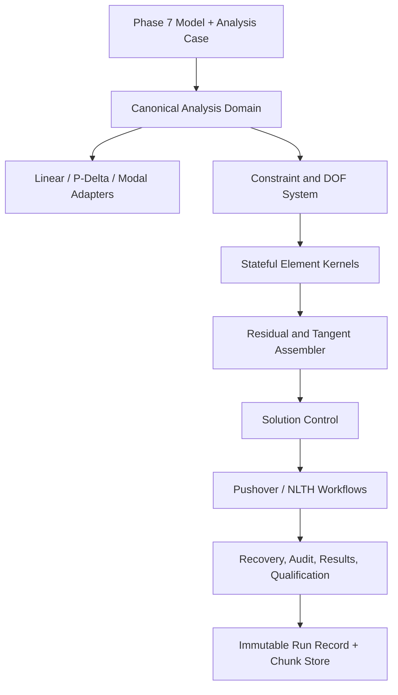

# Phase 8 Target Architecture

```yaml
architecture_status: proposed
implemented_through: P8-M1 canonical-domain-and-state-foundation
primary_scope: nonlinear 3D frame analysis
core_rule: one stateful element kernel shared by static and dynamic workflows
```

## 1. 목표 구조

Phase 8은 Phase 7 모델을 해석별로 다시 해석하지 않고 다음 공통 층으로 분리한다.



정적과 동적 workflow는 시간항만 다르고 같은 도메인, 상태, 요소 응답을 사용한다. 선형·Direct P-Delta·모달/RSA도 같은 topology/property/constraint/load/mass snapshot을 adapter로 소비한다. 상세 계약은 [MODELING_ELASTIC_INTEGRATION.md](MODELING_ELASTIC_INTEGRATION.md)를 따른다.

## 2. 비선형 해석 케이스 계약

```js
{
  id,
  kind: 'nonlinearStatic' | 'pushover' | 'nonlinearTimeHistory',
  engineId,
  modelHash,
  domainHashes,
  initialState: {
    policy: 'zero' | 'nonlinear-case' | 'verified-linear-import',
    caseId,
    runRecordId,
  },
  gravity: {
    combinationId,
    steps,
    holdConstant: true,
  },
  loading: {
    patternId,
    direction,
    scale,
    recordId,
  },
  control: {
    type: 'load' | 'displacement' | 'arcLength',
    controlDof,
    target,
    initialStep,
    minStep,
    maxStep,
  },
  formulation: {
    geometry: 'small-displacement' | 'corotational-3d',
    material: 'elastic' | 'concentrated-plasticity' | 'fiber-section',
  },
  solver: {
    method: 'full-newton' | 'modified-newton',
    lineSearch,
    maxIterations,
    tolerances,
  },
  massSourceId,
  functionIds,
  outputPolicy,
  qualificationRequest,
}
```

### 필수 규칙

- `modelHash`가 실행 시점 모델과 다르면 case를 stale로 표시하고 재실행한다.
- Pushover는 gravity combination을 명시해야 한다. 비어 있으면 자동 추정하지 않고 setup 단계로 보낸다.
- control DOF는 constraint 축약 후에도 유일하게 표현 가능해야 한다.
- fiber/hinge source, material model, acceptance source가 snapshot으로 고정되어야 한다.
- unsupported model feature를 발견하면 실행 전에 capability matrix와 함께 차단한다.
- initial state는 mutable case ID만이 아니라 immutable predecessor run record와 domain hash를 참조한다.
- predecessor가 failed/stale/unsupported이면 dependent case를 실행하지 않는다.
- modeling transaction은 영향받는 domain hash와 case dependency를 stale 처리한다.

## 3. Canonical analysis domain

모델 객체를 해석 중 직접 수정하지 않는다. Phase 7 선형해석과 Phase 8 비선형해석이 공유할 canonical domain을 실행 전에 한 번 고정한다.

- 정규화된 node, member, material, section
- offset과 local axis를 포함한 element geometry
- release와 내부 hinge 자유도
- support, linear spring, prescribed displacement
- rigid diaphragm 및 기타 multi-point constraint
- semi-rigid diaphragm/generated member의 전개 결과
- gravity/member/nodal load와 고정단력
- 질량원과 lumped/consistent mass 선택
- element별 nonlinear formulation과 parameter source
- 단위 및 부호규약
- topology hash, property hash, load hash
- constraint hash, mass hash, nonlinear-property hash, output-policy hash

canonical domain은 `src/solver/domain`에 위치하고 nonlinear namespace가 소유하지 않는다. 기존 `src/solver/pdelta/analysisDomain.js`의 load/generated-object 전개는 공통 domain 단계로 이동하며 P-Delta, modal, nonlinear solver별로 다시 복제하지 않는다.

### Constraint 표현

전체 자유도 `u_f`와 독립 자유도 `q`의 관계를 다음처럼 일반화한다.

```text
u_f = T_c q + u_bar
```

- `T_c`: support와 rigid diaphragm을 포함한 constraint transformation
- `u_bar`: prescribed displacement
- reduced residual: `r_q = T_c^T r_f`
- reduced tangent: `K_q = T_c^T K_f T_c`

선형해석의 diaphragm 전용 reduction을 복사하지 않고 정적·동적·arc-length에서 공통 사용 가능한 constraint service로 추출한다.

## 4. Committed/trial 상태

### 전역 상태

```js
{
  committed: {
    step,
    time,
    lambda,
    q, u, v, a,
    elementStates,
    energies,
    eventCursor,
  },
  trial: {
    iteration,
    lambda,
    q, u, v, a,
    elementStates,
    residual,
    norms,
  },
}
```

### 상태 전이

```text
beginStep(committed) -> trial copy
evaluate(trial)      -> 새 trial element state, commit 변경 금지
acceptIteration      -> trial만 갱신
commitStep           -> trial을 committed로 원자적 교체
rollbackStep         -> committed snapshot으로 복원
checkpoint           -> 재시작 가능한 직렬화 snapshot
```

line search의 각 후보는 서로 독립된 trial branch를 사용한다. 선택되지 않은 후보가 material history를 오염시키면 안 된다.

## 5. 요소 커널 계약

모든 요소는 전역 조립기가 이해할 수 있는 하나의 응답 계약을 제공한다.

```js
evaluateElement({
  element,
  committedState,
  trialKinematics,
  dt,
  mode,
}) => ({
  resistingForceGlobal,
  tangentGlobal,
  massGlobal,
  trialState,
  localResponse,
  energies,
  diagnostics,
})
```

### 불변조건

- `tangentGlobal`은 smooth branch에서 `d(resistingForceGlobal)/du`와 일치해야 한다.
- evaluate는 committed state를 변경하지 않는다.
- 강체운동은 수치 허용오차 밖의 변형과 내력을 만들지 않는다.
- local/global force transformation과 결과회복이 같은 kinematics를 사용한다.
- release와 offset은 강성뿐 아니라 내력, 질량, 하중, 결과회복에 일관되게 적용된다.
- 요소 에너지 증가량은 material 및 geometric response와 일치해야 한다.

## 6. 전역 잔차와 접선

### 정적

```text
r(u, lambda) = Pgravity + lambda Pref + Pconstant - Pint(u, state)
Kt = dPint / du
```

각 Newton 반복에서 모든 요소를 현재 trial state로 평가하고 `Pint`와 `Kt`를 다시 조립한다.

### 동적

```text
r_eff = P(t) - M a - C v - Pint(u, state)
K_eff = Kt + a0 M + a1 C
```

`a0`, `a1`은 선택한 Newmark 계수와 `dt`에서 산출한다. 질량과 감쇠는 모델 행렬이며 scalar 기본값으로 대체하지 않는다.

### 조립 결과

각 반복은 최소 다음을 기록한다.

- load factor 또는 time
- 외력, 내력, 관성력, 감쇠력 norm
- force/displacement/energy convergence ratio
- tangent symmetry, condition/pivot diagnostics
- line-search alpha
- element state change count
- hinge yield/capping/failure event
- accepted/rejected/cutback/rollback 상태

## 7. 선형계 풀이 backend

기존 sparse LDLT의 SPD 경로는 탄성 및 안정한 초기단계에서 reference로 재사용할 수 있다. production nonlinear path는 Worker에서 동작하는 typed sparse/WASM backend를 사용한다. 다음 경우에는 SPD 가정이 깨진다.

- post-peak 또는 negative tangent
- arc-length augmented matrix
- 일부 constraint와 내부 자유도
- 불안정점 근처의 비정정 접선

따라서 M2에서 다음 backend를 분리한다.

1. SPD sparse solver: 안정한 대칭 양정정 접선
2. pivoted symmetric-indefinite 또는 general sparse solver: 비정정/augmented system
3. dense pivoted reference solver: 300 active DOF 이하 benchmark와 cross-check
4. worker/WASM adapter: production sparse backend, cancellation, progress, memory ownership

solver 선택은 자동 fallback이 아니라 matrix property 진단과 실행 trace에 기록한다. pivot 실패나 과도한 condition은 정상 결과로 통과시키지 않는다.

성능·메모리·결과 streaming 계약은 [PERFORMANCE_AND_SCALABILITY.md](PERFORMANCE_AND_SCALABILITY.md)를 따른다.

## 8. Solution control

### Full Newton load control

```text
Kt_i Delta_u_i = r_i
u_i+1 = u_i + alpha Delta_u_i
```

반복마다 `Pint`, `Kt`, trial element state를 재평가한다. modified Newton은 full Newton 검증 후 선택적 성능모드로 추가한다.

### Displacement control

제어 자유도 `c`에 대해 증분 방정식을 실제로 푼다.

```text
[ Kt  -Pref ] [Delta_u     ] = [ r              ]
[ c^T    0   ] [Delta_lambda]   [Delta_u_target ]
```

constraint 축약 좌표와 물리 control DOF의 관계를 명시적으로 변환한다.

### Arc-length

Crisfield spherical constraint를 predictor/corrector의 augmented equation으로 구현한다.

```text
Delta_u^T W Delta_u + alpha^2 Delta_lambda^2 Pref^T W Pref = Delta_s^2
```

이전 increment 방향을 이용한 branch 선택, limit point 통과, step radius 자동조절, root 선택 근거를 기록한다. 미리 만든 경로를 입력받아 제약만 검사하는 코드는 solver로 간주하지 않는다.

### Adaptive step controller

- 목표 반복 수에 따라 다음 step 크기 증가/감소
- 비수렴 시 committed state로 rollback 후 cutback
- 최소 step 이하에서 명시적 실패
- 최대 retry와 총 iteration budget
- event 근처 자동 step 제한
- 실패 뒤 자동으로 다음 스텝 진행 금지

## 9. 3D corotational frame

### 필수 kinematics

- 초기 local triad와 변형 후 chord triad
- finite nodal rotation 표현과 relative rotation extraction
- rigid-body motion을 제거한 basic deformation
- axial, torsion, strong/weak-axis bending basic force
- material tangent와 geometric tangent
- transformation derivative가 포함된 global tangent

### 요소 종류

| 요소 | Phase 8 역할 |
| --- | --- |
| elastic corotational frame | 기하비선형과 선형극한 기준 요소 |
| elastic corotational truss | 가새 및 axial-only 요소 |
| end-hinged frame | elastic interior와 stateful end spring의 직렬 결합 |
| fiber-section frame | section integration을 사용하는 distributed plasticity 경로 |

### Release와 offset

- rigid offset은 kinematic transformation으로 처리한다.
- release는 내부 자유도 또는 일관된 nonlinear condensation으로 처리한다.
- hinge와 release가 같은 축에 중복 지정되면 validation error다.
- 부재 전체 `Iy/Iz/J`를 힌지상태에 따라 일괄 축소하는 방식은 사용하지 않는다.

## 10. 소성힌지

### 집중소성 기본 경로

- i/j 단부에 독립적인 local y/z 회전 spring
- A-B-C-D-E envelope와 축력 의존 parameter
- unloading/reloading, 잔류회전, strength/stiffness degradation을 가진 state machine
- spring deformation과 elastic member deformation의 호환
- local spring return mapping 또는 구간 상태 전이
- event: first yield, IO/LS/CP 또는 프로젝트 기준, capping, residual, failure

### 자동배정

자동배정 결과는 계산값이 아니라 입력 snapshot이다.

- member axis별 `My`, `Mz`
- axial ratio와 PMM interaction source
- shear span/member length, section/material/detailing source
- hinge length와 rotation definition
- backbone source/edition/assumption
- auto value와 user override diff

근거가 없는 기본값은 `assumed`로 표시하고 qualification을 제한한다.

## 11. PMM 및 fiber 단면

### Fiber 좌표와 section response

각 fiber는 `(y, z, area, materialId)`를 가진다.

```text
epsilon(y,z) = epsilon0 - kappa_y z + kappa_z y
[N, My, Mz] = integral(sigma [1, -z, y] dA)
```

section tangent는 같은 material tangent로 `d[N,My,Mz]/d[epsilon0,kappa_y,kappa_z]`를 조립한다.

### 단면 generator

- steel H/BOX/PIPE: flange/web/corner를 2D mesh로 세분하고 mesh convergence 제공
- RC rectangle: cover/core 분리, 실제 bar 좌표와 면적, 선택한 confinement model
- custom: 명시 fiber import와 단위 validation

### Moment-curvature

- 목표 축력에서 `epsilon0`를 Newton으로 찾아 축력 평형을 맞춘다.
- 단축 및 2축 곡률 경로를 구분한다.
- yield, peak, ultimate를 재료상태와 곡률기준으로 판정한다.
- 5점 고정 sweep 대신 adaptive increment와 mesh convergence를 사용한다.

### PMM surface

- 검증된 section response에서 `P-My-Mz` surface를 생성하거나 승인된 외부 입력을 사용한다.
- interpolation은 convexity, sign, bounds를 검사한다.
- 범위 밖 입력은 clamp하지 않고 analysis qualification을 차단한다.

## 12. Pushover workflow

```text
validate model and nonlinear assignments
  -> assemble immutable domain
  -> gravity preload with load control
  -> commit gravity state
  -> generate signed lateral reference pattern
  -> displacement-control increments
  -> optional arc-length near/post peak
  -> recover base shear, control displacement, story/member/hinge response
  -> equilibrium and qualification audit
```

### 필수 결과

- `Vbase - deltaControl` capacity curve
- 각 스텝의 lambda, 실제 control displacement, iteration/cutback
- 중력 및 횡하중의 외력/반력/내력 평형
- 층전단, 층변위, drift, 비틀림
- 부재단력, 힌지 회전·모멘트·상태·누적에너지
- first yield, mechanism, peak, 80% post-peak 등 event
- 종료사유: target, mechanism, loss of convergence, instability, limit
- 모든 가정과 design eligibility

## 13. MDOF NLTH workflow

```text
validate dynamic model
  -> domain + M + initial K
  -> optional gravity preload and state commit
  -> damping matrix
  -> ground-motion unit/sign/scale validation
  -> Newmark predictor
  -> step Newton with shared nonlinear element kernel
  -> commit or rollback/substep
  -> recovery, energy and equilibrium audit
```

### 첫 정식 범위

- uniform base acceleration, X/Y/Z 한 방향 또는 명시 동시성분
- average-acceleration Newmark
- lumped mass 기본, 검증된 consistent mass 선택
- Rayleigh damping with initial-stiffness 또는 committed-stiffness 정책
- concentrated plasticity frame
- fiber path는 별도 qualification 뒤 활성화

### 필수 결과

- nodal displacement/velocity/acceleration history
- story displacement, drift, shear, torsion history
- base shear and overturning moment
- member force와 hinge/fiber state history
- input, kinetic, damping, strain, plastic energy balance
- step별 iterations, substeps, convergence, warnings
- peak/envelope와 발생시각

## 14. 결과 및 qualification 계약

```js
{
  status: 'completed' | 'failed' | 'cancelled' | 'unsupported',
  qualification: 'legacy-preliminary' | 'implemented' | 'candidate' | 'verified' | 'blocked',
  designBlocked: true,
  engine: { id, version, formulation },
  provenance: { modelHash, caseHash, domainHash, sourceSnapshots },
  convergence: { criteria, steps, failures, cutbacks },
  audits: { equilibrium, tangent, energy, compatibility },
  results: { global, stories, nodes, members, hinges, sections },
  limitations: [],
}
```

`status=completed`는 계산 절차가 끝났다는 뜻이며 `qualification=verified`와 별개다. 보고서와 agent API는 둘을 항상 함께 전달한다.

## 15. 권장 파일 경계

```text
src/nonlinear/
  core/
    analysisDomain.js
    constraints.js
    stateStore.js
    elementContract.js
    assembler.js
    residual.js
    qualification.js
  solvers/
    linearSystem.js
    newton.js
    lineSearch.js
    stepController.js
  controls/
    loadControl.js
    displacementControl.js
    arcLength.js
  elements/
    corotationalFrame3d.js
    corotationalTruss3d.js
    hingedFrame3d.js
    fiberFrame3d.js
  materials/
    elastic.js
    steelCyclic.js
    concreteUniaxial.js
    hingeBackbone.js
  sections/
    fiberSection3d.js
    fiberGenerators.js
    momentCurvature.js
    pmmSurface.js
  workflows/
    gravityPreload.js
    pushover.js
    nonlinearTimeHistory.js
  results/
    recover.js
    audit.js
    views.js
  legacy/
    preliminaryPushover.js
    sdofNewmarkTrace.js

src/solver/domain/
  buildAnalysisDomain.js
  domainHashes.js
  propertyResolver.js
  constraintTransform.js
  loadDomain.js
  massDomain.js
  originMap.js
  capabilityMatrix.js

src/runtime/analysis/
  analysisWorker.js
  wasmSparseAdapter.js
  resultChunkStore.js
  checkpointStore.js
```

실제 구현 시 기존 import 영향과 module size를 검토해 파일명은 조정할 수 있지만 경계는 유지한다.

## 16. 기존 코드 migration

1. M0에서 기존 public API의 payload에 `qualification=legacy-preliminary`, `designBlocked=true`를 강제한다.
2. 기존 함수는 `legacy` namespace로 옮기고 호환 adapter를 둔다.
3. 새 API는 `runNonlinearStatic`, `runPushoverAnalysis`, `runNonlinearTimeHistory`로 분리한다.
4. 새 solver가 특정 feature를 지원하지 않으면 legacy로 자동 fallback하지 않는다.
5. 기존 저장 case는 migration 시 `engineId`를 명시하고 사용자가 새 case로 복제할 수 있게 한다.
6. 새 결과 adapter가 기존 chart에 필요한 최소 view를 만들되 raw solver state를 UI shape로 오염시키지 않는다.
7. Phase 3 B1~B8은 regression suite로 남기고 qualification suite는 별도 디렉터리와 runner를 사용한다.
8. model schema v4는 v5 registry로 손실 없이 migration하고 legacy hinge/backbone을 자동 verified로 승격하지 않는다.
9. linear/static/P-Delta/modal/RSA adapter가 canonical domain golden test를 통과하기 전 기존 실행경로를 제거하지 않는다.
10. `analysisRunRecord`의 `p7-` evidence 전용 판정을 versioned verification registry로 일반화한다.

## 17. 모델링·탄성 연계 불변조건

1. 같은 model/case의 topology/property/constraint hash는 선형과 비선형에서 같아야 한다.
2. elastic A/I/J와 fiber geometry는 같은 section geometry snapshot에서 파생한다.
3. elastic E/G/rho와 nonlinear constitutive parameter는 같은 material source를 가리킨다.
4. RC auto hinge/fiber는 실제 reinforcement snapshot 없이는 `verified`가 될 수 없다.
5. local axis, release, rigid offset, diaphragm는 모든 solver에서 같은 DOF 의미를 가진다.
6. self weight와 mass source는 physical ownership을 한 번만 가진다.
7. generated object는 원본 ID와 formulation을 결과까지 유지한다.
8. 선형 결과는 initial guess로 쓸 수 있지만 committed nonlinear state로 자동 변환하지 않는다.
9. model change는 영향 hash에 연결된 case/state/cache/result를 stale 처리한다.
10. UI, report, agent/MCP는 같은 immutable run record와 result chunks를 읽는다.

## 18. Production runtime 불변조건

1. M-tier 이상 solver는 main thread에서 실행하지 않는다.
2. production global matrix는 dense array-of-arrays를 생성하지 않는다.
3. full Newton은 tangent 변경 시 numeric factorization을 갱신한다.
4. line-search/cutback state memory는 bounded buffer로 관리한다.
5. result history는 channel policy에 따라 chunk 저장한다.
6. cancellation과 crash는 uncommitted trial을 model에 남기지 않는다.
7. backend, thread mode, build hash, profile은 run record에 남긴다.
8. 작은 model은 dense reference와 production backend를 교차검산한다.
