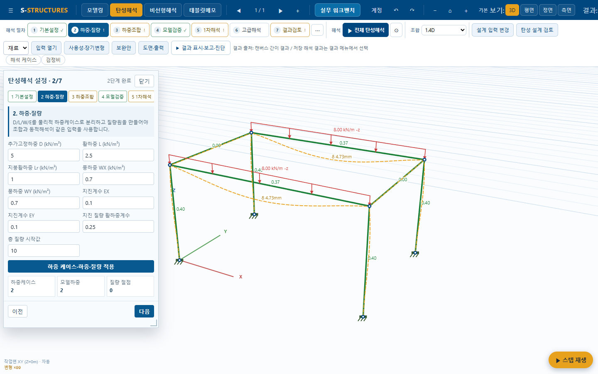
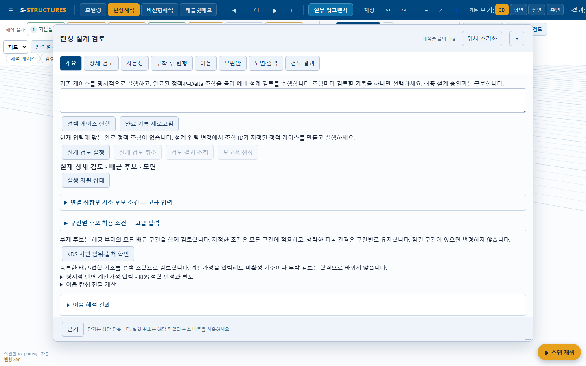
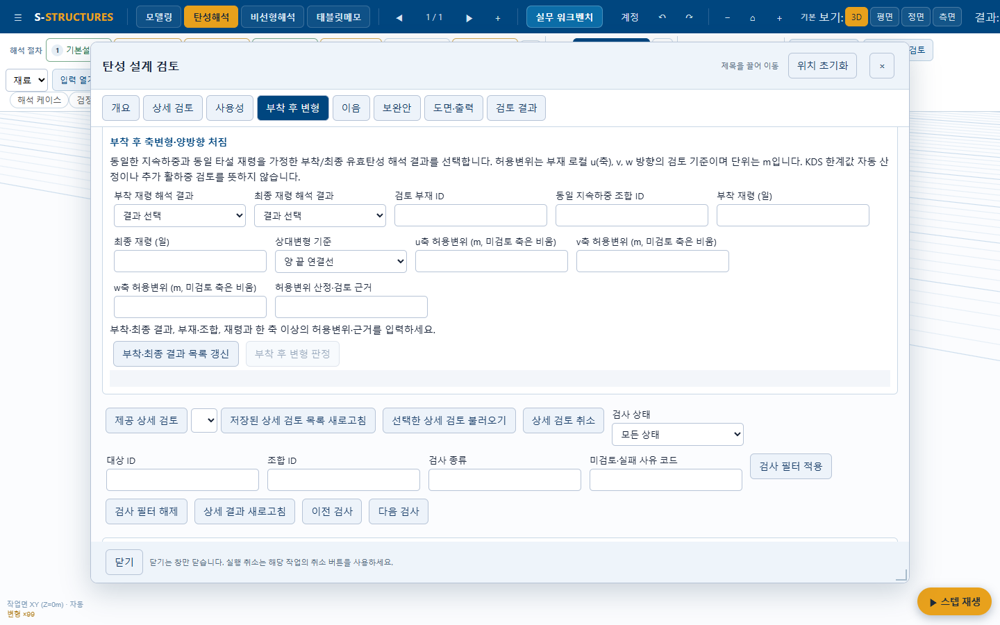
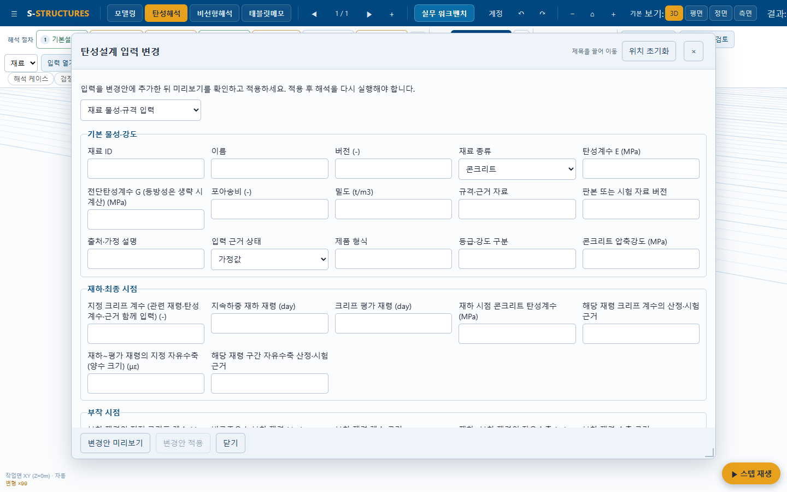
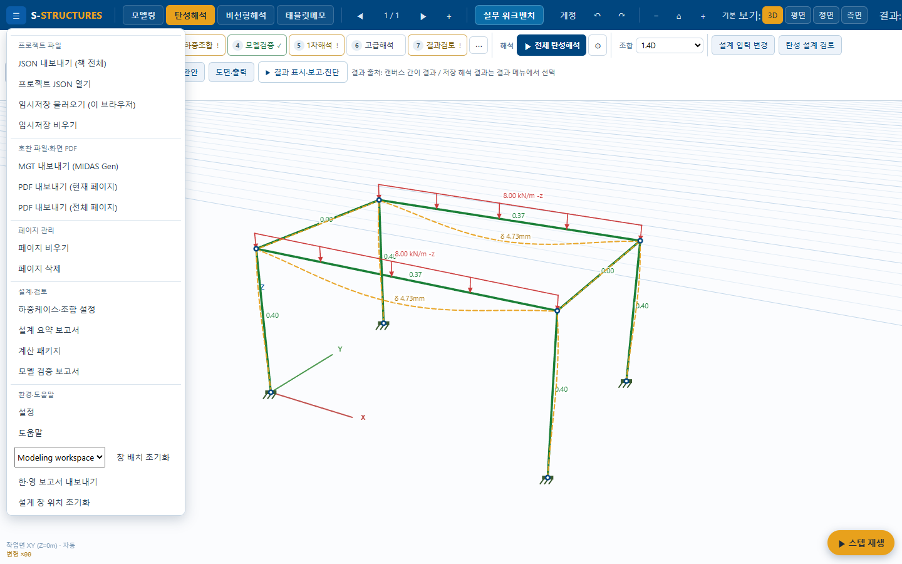
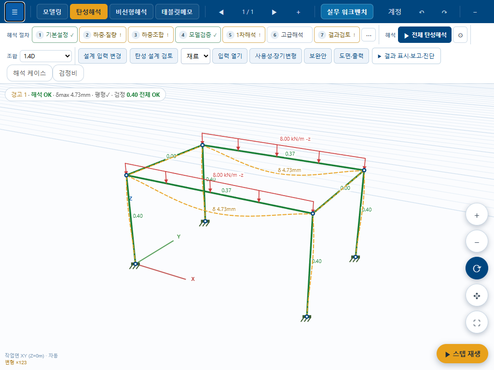
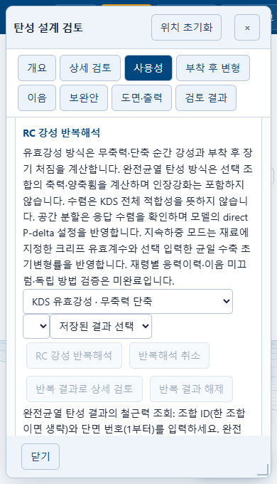
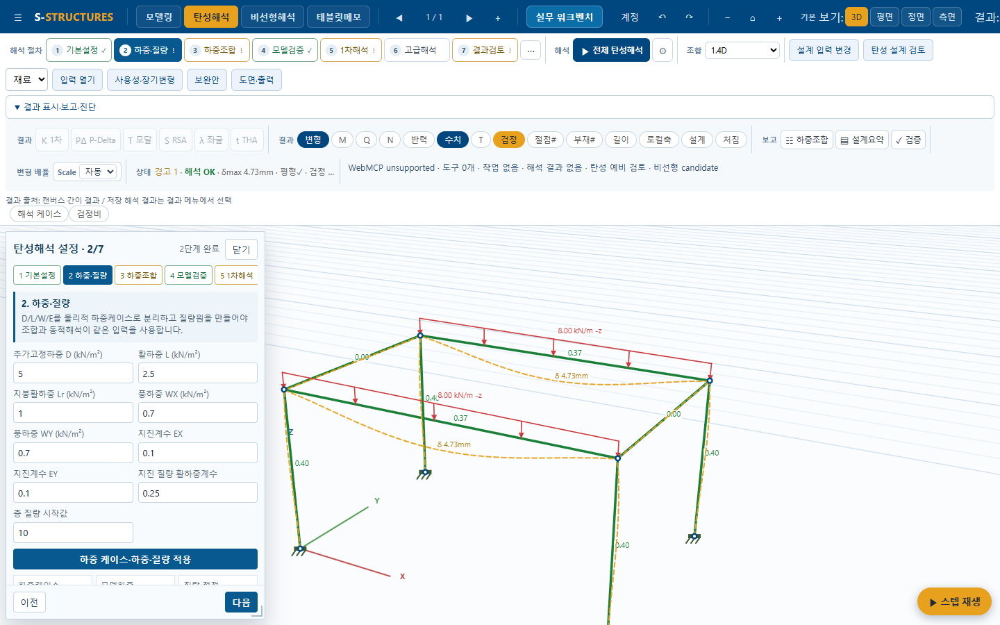

# UX 구현 기록 — 2026-09-13

기존 청색·금색/작업 탭/캔버스 디자인을 유지한 UI 정리 적용. 해석·설계 계산기, WebMCP 도구명·입력 계약, 후보 적용·보고서 계산식은 변경하지 않았다. 배포는 하지 않았다.

## 단계별 적용

| 단계 | 적용 내용 | 근거 |
|---|---|---|
| UX-M1 창 | 입력·검토 공통 프레임, 고정 제목/닫기/입력 적용 footer, 드래그·크기·위치 복원·초기화, Esc·진입 버튼 포커스 복귀 | workspaceUxShell, geometry test, 실제 드래그→닫기→재열기 |
| UX-M1 기존 창 | 기존 floatingPanel 유지, 리본 높이에 따라 기존 설정·작업 패널 제목 복구, 단면 창 공통 layer | workspaceUx; 더보기 펼침의 제목 경계 검사 |
| UX-M2 리본·메뉴 | 기존 결과/보고/배율/진단을 더보기로 이동, 같은 버튼 객체·이벤트 유지. 메뉴 버튼 기준 위치·높이 보정, 명령 분류, 일부 표시 문구 한국어화 | 기존 컨트롤 424개 이관 중 분리 0개, 결과 명령 표시 검사 |
| UX-M3 입력 | 재료·단면·배근·접합·기초·지반 바로가기, 재료 편집 진입, 콘크리트 기본/재하·최종/부착 그룹, 부착 변형 대상 목록 제안·준비 상태 | 기존 공용 openRecord 사용, 입력 유형·취소·현재성 검사 |
| UX-M4 검토·출력 | 내부 탐색 8개, 사용성/이음/보완안/계산서·도면·수량을 상태 유지 접기 영역으로 분리, 원시 JSON은 고급 입력으로 보존 | 실제 개요·부착·결과 바로가기 캡처, candidate/PDF UI 검사 |
| UX-M5 최소 확인 | 1440×900/1024×768/390×680 경계·닫기·메뉴 검사, 모델 비변경, 기존 UI/Agent 서비스 결과·보고서 회귀 | 아래 검사 목록 및 AUDIT.json |

실무 흐름 전체를 새로운 탭으로 재생성하는 대신 기존 요소를 유지하는 **내부 탐색 + 업무별 접기**로 구현했다. 숨긴 영역도 DOM과 이벤트·입력·진행 상태가 유지된다. 닫기와 작업 취소를 혼동하지 않도록 하단에 안내한다.

## 기능 보존 확인

- 이관 직전 기존 button/input/select/textarea 424개를 추적했고 이관 직후 모두 연결되어 있었다. 이후 기존 설정 화면의 정상 재렌더링은 별도 동작으로 취급한다. 컨트롤 연결성이 모든 기능의 수치 정확성을 증명하는 것은 아니다.
- 브라우저 탐색 전후 입력 해시가 같았다. 새 바로가기는 기존 designInputPanel.openRecord / designReviewPanel.open을 호출한다.
- 판정·미검토·KDS 제한·현재성 검사와 원시 고급 입력, 보고서 형식은 유지했다. 부착 후 변형 실행은 필수 입력이 없는 상태에서 비활성화한다. 서버 측 검증을 대체하지 않는다.
- 위치는 기존 floatingPanel에 위임한다. 사용자 드래그/크기 변경만 저장 위치를 갱신하며 자동 viewport 보정은 저장 위치를 덮어쓰지 않게 감쌌다.
- 기존 저장 파일/버전과 해석 결과 데이터 구조는 변경하지 않았다. 기존 파일 호환 전체 재검증 또는 공개 배포를 수행한 것은 아니다.

## 실제로 발견해 고친 UI 문제

1. 종류 선택 후 폼 재렌더링으로 포커스가 사라지면 Esc가 동작하지 않았다. 활성 작업 창을 기준으로 키 처리를 연결했다.
2. 복원된 이전 설정 창이 리본 버튼 클릭을 가렸다. 공통 layer를 정하고 기존 도구 창을 리본 하단으로 복구했다.
3. 화면 크기를 줄일 때 임시 보정 위치가 사용자 저장값으로 덮어써졌다. 창 shell에서 자동 clamp와 사용자 저장을 분리했다.
4. 개요 바로가기의 첫 요소가 style 태그가 될 수 있었다. 첫 설명 문단으로 명시했다.

초기 브라우저 검사의 전체 컨트롤 참조 추적은 기존 설정 창 자체 재렌더링을 삭제로 오판했다. 이관 시점 참조 동일성 검사로 범위를 바로잡았다. resize 이벤트 반영 전의 즉시 좌표 검사는 반영 완료를 기다리도록 수정했다. 이는 수치 해석 오류가 아니다.

## 검증

- `node tests/ux-workspace-geometry.mjs`: 기본 창/메뉴 경계 PASS.
- `node tests/m22-native-ribbon.mjs`: 기존 4개 모드·명령 연결 PASS.
- `node tests/p19-m2-design-input.mjs`: 입력 원자성·미리보기·적용·실행취소·현재성 등 기존 검사 PASS.
- `node tests/p19-m3-design-workflow.mjs`: RC/강재 UI·Agent 정적/P-Delta 결과→설계→불변 보고서, 취소/실패/현재성 방어 PASS.
- `verification/evidence/phase25/focused-2026-09-13T06-47-52-645Z/SUMMARY.json`: attachment UI 128ms, RC service UI 151ms, 검사→입력 228ms, artifact controls 74ms, PDF bundle UI 180ms, candidate lifecycle 165ms PASS.
- `tools/check-ux-browser.js`: 실제 UI 탐색·기존 명령 접근·콘크리트 그룹·빈 부착 입력 차단·Esc·드래그 재열기·메뉴·세 viewport·모델 비변경 PASS. [기계 판독 결과](../../output/playwright/ux-update-20260913/AUDIT.json).
- 창 위치: 기본 (130,60,1180,780), 이동 후 (165,80,1180,780), 재열기 동일. 메뉴 y=44.5px로 버튼 아래 표시.

검증은 요청에 맞춰 선택 범위로 제한했다. 실제 건물/전체 수치 회귀/태블릿 펜/로그인/모든 비선형 경로의 신규 실화면 검증은 수행하지 않았다. 복잡한 모든 JSON 조건의 전용 시각 편집기, 부착 재령의 원본 결과 자동 채움, 전체 결과의 새로운 표 렌더러는 이번 이관에 포함하지 않는다. 기존 기능과 자료는 그대로 접근 가능하다.

## 최종 화면

## 파일

workspaceUx: 기존 UI 이관·명령 진입·메뉴/기존 패널 복구.
workspaceUxShell: 공통 작업 창과 위치 정책.
workspaceUxStyles: 현재 색상 기반 공통 UI 스타일.
indexBridge: 이관 설치.
indexDesignInput: 콘크리트 폼 그룹·표시명.
indexPracticalDesign: 기존 컨트롤의 업무별 접기 그룹.
rcAttachmentReviewControls: 대상 목록 제안·필수 입력 안내.

이전 [design.md](../../design.md)와 [기준선 점검](UX_AUDIT_20260913.md)을 함께 보되, 구현 상태는 이 기록이 우선한다.
