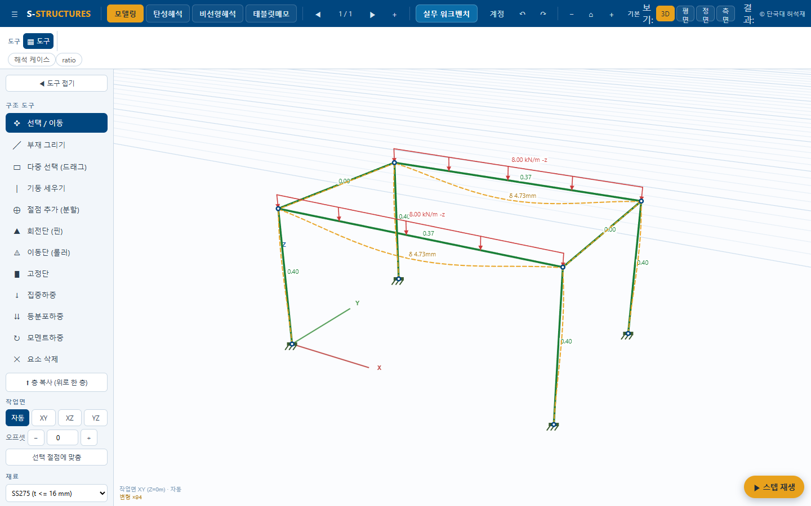
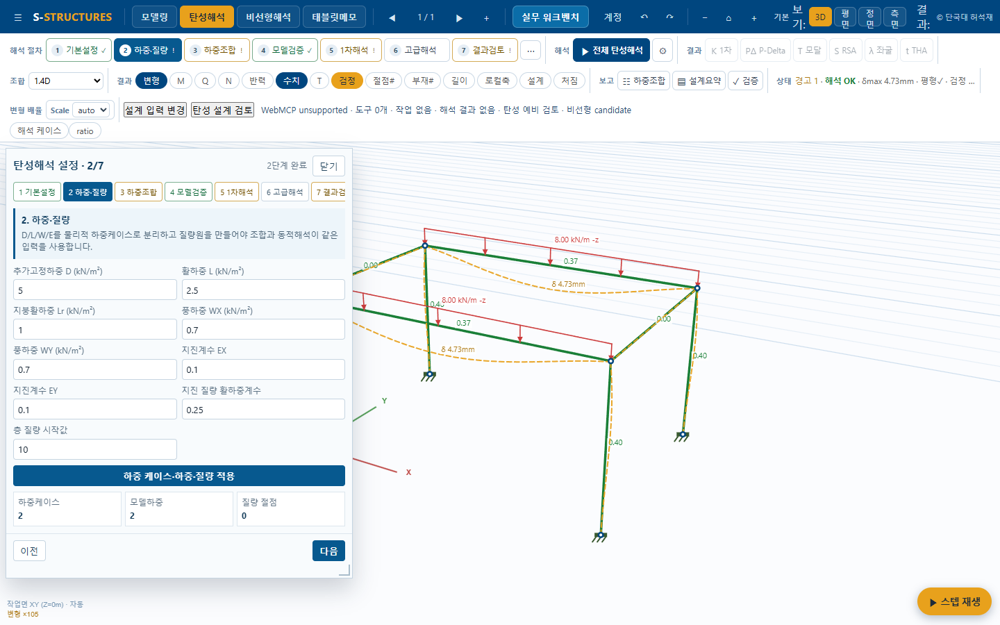
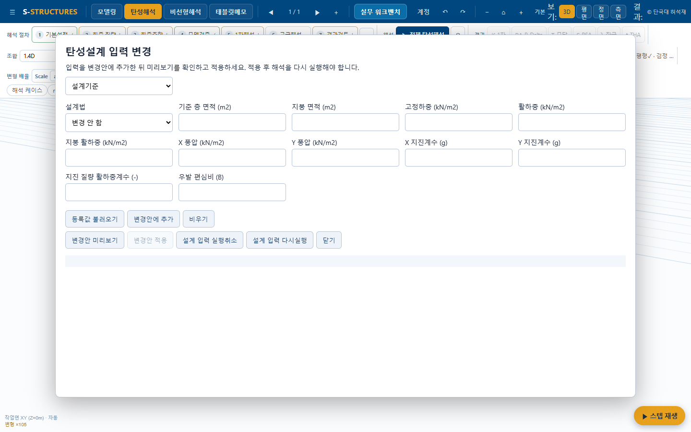
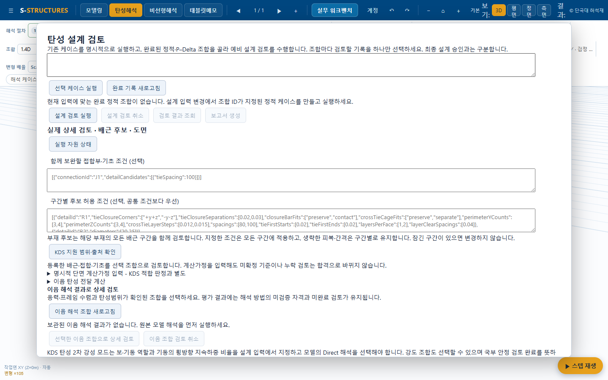
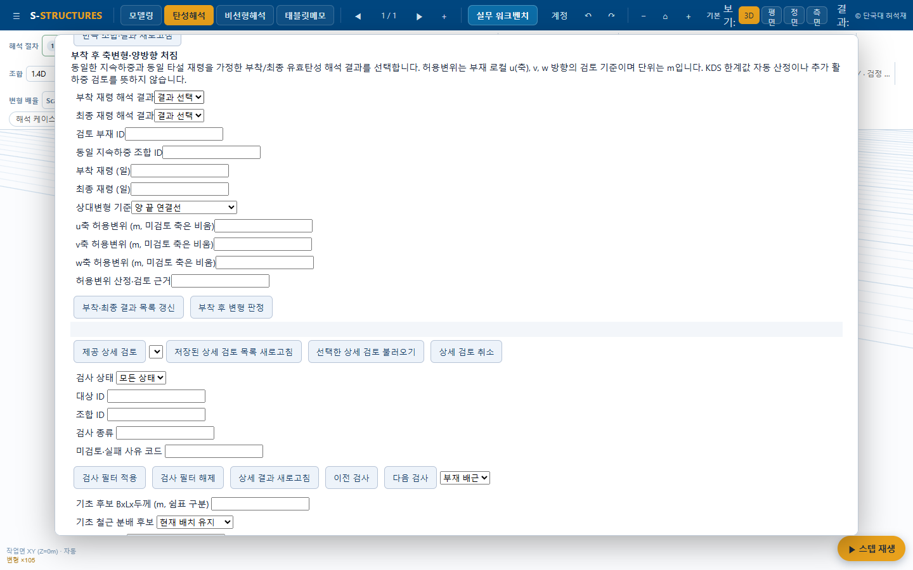
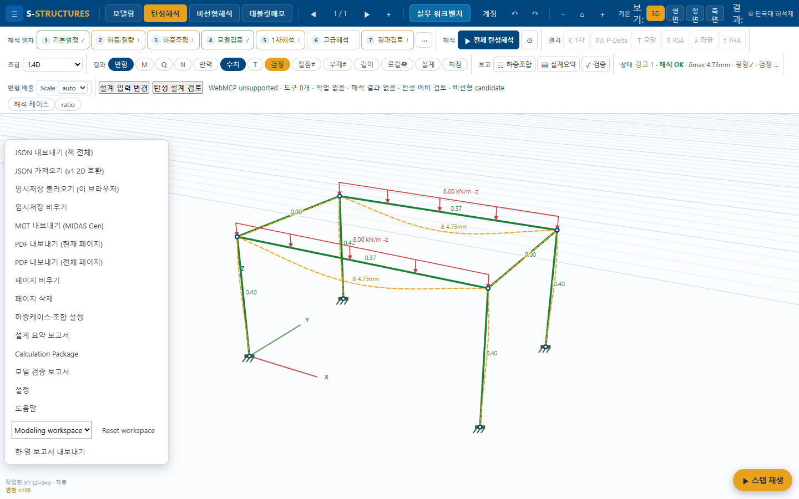
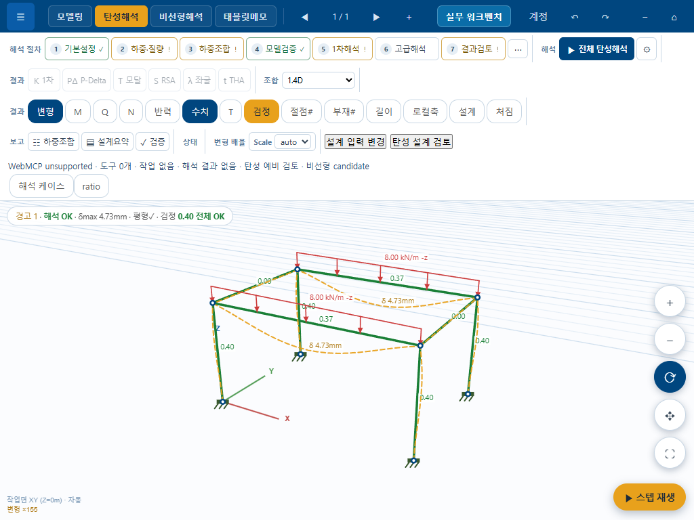

# UX 기준선 점검 — 2026-09-13

## 점검 범위

로컬 http://127.0.0.1:5185/ 의 새 Playwright 세션에서 기본 예제 화면을 관찰했다. 모델/설계 입력 적용이나 해석 실행은 하지 않았다. 내부 브라우저 접근성 트리도 확인했다. 1440×900 모델링·탄성해석·입력·검토·메뉴와 1024×768 탄성 화면을 캡처했다. 비선형 전체·계정·보고서 생성·태블릿 펜 기능은 실행 검증하지 않았다. 미구현 공학 기능은 본 UX 작업 범위에서 제외한다.

기존 design.md 또는 같은 이름의 대소문자 변형은 검색에서 발견되지 않아 루트 [design.md](../../design.md)를 만들었다. 기존 구조설계 기술문서는 UI 디자인 지침으로 취급하지 않았다. 런타임 코드는 변경하지 않았다.

## 확인된 문제와 수정 우선순위

| ID | 우선 | 확인 내용 | 근거 / 수정 방향 |
|---|---|---|---|
| UX01 | P1 | 팝업 배치·레이어 관리가 분리됨 | indexDesignInput:111 inset 8%/z19000, indexDesignReview:10 inset6%/z19010; 단면 편집 z1200과 floatingPanel 사용. 공통 창/위치 owner 도입 |
| UX02 | P1 | 1440 화면에서도 상단 ‘보기/결과/평면’ 글자 세로 줄바꿈 | 01~04 캡처. 고정 최소 폭·더보기·우선순위 조정 |
| UX03 | P1 | 검토 창에 기능이 누적되어 접근 어려움 | 04 캡처와 DOM: ssDesignReview 높이792/client790, scrollHeight2393, 버튼55·입력52(접힌 영역 포함). 내부 탐색·고정 헤더/닫기 |
| UX04 | P1 | 최근 장기변형 기능이 있지만 직접 진입 없음 | 08 캡처; indexPracticalDesign:131 → rcServiceControls → attachmentControls. 사용성 바로가기와 해당 섹션 포커스 |
| UX05 | P1 | 리본 ‘해석 결과 없음’과 캔버스 ‘해석 OK/전체 OK’ 동시 노출 | 02/07 캡처. 동일 수치 오류로 단정하지 않음; 원본 모델러 간이 결과와 저장 해석 결과 출처를 구분해야 함 |
| UX06 | P1 | 새 입력이 ID 직접 입력·정렬되지 않은 기본 폼 | 08 캡처, rcAttachmentReviewControls:7~13. 유효 대상 목록·선택 연계·단위 표시·두 시점 정보 자동 표시 |
| UX07 | P2 | 접합/기초 후보·구간 조건 JSON이 검토 첫 화면 상단 점유 | 04 캡처; indexPracticalDesign:88~89. 일반 조건 폼과 고급 JSON 분리 |
| UX08 | P2 | 리본에 개발/연결 진단이 상시 노출 | WebMCP status/도구수/candidate, Phase13 접근성 문구. webmcp/register:29. 짧은 상태와 진단 상세 분리 |
| UX09 | P2 | 리본 추가 버튼은 기본 브라우저 스타일 | 02/07 캡처; 입력·검토 host append 경로에 표준 ribbon class 부재. 공용 명령 스타일 |
| UX10 | P2 | 메뉴의 저장/삭제/출력/설정과 영어 항목 혼재 | 06 캡처. 출력 종류별 구분, 삭제 그룹 분리, 한국어 명칭 |
| UX11 | P2 | 메뉴가 버튼 바로 아래가 아닌 작업영역 아래에 나타남 | 06 캡처: 메뉴 상단 약251px, 버튼은 상단바. index.html menuDrop absolute top46. 실제 좌표계·상위 containing block 대조 후 앵커 배치 |
| UX12 | P2 | 단면 만들기·적용은 있으나 재료 전용 대칭 진입 부족 | 내부 브라우저 palette/소스; 재료 등록은 설계 입력 종류에 존재. 기능 미구현이 아니라 접근 경로 부족 |
| UX13 | P2 | 1024 화면에서 상단·리본이 약300px 차지 | 07 캡처. 모든 그룹 줄바꿈 대신 더보기, 자주 쓰는 명령 우선 |
| UX14 | P3 | favicon 404 | Playwright console. 본 화면 기능 장애로 분류하지 않음 |

팝업 ‘매번 임의 이동’ 자체를 반복 드래그 시험으로 재현한 것은 아니다. 위치 정책이 서로 다르고 실제 열린 위치가 다름을 확인했다. 공용 창 이관 시 재열기·저장 복원·화면 변경을 추가 시험한다.

## 신규 기능 도달성 대조

| 기능 | 현재 UI 상태 | 다음 개선 |
|---|---|---|
| 재료/단면/배근/접합/지반/기초 | 설계 입력 종류 및 공용 입력 계약에 존재 | 직접 바로가기·기본/고급 그룹 |
| RC 강성 반복·철근력 | 긴 설계 검토 내부에 존재 | 사용성 탐색, 조합/단면 선택 |
| 부착 후 축력·양축 변형 | 화면 존재 확인, 빈 상태에서 실행 버튼도 보임 | 필수 조건에 맞춘 실행 가능 상태와 안내, 출처·단위 표시 |
| 이음 전달·결과 상세 | 검토 창의 접기/섹션에 존재 | 이음 탭과 입력·결과 연결 |
| 배근·접합·기초 보완 후보 | 검토 창에서 입력/조회/적용 경로 존재(소스 대조) | 실패 검사에서 보완안으로 이동 |
| 도면·수량·PDF·ZIP | 검토 창 하단에 버튼 존재(접근성 트리) | 보고서 탭, 파일 종류·범위 명시 |
| WebMCP | 내부 브라우저 등록 요청 88개, 별도 Playwright는 unsupported | 브라우저 환경 차이이며 기능 누락으로 오판하지 않음 |

## 캡처

05-attachment.png는 자동 scrollIntoView 뒤 캡처가 잘린 것으로 관찰되어 유효 근거에서 제외하고 08로 대체했다. 원본은 재현 이력으로 보존한다. snapshot 원본은 같은 캡처 폴더에 복사했다. 기능 전체 테스트 통과를 주장하지 않는다.

## 실행 순서

[design.md](../../design.md)의 UX-M1 창 배치 → M2 리본/메뉴 → M3 입력/바로가기 → M4 검토/출력 → M5 최소 통합 확인으로 진행한다. UI 서비스 연결과 현재성·KDS 제한은 보존한다. 이번에는 준비 문서와 기준선 캡처만 완료했다.
